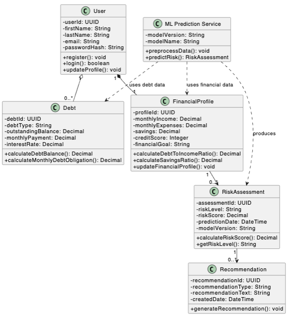
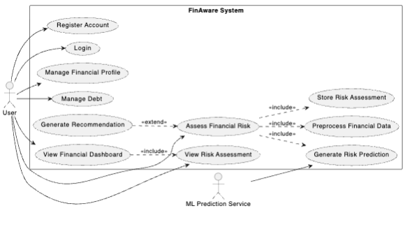
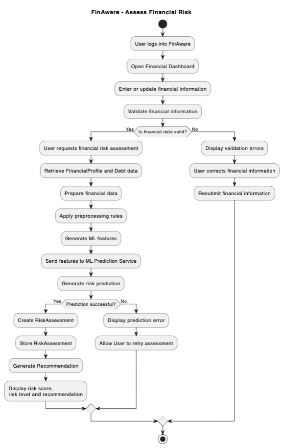
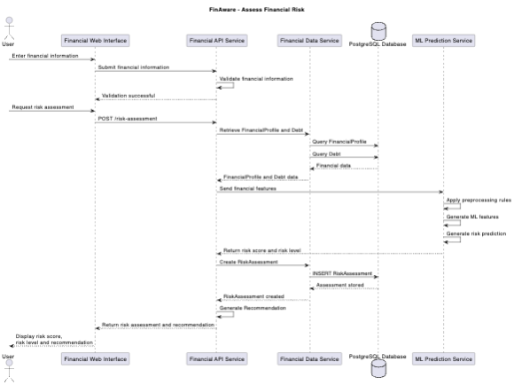

**FinAware**

Machine Learning Integration — Implementation Plan

Step-by-step, in order of importance, with effort estimates

| **Item** | **Detail** |
| - | - |
| Project | FinAware — interactive personal-finance decision-support system |
| Emerging technology | Machine learning (Random Forest, Gradient Boosting, KNN, SVM) |
| Dataset | personal\_finance\_zar.csv — 32,424 records × 24 columns (ZAR, 1 USD = 16.27 ZAR) |
| Scope | **Additive only.** The existing FinAware application stays as it is. The ML service, the dataset and the Assess Financial Risk feature are added alongside it. |
| Design authority | The four supplied UML diagrams: Class, Use Case, Activity and Sequence (Assess Financial Risk) |
| Inputs reviewed | Existing FinAware repo (FinAware-byte/FinAware, main); ML specification; developer handoff package (12 Python files); data package (2 CSVs + data dictionary); the four UML diagrams |
| Date | 21 September 2026 (revision 5 — self-contained for AI use) |
| Total effort | ≈ 21 developer-days core + 20% contingency ≈ 25 days (≈ 5 weeks full-time) |

**Contents**

**0. Instructions for an AI assistant using this document**

1. Executive summary

2. What exists today

2A. Alignment with the UML diagrams

2B. Inventory — what remains, what is added, what is used, what is not used

3. Verified findings from the review

Step 0 — Environment & repository setup

Step 1 — Agree and document the risk target

Step 2 — Fix and harden the handoff ML code

Step 3 — Train, evaluate and select the model

Step 4 — Per-user explainability

Step 5 — Recommendation engine in the Financial API Service

Step 6 — ML service API contract and error handling

Step 7 — New Financial API and Financial Data services, and database tables

Step 8 — Frontend: new Financial Profile and Risk Assessment pages

Step 9 — Docker, Helm and Kubernetes

Step 10 — Testing

Step 11 — Documentation and academic write-up

4. Decisions required

5. Risks

6. Definition of done

Appendix A — Developer handoff package: full reference

Appendix B — Data package: full reference

Appendix C — Traceability to the ML specification

Appendix D — Verbatim source of the handoff package

Appendix E — UML diagrams (design authority) with text transcriptions

Appendix F — Full ML specification (as supplied)

Appendix G — Existing FinAware code reference (patterns to follow)

# 0. Instructions for an AI assistant using this document

This document is self-contained. It includes the full ML specification (Appendix F), the four UML diagrams with text transcriptions (Appendix E), the existing FinAware code patterns (Appendix G), the developer handoff code verbatim (Appendix D), the dataset reference (Appendix B) and the step-by-step plan (Steps 0–11). An AI assistant given this document should be able to implement the ML feature without other context.

| **Suggested prompt to paste with this document** "You are implementing the FinAware ML risk-assessment feature described in the attached document. Read section 0 first and follow its rules. Work through Steps 0 to 11 in order. Before each step, restate what you will build and which files you will create. Do not modify existing FinAware behaviour. Stop and ask me at every STOP POINT listed in section 0.4." |
| - |

## 0.1 Hard rules (never break these)

1. **Do not invent the risk target.** The dataset has no genuine Low/Medium/High label. Propose a constructed target (Step 1), then STOP until the human confirms the supervisor has approved it. Never train the final models on an unapproved target.

2. **Additive only.** Do not change or remove existing pages, services, tables, data or behaviour. Only the additive touch points in section 2A.5 may be edited.

3. **Follow the UML diagrams (Appendix E).** Components, flow, names and responsibilities come from the sequence, activity and class diagrams — e.g. recommendations are generated in the Financial API Service, and data access goes through the Financial Data Service.

4. **No OpenAI or other LLM in the new flow.** Recommendations are deterministic rules.

5. **Do not silently alter data.** Every transformation is logged and documented.

6. **Do not claim causation or independent discovery.** Use 'Factors influencing this prediction'; disclose that the target is constructed.

7. **Do not invent numbers.** Metrics, importances and class distributions come from running code on the real data.

8. **Never expose the ML service, model files or secrets to the browser.**

## 0.2 Where things are

| **Item** | **Location** |
| - | - |
| FinAware repository | ~/Documents/school proj/finaware\_main\_project (GitHub FinAware-byte/FinAware, branch main) |
| Handoff code | finaware\_main\_project/developerhandoffpackagefolder/ (verbatim in Appendix D) |
| Dataset and dictionary | ~/Downloads/redeveloperhandoffpackagefolder (1)/ — personal\_finance\_zar.csv, synthetic\_personal\_finance\_dataset.csv, data\_dictionary.xlsx (reference in Appendix B) |
| UML diagrams | finaware\_main\_project/docs/uml/01-class, 02-use-case, 03-activity, 04-sequence (Appendix E) |
| Specification | Appendix F (full text) |
| Existing code patterns | Appendix G |

## 0.3 Work order

| **Order** | **Step** | **Output** | **Gate** |
| - | - | - | - |
| 1 | Step 0 — setup | ml-service/ with data; working Node and Python | App builds unchanged |
| 2 | Step 1 — propose target rubric + class distribution | docs/risk\_tier\_methodology.md draft | **STOP A** |
| 3 | Step 2 — data audit, features, pipeline (fixed handoff code) | reports/data\_audit.md; ml/ modules | — |
| 4 | Steps 6, 7, 8, 9 against a stubbed ML response | New services, tables, pages, deployment | **STOP B** (migration review) |
| 5 | Step 3 — train & evaluate (only after STOP A approval) | reports/model\_comparison.md; artefacts | **STOP C** |
| 6 | Steps 4 and 5 — explainability, recommendation rules | explain.py; recommendations.ts | — |
| 7 | Step 10 — tests; Step 11 — documentation | Tests green; docs complete | **STOP D** (final review) |

## 0.4 STOP POINTS (ask the human before continuing)

- **STOP A — Target approval.** Present the proposed rubric, thresholds, weights, class distribution and the circularity disclosure. Continue to Step 3 only after explicit approval. Also confirm Decisions D-1 to D-6 (section 4); if not answered, use the recommended option and say so.

- **STOP B — Database migration.** Show the Prisma diff and confirm it only creates new tables and adds the Users back-relation.

- **STOP C — Model selection.** Present the comparison table, confusion matrices and the proposed final model with reasons.

- **STOP D — Final review.** Walk through the activity diagram on screen, including both error branches, and the §52 checklist (Appendix C.4).

## 0.5 Known environment issues on this machine

- Global npm is broken in every nvm Node version (missing proc-log module). Fix first: nvm install 20 --reinstall-packages-from=20.20.0.

- Python 3 is installed but has no pandas or scikit-learn; use a virtual environment inside ml-service/.

- Training all four models takes about 5–6 minutes (SVM dominates).

# 1. Executive summary

FinAware today is a working Next.js 14 prototype with seven Express microservices, Prisma/SQLite, Docker Compose and a Helm chart. **This plan does not modify the existing application.** It adds a new Assess Financial Risk capability exactly as drawn in the four UML diagrams: a Financial API Service, a Financial Data Service, an ML Prediction Service, new FinancialProfile / RiskAssessment / Recommendation records, and a new page reached from the dashboard. Existing pages, services, tables and data remain unchanged.

The developer handoff package supplies a usable Python/FastAPI ML service skeleton, and the data package supplies a clean dataset. Both were run end-to-end during this review. The skeleton trains and serves predictions, but it has confirmed defects, and the risk target it proposes does not work on this data (High risk = 0.54 % of records).

| **The one blocking decision** The dataset contains no genuine Low/Medium/High label. A **constructed risk\_tier target must be designed, agreed with the supervisor and documented before supervised training**. It must not be quietly invented. Everything else can be built around the API contract while that sign-off is pending. |
| - |

## 1.1 Effort at a glance

| **\#** | **Step** | **Days** | **Can run in parallel with** |
| - | - | - | - |
| 0 | Environment & repository setup | 0.5 | — |
| 1 | Agree and document the risk target | 1.5 (+ supervisor turnaround) | 2, 7, 8, 9 |
| 2 | Fix and harden the handoff ML code | 1.5 | 1 |
| 3 | Train, evaluate and select the model | 2 | —  (needs 1 signed off) |
| 4 | Per-user explainability (SHAP) | 1 | 5 |
| 5 | Recommendation engine in the Financial API Service | 1 | 4 |
| 6 | ML Prediction Service API contract & errors | 1 | 7 |
| 7 | New Financial API + Financial Data services and database tables (additive) | 3.5 | 1, 6, 8 |
| 8 | Frontend: new Financial Profile & Risk Assessment pages | 3 | 1, 7 |
| 9 | Docker / Helm / Kubernetes | 1.5 | 1, 7, 8 |
| 10 | Testing (data, feature, model, API, E2E + regression) | 2.5 | written alongside each step |
| 11 | Documentation & academic write-up | 2 | —  (final) |
|  | **Core total** | **21 days** |  |
|  | **With 20 % contingency** | **≈ 25 days ≈ 5 weeks full-time** |  |

How that translates to calendar time:

- **One full-time developer:** about 5 weeks.

- **Part-time student (~15 hours/week):** about 11–13 weeks.

- **With AI-assisted coding** (the code-heavy Steps 2–10 generated and then reviewed): roughly 8–10 days of human effort. Most of the remaining time is review, supervisor sign-off, testing the demo and writing up — those cannot be shortened much.

- **Critical path:** Step 1 sign-off → Step 3 training. Start Step 1 on day one; build Steps 7–9 against a stubbed ML response while waiting.

# 2. What exists today

## 2.1 Existing FinAware application

| **Area** | **Current state** | **Action (additive only)** |
| - | - | - |
| Frontend | Next.js 14 App Router, Tailwind, Recharts. Dashboard, Income vs Expense, Identity, Debts, Rehab, Get Help pages | Unchanged. Add new Financial Profile and Risk Assessment pages |
| Backend | Next.js API routes proxy to 7 Express services (ports 4101–4107) | Unchanged. Add Financial API (4108) and Financial Data (4109) services |
| Database | Prisma + SQLite. Users, Credit\_Profile, Debts, Payment\_History, Legal\_Records, AI\_Recommendations, Expert\_Requests, Providers, Wealth\_Assets | Unchanged tables and data. Add FinancialProfile, RiskAssessment, RiskDriver, Recommendation |
| Existing risk | Users.risk\_level derived from ID-number suffix (demo simulation) | Unchanged. The ML assessment is stored separately in RiskAssessment |
| Existing AI recommendations | OpenAI call on the Rehab page | Unchanged. The new flow does not use OpenAI (spec §48) |
| Infrastructure | Dockerfile, Docker Compose, Caddy TLS, Helm chart (dev/stag/prod), legacy k8s manifests | Unchanged services. Add three new services |
| Quality | CI runs lint, typecheck, build. No automated tests | Add tests + Python CI job; regression check that existing pages still work |

## 2.2 Developer handoff package

Location: finaware\_main\_project/developerhandoffpackagefolder (also in Downloads). Contents: README, requirements.txt, Dockerfile, config.py, preprocessing.py, train.py, inference.py, explainability.py, recommendations.py, api.py, sample\_request.json, node\_integration\_example.ts.

**Not included:** docs/risk\_tier\_methodology.md (referenced by the README) and tests. The data files are in a separate zip: personal\_finance\_zar.csv, synthetic\_personal\_finance\_dataset.csv (original USD source with region) and data\_dictionary.xlsx. The four UML diagrams were supplied as separate images.

# 2A. Alignment with the UML diagrams

The four diagrams are the design authority for the new feature. Every element maps to something built in Steps 1–11:

## 2A.1 Sequence diagram → components

| **Diagram participant** | **Built as** | **Responsibilities (from the diagram)** |
| - | - | - |
| User / Financial Web Interface | New Next.js pages /financial-profile and /risk-assessment + API routes /api/financial-profile and /api/risk-assessment | Enter financial information; request risk assessment; display risk score, risk level and recommendations |
| Financial API Service | New Express service services/financial-api (port 4108) | Validate financial information; orchestrate POST /risk-assessment; send features to ML; create RiskAssessment; **generate Recommendation**; return result |
| Financial Data Service | New Express service services/financial-data (port 4109) | Query FinancialProfile and Debt; INSERT RiskAssessment and Recommendations via Prisma |
| PostgreSQL Database | Existing Prisma database (SQLite today) — see Decision D-1 | Stores FinancialProfile, RiskAssessment, Recommendation; existing Debts read-only |
| ML Prediction Service | New Python FastAPI service ml-service (port 8000) | Apply preprocessing rules; generate ML features; generate risk prediction; return risk score and risk level |

| **Two changes to the earlier plan that the sequence diagram requires** 1. **Recommendations are generated in the Financial API Service (Node/TypeScript), not in the Python ML service.** The ML service returns risk score, risk level, probabilities and drivers; the Node rule engine turns those into Recommendations. 2. **Data access goes through a separate Financial Data Service.** The API service never talks to the database directly. |
| - |

## 2A.2 Class diagram → new Prisma models

| **Diagram class** | **Implementation** | **Notes** |
| - | - | - |
| User | Existing Users table — **unchanged** | Diagram's email/passwordHash are conceptual; FinAware's existing ID-number login is kept |
| Debt | Existing Debts table — **read-only** | balance → outstandingBalance; interest\_rate → interestRate; monthly payment taken from existing Credit\_Profile.monthly\_obligations (see D-4) |
| FinancialProfile | **New** model: profileId (uuid), userId → Users, monthlyIncome, monthlyExpenses, savings, creditScore, financialGoal, updatedAt | 1 User : 1 FinancialProfile. financialGoal is stored and shown, not a model input |
| ML Prediction Service | ml-service with modelName, modelVersion; preprocessData(), predictRisk() | Matches /predict and model\_metadata.json |
| RiskAssessment | **New** model: assessmentId (uuid), profileId, riskLevel, riskScore, lowProbability, mediumProbability, highProbability, predictionDate, modelName, modelVersion, targetVersion | 1 FinancialProfile : 0..\* RiskAssessment (full history kept) |
| (driver detail) | **New** model RiskDriver: assessmentId, featureName, displayName, importance, direction | Needed for spec §26–29; not drawn but consistent with the diagram |
| Recommendation | **New** model: recommendationId (uuid), assessmentId, recommendationType, recommendationText, reason, priority, rulesVersion, createdDate | 1 RiskAssessment : 0..\* Recommendation |

**riskScore** appears in the class and sequence diagrams but the ML model outputs probabilities. Define it transparently (Decision D-3), e.g. riskScore = 100 × (0.5 × P(Medium) + 1.0 × P(High)), a 0–100 value that rises with predicted risk. riskLevel is always the class with the highest probability.

## 2A.3 Activity diagram → required behaviour

| **Activity step** | **Where it happens** |
| - | - |
| User logs in → Open Financial Dashboard | Existing login and dashboard; one new link/sidebar entry to the Risk Assessment page |
| Enter or update financial information | New Financial Profile page (PUT /api/financial-profile) |
| Validate → invalid: display errors, correct, resubmit | Financial API Service validation (Zod) returning field-level errors; form shows them inline |
| User requests financial risk assessment | Button on the Risk Assessment page (POST /api/risk-assessment) |
| Retrieve FinancialProfile and Debt data | Financial Data Service |
| Prepare data → preprocessing → generate ML features → send to ML → generate prediction | Financial API Service assembles the feature payload; ML Prediction Service preprocesses and predicts |
| Prediction successful? No → display prediction error → allow retry | Structured error from ML/API; page shows error with a Retry button; nothing is stored |
| Yes → create and store RiskAssessment → generate Recommendation → display score, level and recommendation | Financial Data Service stores; Financial API Service generates recommendations; page renders results |

## 2A.4 Use-case diagram → coverage

| **Use case** | **Status** |
| - | - |
| Register Account, Login, Manage Debt, View Financial Dashboard | Existing — unchanged |
| Manage Financial Profile | New (Step 7–8) |
| Assess Financial Risk «include» Preprocess Financial Data, Generate Risk Prediction, Store Risk Assessment | New (Steps 2–7) |
| Generate Recommendation «extend» Assess Financial Risk | New (Step 5) |
| View Risk Assessment «include»d by View Financial Dashboard | New page + latest-assessment link from the dashboard (Step 8) |
| ML Prediction Service (secondary actor) | New ml-service (Steps 2–6) |

## 2A.5 Minimal touch points to existing files

Adding a feature cannot be done with literally zero edits to existing files. These are the only ones, and each is a pure addition (no existing line changes behaviour):

| **File** | **Addition** |
| - | - |
| prisma/schema.prisma | Four new models, plus one back-relation line on Users (Prisma requires both sides). No existing column or table altered; migration only creates tables |
| middleware.ts | Add /financial-profile and /risk-assessment to the protected route list |
| components/sidebar/main-tabs.tsx | One new tab: Risk Assessment |
| lib/microservices/proxy.ts | Two new service names and URLs |
| package.json | New service:\* scripts; include them in dev:stack |
| .env.example | FINANCIAL\_API\_SERVICE\_URL, FINANCIAL\_DATA\_SERVICE\_URL, ML\_SERVICE\_URL |
| docker-compose.yml, Helm values/templates, deploy/k8s | Three new services appended |
| .github/workflows/ci.yml | New Python job |

# 2B. Inventory — what remains, what is added, what is used, what is not used

A single reference for what happens to every part of FinAware and the handoff package.

## 2B.1 What remains unchanged (existing FinAware)

| **Area** | **Items kept exactly as they are** |
| - | - |
| Pages | /login, /join, /fica-verification, /dashboard, /income-expense, /identity, /debts, /rehab, /help |
| Services | auth (4101), dashboard (4102), identity (4103), debts (4104), rehab (4105), help (4106), pdf (4107) |
| Database tables and data | Users, Credit\_Profile, Debts, Payment\_History, Legal\_Records, AI\_Recommendations, Expert\_Requests, Providers, Wealth\_Assets |
| Existing behaviour | ID-number login, FICA flow, simulated risk badge (ID suffix), OpenAI recommendations on the Rehab page, PDF export, WhatsApp help |
| Infrastructure | Existing Dockerfile, Caddy TLS, existing Compose services, Helm templates for existing services, deploy/k8s manifests, macOS scripts |
| Documentation | Existing README sections and docs/ diagrams (kept; new versions added alongside) |

## 2B.2 What is added (new)

| **Area** | **New items** |
| - | - |
| Dataset | ml-service/data/: personal\_finance\_zar.csv, synthetic\_personal\_finance\_dataset.csv (provenance), data\_dictionary.xlsx, checksums README |
| ML Prediction Service | ml-service/ (Python, FastAPI, port 8000): data audit, features, target, pipeline, training, evaluation, prediction, SHAP explainability, API, tests, reports |
| Financial API Service | services/financial-api (Node/Express, port 4108): validation, orchestration, recommendation rule engine |
| Financial Data Service | services/financial-data (Node/Express, port 4109): FinancialProfile, RiskAssessment, Recommendation persistence; read-only access to Debts and Credit\_Profile |
| Database tables | FinancialProfile, RiskAssessment, RiskDriver, Recommendation (create-only migration) |
| Frontend | /financial-profile and /risk-assessment pages, API routes /api/financial-profile and /api/risk-assessment, one sidebar tab |
| Infrastructure | Three new Compose services, Helm Deployments/Services/ConfigMap entries, deploy/k8s additions, Python CI job |
| Documentation | risk\_tier\_methodology.md, feature\_mapping.md, data\_audit.md, model\_comparison.md, the four UML diagrams, updated architecture diagrams, ML README |

## 2B.3 Handoff package — how each file is used

| **Handoff file** | **Status** | **What happens** | **New location** |
| - | - | - | - |
| requirements.txt | Used (updated) | Pin exact versions; add shap, pytest, httpx | ml-service/requirements.txt |
| config.py | Used (fixed) | Correct loan\_interest\_rate\_pct name; drop region alias; D-2 feature list | ml-service/ml/config.py |
| preprocessing.py → clean() | Rewritten | Report and log every change instead of silently blanking or dropping rows | ml-service/ml/data\_audit.py |
| preprocessing.py → engineer() | Used (fixed) | Correct DTI definition; stop overwriting savings\_to\_income\_ratio; remove duplicate features; documented zero handling | ml-service/ml/features.py |
| preprocessing.py → target() | Replaced | Supervisor-approved rubric replaces the handoff rubric (High = 0.54 %) | ml-service/ml/target.py |
| preprocessing.py → preprocessor() | Used almost as is | One-hot (handle\_unknown='ignore') + scaling, fitted on training data only | ml-service/ml/pipeline.py |
| train.py | Used (extended) | Keep 4 models, stratified 80/20, seed 42, 5-fold CV. Add SVM calibration, weighted F1, confusion-matrix images, ablation, selection rationale, metadata; save only the chosen model | ml-service/ml/train.py + evaluate.py |
| inference.py | Used (fixed) | Probabilities mapped by class name; add riskScore; no silent filling of missing inputs | ml-service/ml/predict.py |
| explainability.py | Not used — replaced | Inverted direction and near-zero values; replaced by SHAP | ml-service/ml/explain.py (new code) |
| recommendations.py | Ported to TypeScript | Rules reused; moved to the Financial API Service as the sequence diagram requires | services/financial-api/src/recommendations.ts |
| api.py | Used (fixed) | Port 8000; /health/live, /health/ready, /model-info; required inputs; structured errors | ml-service/api/main.py |
| Dockerfile | Used (upgraded) | Multi-stage, model baked in, non-root user, port 8000, health check | ml-service/Dockerfile |
| sample\_request.json | Used (rewritten) | Real dataset category values; becomes a test fixture | ml-service/tests/fixtures/ |
| node\_integration\_example.ts | Reference only | Existing callServiceJson helper is used instead (timeouts and 'service unavailable' already handled) | — |
| README.md | Merged | Corrected commands merged into the ML README | ml-service/README.md |

Roughly 70 % of the handoff Python is reused (pipeline, training loop, FastAPI app, Dockerfile). The explainability module and the target rubric are replaced; the recommendation rules move to Node.

## 2B.4 What will NOT be used

| **Item** | **Reason** |
| - | - |
| Handoff target rubric (component\_dti / exp / save / credit, 35/25/20/20 weights) | High tier only 0.54 %; savings component never fires on this data |
| Handoff explainability method (set feature to 0 and compare) | Direction inverted for Low predictions; breaks ratios; impacts ≈ 0 |
| Saving all four models in one 28 MB bundle | Only the selected model is deployed; others are reported, not shipped |
| training\_dataset\_with\_risk\_tier.csv output in artifacts | Not needed at runtime; the target is reproducible from target.py |
| Engineered duplicates: debt\_zar, loan\_burden\_zar, emi\_to\_income\_ratio | Duplicate existing fields (spec §16) |
| USD columns as model features | Duplicate the ZAR columns (spec §16); kept in the file for provenance only |
| synthetic\_personal\_finance\_dataset.csv for training | Original USD source kept for provenance only; training uses personal\_finance\_zar.csv |
| region field and aliases | Removed from the cleaned dataset; not in the UML data model |
| gender, education\_level, job\_title, loan\_term\_months, loan\_type as model inputs | Not captured by FinancialProfile/Debt in the class diagram; no signal in the data (Decision D-2) |
| user\_id and record\_date as features | Identifier and date only (spec §6, §16) |
| OpenAI in the new Assess Financial Risk flow | Spec §48; recommendations are rule-based. The existing Rehab page keeps its own OpenAI feature untouched |
| Port 8001 | Standardised on 8000 per the specification |
| developerhandoffpackagefolder/ inside the repo | Removed once its contents are in ml-service/; the Downloads zip stays as the untouched original |

## 2B.5 Final layout of the new ML service

ml-service/  Dockerfile · requirements.txt · README.md

  data/       personal\_finance\_zar.csv · synthetic\_personal\_finance\_dataset.csv · data\_dictionary.xlsx

  ml/         config · data\_audit · features · target · pipeline · train · evaluate · predict · explain

  api/        main.py  (FastAPI, port 8000)

  artifacts/  pipeline.joblib · feature\_schema.json · model\_metadata.json  (built, not committed)

  reports/    data\_audit.md · model\_comparison.md · confusion matrices

  tests/      data · feature · model · API tests + fixtures

# 3. Verified findings from the review

## 3.1 The dataset

| **Check** | **Result** |
| - | - |
| Shape | 32,424 rows × 24 columns — matches the dictionary |
| Missing values / duplicate rows | 0 / 0 |
| ZAR fields | Exactly USD × 16.27 for all five monetary fields |
| Loan consistency | has\_loan = No ⇒ loan\_type 'No Loan' and all loan fields = 0 (no exceptions) |
| debt\_to\_income\_ratio | = monthly EMI ÷ monthly income. An extra emi\_to\_income\_ratio would be a duplicate — do not add it |
| savings\_to\_income\_ratio | = savings ÷ **annual** income, clipped to 0.1–10. The dictionary does not say this, and spec §13.4 (÷ monthly income) is wrong for this data |
| Independence of columns | Credit score correlates ≈ 0 with every field; job\_title is independent of employment\_status (unemployed doctors, employed 'Students'); median income is ≈ R65k for every employment status |
| Loan burden | 60 % of loan holders have EMI \> income; 82.5 % of loan holders have a negative monthly surplus |
| Savings | Very large: median savings cover 101 months of expenses |

| **Academic consequence** The columns were generated independently at random. Demographic and job fields carry no real signal, so **the model can only learn whatever rule is used to build the target**. This is acceptable for a prototype but must be disclosed; do not claim the model discovered risk from the data. |
| - |

## 3.2 Handoff code — results when run on the real data

| **Model** | **Accuracy** | **Macro F1** | **High-risk recall** |
| - | - | - | - |
| Gradient Boosting (selected by the script) | 0.995 | 0.965 | 0.94 |
| Random Forest | 0.988 | 0.951 | 0.94 |
| SVM | 0.981 | 0.927 | 0.86 |
| KNN | 0.955 | 0.634 | 0.00 |

Training all four took 5.5 minutes; the saved bundle is 28 MB because it stores every model. The proposed target produced **Low 66.95 % / Medium 32.52 % / High 0.54 % (174 rows)**, and the tier is effectively 'has a loan or not' (99.4 % of non-borrowers are Low; 80 % of borrowers are Medium).

## 3.3 Confirmed defects in the handoff code

| **\#** | **Defect** | **Effect** |
| - | - | - |
| D1 | config.py names the rate 'interest\_rate'; the data column is loan\_interest\_rate\_pct | Interest rate silently dropped from the model |
| D2 | If debt\_to\_income\_ratio is omitted, it is computed as loan amount ÷ income | Sample request gets 2.38 instead of 0.107; a 'DTI \> 0.40' recommendation appears beside a Low result |
| D3 | engineer() overwrites savings\_to\_income\_ratio with savings ÷ monthly income | Changes a documented field's meaning; savings component of the target never fires |
| D4 | sample\_request.json uses "Bachelor's Degree", loan\_status "Active", region "Gauteng" | None exist in the training data |
| D5 | Explainability measures change against the predicted class and 'neutralises' features by setting them to 0 | Direction is inverted for Low predictions; income = 0 breaks ratios; impacts ≈ 0.000008 |
| D6 | Probabilities saturate (sample = 99.998 % Low) | Over-confident output; weak explanations |
| D7 | debt\_zar, loan\_burden\_zar, emi\_to\_income\_ratio duplicate existing fields | Violates spec §16 |
| D8 | clean() blanks out-of-range values and drops duplicates without logging | Violates spec §5 (no silent alteration) |
| D9 | Every failure returns HTTP 400, including model missing | Violates spec §43 structured errors |
| D10 | API fills any omitted field with the median / most frequent value | A request with only income, expenses and savings returns 99.99 % Low |
| D11 | No model\_metadata.json, versions, weighted F1, display labels or rules version; response shape differs from spec §35 | Spec deliverables missing |
| D12 | SVC(probability=True) deprecated in scikit-learn 1.9; port 8001 vs spec 8000; container runs as root; image has no trained model | Maintenance / deployment gaps |

Verified working: /health returns 200; /predict returns 200 for the sample; a negative income is rejected with 422.

# Step 0 — Environment & repository setup

| **Priority** | **Effort** | **Depends on** |
| - | - | - |
| 0 | 0.5 day | Nothing — do first |

### Why this matters

Nothing else can be built or verified until the toolchain works and the ML code and data live inside the project repository under version control.

### Tasks

- Repair npm (currently broken in every nvm Node install): nvm install 20 --reinstall-packages-from=20.20.0. Confirm npm ci, npm run typecheck, npm run lint and npm run build pass on the untouched app.

- Move the handoff code into the repo as ml-service/ (not left as developerhandoffpackagefolder/).

- Add ml-service/data/personal\_finance\_zar.csv, synthetic\_personal\_finance\_dataset.csv (provenance) and data\_dictionary.xlsx. Record SHA-256 checksums in ml-service/data/README.md.

- Create a Python 3.12 virtual environment; pin exact versions (pandas, numpy, scikit-learn 1.5–1.7, joblib, fastapi, uvicorn, pydantic, shap, pytest, httpx).

- Git-ignore ml-service/artifacts/; models are produced by training (locally and in the Docker build), not committed.

- Create a feature branch, e.g. feature/ml-risk-engine.

### Deliverables

- Working Node and Python toolchains

- ml-service/ folder with data and pinned requirements

### Done when

- Baseline app builds cleanly

- python train.py runs inside the repo

# Step 1 — Agree and document the risk target

| **Priority** | **Effort** | **Depends on** |
| - | - | - |
| 1 | 1.5 days + supervisor turnaround | Step 0. Blocks Step 3 |

### Why this matters

This is the specification's single blocking issue. The dataset has no real risk label, and the handoff's rubric is unusable on this data (High = 0.54 %; the savings component never fires). Training on an undocumented or broken target would undermine the whole ML component academically.

| **Example rubric shape (thresholds to be calibrated on the data)** Each indicator scores 0 (healthy), 1 or 2 (stressed). Total 0–10 → Low / Medium / High by agreed cut-points. Example cut-offs to start from: credit score ≥700 / 600–699 / \<600; EMI ÷ income \<0.20 / 0.20–0.40 / \>0.40; expenses ÷ income \<0.60 / 0.60–0.85 / \>0.85. |
| - |

### Tasks

- Choose Option A (genuine labelled dataset) or Option B (documented constructed target). Unless the supervisor can supply labels, use Option B.

- Build risk\_target\_version 1.0 as a points-based rubric using independent financial indicators:

  - Repayment burden — debt\_to\_income\_ratio (EMI ÷ income)

  - Monthly surplus after expenses and EMI (as a share of income)

  - Expense-to-income ratio

  - Credit score

  - Savings coverage in months (savings ÷ monthly expenses) — using correct definitions

- Calibrate the thresholds against the real distributions so every tier is meaningful (e.g. no tier below ~15 %). Report the resulting class distribution.

- Write docs/risk\_tier\_methodology.md: variables, thresholds, weights, rationale, class distribution, version, and the circularity disclosure (spec §20).

- Agree the model feature set (Decision D-2). Per the activity and sequence diagrams, the model may only use data retrieved from FinancialProfile and Debt (plus age and employment status already held on Users). Recommended inputs: monthly income, monthly expenses, savings, credit score, has loan, total debt balance, monthly debt repayment, interest rate, age, employment status, plus engineered ratios. Recommended exclusions: gender, education level, job title, loan term and loan type — none are captured by the diagrams' data model, and the data audit shows they carry no signal.

- Plan an ablation run: the four models trained without the rubric's input variables, to show honestly how much the remaining fields predict.

- Obtain written supervisor sign-off before Step 3.

### Deliverables

- target.py (versioned)

- docs/risk\_tier\_methodology.md

- Class-distribution table

- Supervisor approval (email or signed page)

### Done when

- Thresholds approved

- Every tier has a usable share of records

- Circularity is disclosed in writing

# Step 2 — Fix and harden the handoff ML code

| **Priority** | **Effort** | **Depends on** |
| - | - | - |
| 2 | 1.5 days | Step 0. Can run in parallel with Step 1 |

### Why this matters

The handoff code is a good base but trains on wrong or silently altered inputs (defects D1–D12). Fixing it before training avoids having to retrain and re-report later.

### Tasks

- D1: map loan\_interest\_rate\_pct correctly; remove the stale region alias.

- D2/D3: never recompute dataset fields with a different definition. The server computes debt\_to\_income\_ratio (EMI ÷ income) and savings\_to\_income\_ratio (savings ÷ annual income, clip 0.1–10) from raw values exactly as in the dataset.

- D7: remove debt\_zar, loan\_burden\_zar and emi\_to\_income\_ratio. Engineered features: disposable\_income\_zar, expense\_to\_income\_ratio, monthly\_surplus\_after\_emi\_zar, savings\_coverage\_months, loan\_to\_income\_ratio (keep only if it adds value).

- Division by zero: income ≤ 0 is rejected at validation; expenses = 0 → savings\_coverage\_months capped (e.g. 120) plus an expenses\_zero flag. Document both. Assert no inf/NaN reaches the model.

- D8: replace silent cleaning with a data-audit step that reports and logs every change (spec §5).

- Exclude user\_id, record\_date, all \*\_usd columns and the target from features, plus the D-2 exclusions.

- Write the FinAware → dataset field mapping (feature\_mapping.md): FinancialProfile.monthlyIncome → monthly\_income\_zar; monthlyExpenses → monthly\_expenses\_zar; savings → savings\_zar; creditScore → credit\_score; sum of active Debts.balance → loan\_amount\_zar; Credit\_Profile.monthly\_obligations → monthly\_emi\_zar; balance-weighted Debts.interest\_rate → loan\_interest\_rate\_pct; any active debt → has\_loan; Users.real\_age → age; Users.employment\_status → employment\_status (value mapping documented).

- Split 80/20, stratified, random\_state = 42. One sklearn Pipeline per model: feature engineering → ColumnTransformer (OneHotEncoder(handle\_unknown='ignore') + StandardScaler) → model. Fit on training data only.

- D12: replace SVC(probability=True) with CalibratedClassifierCV(SVC()); pin scikit-learn.

- D4: rewrite sample\_request.json using real category values.

- Save only the selected pipeline: pipeline.joblib, feature\_schema.json (fields, types, allowed categories, ranges), model\_metadata.json (name, version 1.0, target\_version, random\_state, class order, metrics).

### Deliverables

- ml/data\_audit.py → reports/data\_audit.md

- ml/features.py, ml/pipeline.py (fixed)

- Artefact files as listed

### Done when

- Training uses exactly the documented feature list

- Data audit confirms 32,424 × 24 with no silent changes

# Step 3 — Train, evaluate and select the model

| **Priority** | **Effort** | **Depends on** |
| - | - | - |
| 3 | 2 days | Steps 1 (signed off) and 2 |

### Why this matters

The specification requires all four algorithms evaluated with a comparable methodology and an evidence-based, documented final selection — not just 'highest accuracy'.

### Tasks

- Train Random Forest, Gradient Boosting, KNN and SVM on the same split with 5-fold stratified cross-validation on the training set; small hyper-parameter grid per model.

- Evaluate on the held-out 20 %: accuracy, macro F1, weighted F1, per-class precision / recall / F1, confusion matrix (saved as PNG).

- Address KNN's weak High-class recall (distance weighting, k tuning, scaling check) and report the result either way.

- Run the ablation models (without the rubric's inputs) and report them alongside.

- Compute global permutation importance for all four models on the test set.

- Select the final model using macro F1, High-risk recall, confusion matrix, probability quality, explainability and inference speed. Record the reasoning.

### Deliverables

- ml/train.py, ml/evaluate.py

- reports/model\_comparison.md with tables and confusion matrices

- Final pipeline.joblib + model\_metadata.json

### Done when

- All four models reported with every required metric

- Selection justified in writing

# Step 4 — Per-user explainability

| **Priority** | **Effort** | **Depends on** |
| - | - | - |
| 4 | 1 day | Step 3 |

### Why this matters

FinAware must answer 'Why did the model classify me this way?'. Global feature\_importances\_ describe the model overall, not an individual user. The handoff's perturbation method is inverted and unstable (D5).

### Tasks

- Use SHAP TreeExplainer for the selected tree model (Random Forest or Gradient Boosting): fast and exact per prediction.

- Compute contributions towards the High-risk class so 'direction' is consistent: increases\_risk / decreases\_risk.

- Aggregate one-hot columns back to their source feature (e.g. all loan\_type\_\* → Loan type).

- Return the top 3–5 drivers with human-readable labels (spec §29) and an influence band (Significant / Moderate / Minor).

- Wording everywhere: 'Factors influencing this prediction' — never causal language.

### Deliverables

- ml/explain.py

- Display-name mapping file

### Done when

- Drivers are stable, correctly signed and readable

- No invented importance values

# Step 5 — Recommendation engine in the Financial API Service

| **Priority** | **Effort** | **Depends on** |
| - | - | - |
| 5 | 1 day | Step 4 (driver format) |

### Why this matters

The sequence diagram places 'Generate Recommendation' in the Financial API Service after the RiskAssessment is created. Recommendations must be deterministic, reproducible, testable and traceable to the prediction, and the new flow must not use OpenAI (spec §48). The handoff's recommendations.py is ported to TypeScript and corrected.

### Tasks

- Implement in services/financial-api/src/recommendations.ts (TypeScript), consuming riskLevel, probabilities, topDrivers and the user's financial values.

- Store rules as versioned data (rules\_version 1.0), not hard-coded if-statements.

- Tier rules (spec §31) for Low, Medium and High.

- Driver rules (spec §32): debt-to-income, expense-to-income, savings, credit score, low/negative monthly surplus.

- Each output item: title, description, reason, priority, plus trace fields (tier, driver, user value that triggered it).

- De-duplicate and cap at a sensible number (e.g. 5); order by priority.

### Deliverables

- services/financial-api/src/recommendations.ts + rules file

- rulesVersion stored on every Recommendation

### Done when

- Every recommendation can be traced to tier + driver + user value

- Same input always yields the same recommendations

# Step 6 — ML service API contract and error handling

| **Priority** | **Effort** | **Depends on** |
| - | - | - |
| 6 | 1 day | Steps 3–5 (contract can be fixed earlier) |

### Why this matters

The Node backend and frontend depend on a stable contract. Fixing it early lets Steps 7–9 proceed with a stub while training is pending.

### Tasks

- FastAPI on port 8000. Endpoints: POST /predict, GET /health/live, GET /health/ready (model loaded), GET /model-info (metadata only).

- Input validation generated from feature\_schema.json. D10: required model inputs must be supplied — no silent median filling.

- Server-side calculation of debt\_to\_income\_ratio and savings\_to\_income\_ratio; client-supplied values ignored.

- Structured errors: INVALID\_INPUT (422), UNKNOWN\_CATEGORY (warning, prediction still returned), MODEL\_UNAVAILABLE (503), PREDICTION\_FAILED (500).

- Response (sequence diagram: 'Return risk score and risk level', extended per spec §35): riskLevel, riskScore, probabilities \{Low, Medium, High\} mapped by class name (never by position), topDrivers, model \{name, version\}, targetVersion. Recommendations are added later by the Financial API Service, not by this service.

- Validate probabilities sum to ≈ 1 and riskTier = argmax.

- Convert all numpy types to native Python before returning.

### Deliverables

- ml-service/api/main.py

- OpenAPI schema (auto-generated by FastAPI)

### Done when

- Contract documented and frozen

- All error cases return structured JSON

# Step 7 — New Financial API and Financial Data services, and database tables

| **Priority** | **Effort** | **Depends on** |
| - | - | - |
| 7 | 3.5 days | Step 6 contract (can use a stub ML response) |

### Why this matters

This implements the middle of the sequence diagram exactly: Financial API Service ↔ Financial Data Service ↔ database, and Financial API Service ↔ ML Prediction Service. Everything is new code beside the existing services; nothing existing is modified.

### Tasks

- Prisma: add FinancialProfile, RiskAssessment, RiskDriver and Recommendation (section 2A.2), with UUID keys and a back-relation on Users. Migration creates tables only; verify existing tables and data are untouched.

- services/financial-data (port 4109), following the existing services/\*/src/server.ts pattern:

  - GET/PUT /financial-profile/:userId — read and upsert FinancialProfile

  - GET /financial-data/:userId — FinancialProfile + active Debts + Credit\_Profile.monthly\_obligations (read-only on existing tables)

  - POST /risk-assessments — INSERT RiskAssessment + RiskDriver rows; POST /risk-assessments/:id/recommendations

  - GET /risk-assessments/:userId/latest and /history

- services/financial-api (port 4108) — no database access of its own:

  - PUT /financial-profile — validate (Zod, field-level errors) → Financial Data Service → 'Validation successful'

  - POST /risk-assessment — retrieve FinancialProfile and Debt → prepare feature payload (feature\_mapping.md) → ML Prediction Service → on success create RiskAssessment → generate Recommendations (Step 5) → store → return assessment + recommendations

  - On ML failure: return a structured PREDICTION\_FAILED / MODEL\_UNAVAILABLE error and store nothing (activity diagram 'No' branch)

- New Next.js routes /api/financial-profile and /api/risk-assessment (session-checked proxies via callServiceJson). The browser never calls the ML or data services directly.

- Additive edits only as listed in section 2A.5 (proxy.ts service names, package.json scripts, .env.example).

### Deliverables

- services/financial-api, services/financial-data

- Prisma migration (create-only)

- feature\_mapping.md

### Done when

- The full sequence diagram runs end-to-end with a stubbed ML response, then with the real model

- Existing services, pages and tables behave exactly as before

# Step 8 — Frontend: new Financial Profile and Risk Assessment pages

| **Priority** | **Effort** | **Depends on** |
| - | - | - |
| 8 | 3 days | Step 7 (can start against a stub) |

### Why this matters

The activity diagram is the user journey the examiner will follow: log in → open dashboard → enter or update financial information → validate → request assessment → see risk score, risk level and recommendations (or an error with retry). All screens are new; existing pages are not edited.

### Tasks

- New page /financial-profile ('Manage Financial Profile'): monthly income, monthly expenses, savings, credit score, financial goal. Shows existing debts read-only with a link to the existing Debts page ('Manage Debt').

- Validation errors displayed inline per field; user corrects and resubmits (activity 'No' branch). Server validation is authoritative.

- New page /risk-assessment ('Assess Financial Risk' / 'View Risk Assessment'): 'Request risk assessment' button; if no profile exists, direct the user to /financial-profile first.

- Results card: '\<Level\> Financial Risk', risk score, 'N % predicted probability', Low / Medium / High distribution bar (whole-number rounding).

- 'What is influencing your result?' list with influence bands; 'Your recommended actions' list with titles and reasons.

- Prediction error state with a Retry button (activity diagram); loading state; 'Demo data — not financial advice' disclaimer.

- Assessment history list (RiskAssessment 0..\* per profile).

- Entry point from the dashboard: one new sidebar tab (section 2A.5). The existing dashboard page itself is not edited.

- Label the new result clearly as the **ML Financial Risk Assessment** so it is not confused with the existing simulated risk badge (Decision D-5).

### Deliverables

- /financial-profile and /risk-assessment pages and components

### Done when

- The activity diagram can be walked through on screen, including both error branches

- Spec §50 end-to-end scenario demonstrated

- No technical feature names visible to users

# Step 9 — Docker, Helm and Kubernetes

| **Priority** | **Effort** | **Depends on** |
| - | - | - |
| 9 | 1.5 days | Steps 6–7 |

### Why this matters

The ML service must deploy consistently with the existing architecture and remain internal-only.

### Tasks

- Multi-stage Dockerfile: stage 1 trains (or copies approved artefacts), stage 2 slim runtime, non-root user, health check.

- Add financial-api and financial-data to the existing Node image build (same Dockerfile pattern as the other services).

- docker-compose.yml: append ml-service, financial-api and financial-data without publishing their ports; services reach each other by name.

- Helm: new Deployments + ClusterIP Services for the three services, readiness probes, resource limits, new URLs in the ConfigMap; values for dev/stag/prod. Existing templates' behaviour unchanged.

- Mirror in deploy/k8s legacy manifests; update Minikube/OrbStack runbooks.

### Deliverables

- Dockerfile, compose and Helm changes

- Updated deployment READMEs

### Done when

- docker compose up gives a working end-to-end prediction

- helm lint and template pass; ml-service not reachable from outside the cluster

# Step 10 — Testing

| **Priority** | **Effort** | **Depends on** |
| - | - | - |
| 10 | 2.5 days (written alongside Steps 2–9) | Each step as it completes |

### Why this matters

The specification lists specific data, feature, model and API tests, and the project currently has no automated tests at all.

### Tasks

- Data tests (pytest): 32,424 rows, 24 columns, dtypes, allowed categories, no missing values, ZAR = USD × 16.27, loan consistency, DTI definition.

- Feature tests: hand-calculated examples for each engineered feature, including zero-expense handling.

- Model tests: artefact loads, prediction succeeds, probabilities sum to ≈ 1, tier = argmax, class order fixed.

- API tests: valid, invalid, missing field, wrong type, unknown category, model unavailable.

- Node tests for financial-api (validation, orchestration, recommendation rules, ML-failure branch) with mocked data and ML services; financial-data tests against a throw-away SQLite file.

- End-to-end tests for both activity-diagram branches: valid profile → assessment stored and displayed; invalid profile → errors → resubmit; ML down → prediction error → retry succeeds.

- Regression check: existing pages (login, dashboard, identity, debts, rehab, help, PDF) and existing tables behave exactly as before.

- Add a Python job to .github/workflows/ci.yml.

### Deliverables

- ml-service/tests/\*, Node tests, CI update

### Done when

- CI green on every push

- All spec §45 test cases covered

# Step 11 — Documentation and academic write-up

| **Priority** | **Effort** | **Depends on** |
| - | - | - |
| 11 | 2 days | All previous steps |

### Why this matters

The ML component is assessed as much on how it is justified and disclosed as on whether it runs.

### Tasks

- README: ML architecture, how to train, how to run, environment variables.

- Methodology: data audit, target design and circularity, preprocessing and leakage prevention, model comparison and selection, explainability method and its limits, recommendation rules.

- Limitations: synthetic, independently generated data; constructed target; SVM probability calibration; importance ≠ causation.

- Add the four UML diagrams (class, use case, activity, sequence) to docs/ and reference them as the design of the ML feature.

- Add new versions of the architecture and service-communication diagrams that show the three new services beside the existing ones (keep the originals).

- Tick off the specification §52 checklist with evidence links.

### Deliverables

- Updated README and docs/

- Completed §52 checklist

### Done when

- An examiner can trace dataset → target → model → prediction → UI from the documents alone

# 4. Decisions required

| **\#** | **Decision** | **Owner** | **Recommendation** | **Needed by** |
| - | - | - | - | - |
| D-0 | Option A (real labels) or Option B (constructed target); rubric thresholds and weights | Supervisor | Option B; calibrate on data so no tier \< ~15 % | Step 1 |
| D-1 | Sequence diagram shows PostgreSQL; FinAware uses SQLite | Supervisor / owner | Keep SQLite (no change to the current system) and note the diagram's database as the production target. Switching to Postgres changes the existing app and adds ~1.5 days | Step 7 |
| D-2 | Model feature set | Supervisor | Only data in FinancialProfile + Debt (+ age, employment status); exclude gender, education, job title, loan term, loan type | Step 1 |
| D-3 | Definition of riskScore | Supervisor + developer | 100 × (0.5·P(Medium) + 1.0·P(High)); riskLevel = highest probability | Step 6 |
| D-4 | Monthly debt repayment source (existing Debts has no monthly payment field) | Developer | Use existing Credit\_Profile.monthly\_obligations read-only; do not alter the Debts table | Step 2 |
| D-5 | The existing dashboard risk badge (simulated, ID-suffix) stays; the new ML result may differ | Supervisor / owner | Keep both, label the new one 'ML Financial Risk Assessment', and explain in the write-up that the badge is legacy demo data | Step 8 |
| D-6 | Include ablation models | Developer | Yes | Step 3 |

# 5. Risks

| **Risk** | **Impact** | **Mitigation** |
| - | - | - |
| Supervisor sign-off on the target is slow | Blocks training (critical path) | Submit Step 1 on day 1–2; build Steps 7–9 against a stub |
| Near-perfect scores look suspicious | Examiner questions validity | Disclose circularity; present the ablation models |
| Random, independent data gives meaningless demographic drivers | Odd explanations | Explain in limitations; exclude gender; drivers focus on financial indicators |
| SVM training time (minutes) and probability calibration | Slow iteration | Calibrated SVC; train once per change; cache artefacts |
| Two different risk levels shown for the same user (legacy badge vs ML) | Examiner confusion | Decision D-5: clear labelling and a note in the write-up |
| Existing FinAware data does not match the dataset's shape (e.g. no loan term; different debt types) | Mapped inputs differ from training data | feature\_mapping.md; restrict features per D-2; test with real FinAware users |
| SQLite shared across services (diagram shows PostgreSQL) | Concurrency limits under Kubernetes scale-out | Keep replicas at 1 for the prototype; Postgres is a documented future step (D-1) |
| Broken local npm | Cannot build or verify | Step 0 repair |

# 6. Definition of done

A user enters financial information and FinAware returns, through the full chain, a risk tier, the Low / Medium / High probability distribution, the factors influencing the prediction and traceable rule-based recommendations — with the model, target and rule versions recorded:

Financial input → Validation → Feature engineering → Preprocessing → ML model → Risk tier → Probabilities → Drivers → Recommendation rules → API → FinAware UI

# Appendix A — Developer handoff package: full reference

Every file in developerhandoffpackagefolder, with its contents described in full. Status column refers to section 2B.3. Verbatim source is in Appendix D.

## A.1 Package contents

| **File** | **Size** | **Purpose** | **Plan status** |
| - | - | - | - |
| README.md | 1 063 B | Architecture summary, quick-start and test commands | Merged |
| requirements.txt | 130 B | Python dependencies (7 packages, version ranges) | Used (updated) |
| Dockerfile | 192 B | Container image for the FastAPI ML service | Used (upgraded) |
| config.py | 1 359 B | Paths, column-name aliases, numeric and categorical column lists | Used (fixed) |
| preprocessing.py | 3 878 B | Cleaning, feature engineering, risk-target construction, feature selection, sklearn preprocessor | Split: rewritten / fixed / replaced / kept |
| train.py | 3 684 B | Trains and evaluates 4 classifiers, selects primary model, writes artefacts | Used (extended) |
| inference.py | 1 063 B | FinAwarePredictor class: loads bundle, predicts, assembles response | Used (fixed) |
| explainability.py | 1 021 B | Local perturbation-based driver calculation | Not used — replaced by SHAP |
| recommendations.py | 2 131 B | Rule-based recommendation generator | Ported to TypeScript |
| api.py | 1 650 B | FastAPI app: /health and /predict, Pydantic input model | Used (fixed) |
| sample\_request.json | 391 B | Example /predict payload | Used (rewritten) |
| node\_integration\_example.ts | 704 B | Example Node fetch call + Express route pattern | Reference only |

## A.2 README.md

**Stated scope:** preprocessing, feature engineering, risk-tier target creation, four classifiers, evaluation, probabilities, explainability, rule-based recommendations, FastAPI inference, Node/Express integration and Kubernetes deployment.

**Stated architecture:** Next.js/React → Node/Express financial microservice → Python FastAPI ML service → saved scikit-learn model → prediction + probabilities + explainability + recommendations → Node → frontend.

**Quick start (as written; assumes a folder named finaware-ml and data/ inside it):**

cd finaware-ml

python3 -m venv .venv && source .venv/bin/activate

pip install -r requirements.txt

python train.py --data data/personal\_finance\_zar.csv

uvicorn api:app --host 0.0.0.0 --port 8001

**Test commands:** curl http://localhost:8001/health and curl -X POST http://localhost:8001/predict with sample\_request.json.

**Statement on the target:** the source dataset has no official risk\_tier; the package derives an application-defined financial-health target and refers to docs/risk\_tier\_methodology.md — **that file is not included in the package.**

**Gaps:** the README claims Kubernetes deployment, but no Kubernetes or Helm files are in the package; the folder is not named finaware-ml and contains no data/ directory.

## A.3 requirements.txt

| **Package** | **Allowed versions** | **Used for** | **Plan** |
| - | - | - | - |
| pandas | \>=2.2, \<3 | Data loading and transformation | Pin exact |
| numpy | \>=1.26, \<3 | Numerics | Pin exact |
| scikit-learn | \>=1.5, \<1.8 | Pipelines, 4 models, metrics | Pin exact (1.9 deprecates SVC probability=True) |
| joblib | \>=1.4, \<2 | Saving/loading the model bundle | Pin exact |
| fastapi | \>=0.115, \<1 | HTTP API | Pin exact |
| uvicorn\[standard\] | \>=0.30, \<1 | ASGI server | Pin exact |
| pydantic | \>=2.7, \<3 | Request validation | Pin exact |
| (missing) | — | shap, pytest, httpx | Add |

## A.4 Dockerfile

| **Setting** | **Value in handoff** | **Plan** |
| - | - | - |
| Base image | python:3.12-slim | Keep |
| Working directory | /app | Keep |
| Dependency install | pip install --no-cache-dir -r requirements.txt | Keep |
| Source copy | COPY . . (whole folder) | Copy only ml/, api/ and approved artefacts; add .dockerignore |
| Port | EXPOSE 8001 | 8000 |
| Command | uvicorn api:app --host 0.0.0.0 --port 8001 | Port 8000 |
| User | root (default) | Non-root user |
| Model | Not built or copied — /predict fails until train.py has been run | Multi-stage build bakes in the approved model |
| Health check | None | Add (HEALTHCHECK on /health/ready) |

## A.5 config.py

**Paths:** BASE\_DIR = folder of config.py; ARTIFACT\_DIR = BASE\_DIR/artifacts.

**ALIASES** — maps a canonical column name to accepted input names (column names are normalised to lower\_snake\_case first):

| **Canonical name** | **Accepted aliases** | **Matches dataset column?** |
| - | - | - |
| age | age | Yes |
| gender | gender, sex | Yes |
| education\_level | education\_level, education | Yes |
| employment\_status | employment\_status, employment | Yes |
| job\_title | job\_title, occupation | Yes |
| monthly\_income\_zar | monthly\_income\_zar, monthly\_income, income | Yes |
| monthly\_expenses\_zar | monthly\_expenses\_zar, monthly\_expenses, expenses | Yes |
| savings\_zar | savings\_zar, savings | Yes |
| loan\_status | loan\_status, has\_loan, loan | Renames has\_loan → loan\_status |
| loan\_type | loan\_type | Yes |
| loan\_amount\_zar | loan\_amount\_zar, loan\_amount | Yes |
| loan\_term\_months | loan\_term\_months, loan\_term | Yes |
| monthly\_emi\_zar | monthly\_emi\_zar, monthly\_emi, emi | Yes |
| interest\_rate | interest\_rate, interest\_rate\_percent | **No — dataset uses loan\_interest\_rate\_pct (defect D1)** |
| debt\_to\_income\_ratio | debt\_to\_income\_ratio, debt\_to\_income, dti | Yes |
| credit\_score | credit\_score | Yes |
| savings\_to\_income\_ratio | savings\_to\_income\_ratio, savings\_to\_income, savings\_ratio | Yes |
| region | region, province | **No — removed from the cleaned dataset** |
| record\_date | record\_date, date | Yes (excluded from features) |

**NUMERIC:** age, monthly\_income\_zar, monthly\_expenses\_zar, savings\_zar, loan\_amount\_zar, loan\_term\_months, monthly\_emi\_zar, interest\_rate, debt\_to\_income\_ratio, credit\_score, savings\_to\_income\_ratio.

**CATEGORICAL:** gender, education\_level, employment\_status, job\_title, loan\_status, loan\_type, region.

## A.6 preprocessing.py

### norm(s)

Lower-cases a column name and replaces any run of non-alphanumeric characters with a single underscore.

### clean(df)

- Normalises column names and renames aliases to canonical names (A.5).

- Numeric columns: strips $, R, commas, % and spaces, then converts to numbers; unparseable values become blank (NaN).

- Negative income, expenses, savings, loan amount, loan term or EMI → blanked.

- interest\_rate outside 0–100 → blanked (never fires on the real data because of D1).

- credit\_score outside 300–850 → blanked.

- Drops exact duplicate rows and resets the index. **None of these changes are logged (defect D8).**

### engineer(df) — engineered features

| **Feature** | **Formula in handoff** | **Issue / plan** |
| - | - | - |
| expense\_to\_income\_ratio | monthly\_expenses\_zar ÷ monthly\_income\_zar (income 0 → blank) | Keep |
| savings\_to\_income\_ratio | savings\_zar ÷ monthly\_income\_zar — **overwrites the dataset field** | Dataset field is savings ÷ annual income clipped 0.1–10 (D3). Keep the dataset definition |
| debt\_zar | loan\_amount\_zar (missing → 0) | Duplicate of loan\_amount\_zar (D7) — drop |
| emi\_to\_income\_ratio | monthly\_emi\_zar ÷ monthly\_income\_zar | Duplicate of debt\_to\_income\_ratio (D7) — drop |
| debt\_to\_income\_ratio | Only if missing: debt\_zar ÷ monthly income | Wrong definition — dataset uses EMI ÷ income (D2) |
| disposable\_income\_zar | monthly\_income\_zar − monthly\_expenses\_zar | Keep |
| financial\_buffer\_months | savings\_zar ÷ monthly\_expenses\_zar (expenses 0 → blank) | Keep as savings\_coverage\_months with documented zero handling |
| loan\_burden\_zar | monthly\_emi\_zar (missing → 0) | Duplicate of monthly\_emi\_zar (D7) — drop |
| (all) | ±infinity replaced with blank | Replace with explicit, documented handling |
| (not in handoff) | monthly\_surplus\_after\_emi\_zar, loan\_to\_income\_ratio | Add (spec §13.5, §13.6) |

### target(df) — handoff risk target (not used)

Four component scores, each 0–100 (higher = riskier). A missing value scores a neutral 50.

| **Component** | **Formula (value v as ratio; clipped 0–100)** | **Weight** |
| - | - | - |
| Debt-to-income | (max(0, v×100) − 20) ÷ 40 × 100 → 0 at ≤20 %, 100 at ≥60 % | 0.35 |
| Savings | (20 − v×100) ÷ 20 × 100 on savings\_to\_income\_ratio → 0 at ≥0.20, 100 at 0 | 0.25 |
| Expense-to-income | (max(0, v×100) − 50) ÷ 50 × 100 → 0 at ≤50 %, 100 at ≥100 % | 0.20 |
| Credit score | (750 − v) ÷ 450 × 100 → 0 at ≥750, 100 at ≤300 | 0.20 |

risk\_score = 0.35·DTI + 0.25·Savings + 0.20·Expense + 0.20·Credit, clipped 0–100. Tiers: Low \< 33.33 ≤ Medium \< 66.67 ≤ High. Returns the data with risk\_score and risk\_tier plus a count/percentage summary.

**Result on the real data:** Low 21,707 (66.95 %), Medium 10,543 (32.52 %), High 174 (0.54 %). Because savings\_to\_income\_ratio is overwritten with a monthly ratio (median ≈ 60), the savings component is almost always 0.

### features(df)

Excludes risk\_score, risk\_tier, record\_date, date, id, customer\_id, user\_id. Keeps any column listed in NUMERIC or CATEGORICAL, then adds the engineered columns. Resulting 22 features on the real data: age, gender, education\_level, employment\_status, job\_title, loan\_status, loan\_type, loan\_term\_months, debt\_to\_income\_ratio, credit\_score, savings\_to\_income\_ratio, monthly\_income\_zar, monthly\_expenses\_zar, savings\_zar, loan\_amount\_zar, monthly\_emi\_zar, expense\_to\_income\_ratio, debt\_zar, emi\_to\_income\_ratio, disposable\_income\_zar, financial\_buffer\_months, loan\_burden\_zar. **loan\_interest\_rate\_pct is missing (D1).**

### preprocessor(X)

- Numeric columns (detected by dtype): SimpleImputer(median) → StandardScaler.

- Categorical columns: SimpleImputer(most\_frequent) → OneHotEncoder(handle\_unknown='ignore', dense output).

- ColumnTransformer with remainder='drop'. Imputers are the cause of defect D10 at inference time.

## A.7 train.py

**Command line:** --data (required path to CSV); --test-size (default 0.2).

**Flow:** read CSV → clean → engineer → target → features → stratified train/test split (random\_state 42) → for each model: build Pipeline(preprocessor, model), fit, evaluate on test set, 5-fold StratifiedKFold (shuffle, seed 42) cross-validated macro F1 on the training set.

| **Model** | **Hyper-parameters** |
| - | - |
| random\_forest | RandomForestClassifier(n\_estimators=400, min\_samples\_leaf=2, class\_weight='balanced', random\_state=42, n\_jobs=-1) |
| gradient\_boosting | GradientBoostingClassifier(n\_estimators=250, learning\_rate=0.05, max\_depth=3, random\_state=42) |
| knn | KNeighborsClassifier(n\_neighbors=15, weights='distance') |
| svm | SVC(kernel='rbf', C=2.0, gamma='scale', probability=True, class\_weight='balanced', random\_state=42) |

**Metrics per model:** accuracy, macro precision, macro recall, macro F1, full classification report, confusion matrix, macro one-vs-rest ROC AUC, cross-validated macro F1 mean and standard deviation. **Not reported:** weighted F1 as a headline figure, confusion-matrix images.

**Selection rule:** highest test macro F1, ties broken by accuracy. No written rationale.

| **Artefact written to artifacts/** | **Content** |
| - | - |
| finaware\_model.joblib | Bundle: selected pipeline, **all four pipelines**, primary model name, feature columns, risk labels \[Low, Medium, High\] (28 MB) |
| model\_metrics.json | Metrics for all four models |
| feature\_schema.json | List of feature names only (no types, categories or ranges) |
| risk\_target\_summary.json | Tier counts and percentages |
| evaluation\_report.json | Records before/after cleaning, primary model, all metrics |
| training\_dataset\_with\_risk\_tier.csv | Full engineered dataset with risk\_score and risk\_tier (8.6 MB) |

**Observed on the real data (5 min 33 s):** Gradient Boosting accuracy 0.995 / macro F1 0.965; Random Forest 0.988 / 0.951; SVM 0.981 / 0.927; KNN 0.955 / 0.634 (High recall 0.00). Selected: gradient\_boosting. scikit-learn 1.9 prints a deprecation warning for SVC(probability=True).

## A.8 inference.py

FinAwarePredictor(path) loads the joblib bundle. predict(payload) runs clean → engineer on a one-row DataFrame, selects the feature columns and returns:

| **Response field** | **Content** |
| - | - |
| risk\_tier | model.predict() |
| confidence | Highest probability |
| probabilities | \{class: probability\} zipped with model.classes\_ (alphabetical: High, Low, Medium) |
| financial\_indicators | debt\_to\_income\_ratio, expense\_to\_income\_ratio, savings\_to\_income\_ratio, disposable\_income\_zar, financial\_buffer\_months, emi\_to\_income\_ratio |
| explainability | Output of explain\_prediction (A.9) |
| recommendations | Output of generate\_recommendations (A.10) |

## A.9 explainability.py (replaced)

- Takes the predicted class and its probability.

- For each feature: sets it to 0 (numeric) or 'Unknown' (categorical), re-predicts, and records the change in the predicted class's probability.

- Direction text: 'increases predicted risk' if the change is positive — but this is measured against whichever class was predicted, so for a Low prediction it is inverted (D5).

- Returns method 'local\_feature\_perturbation', predicted class, probability and the top 5 features by absolute change.

## A.10 recommendations.py (ported to TypeScript)

Recomputes ratios from raw values (expense ratio, savings ratio, EMI ratio; income 0 → expense ratio 1, others 0). Uses the supplied debt\_to\_income\_ratio or falls back to loan ÷ income.

| **Priority** | **Category** | **Rule** | **Recommendation text** |
| - | - | - | - |
| High | Expenses | expense\_to\_income\_ratio \> 0.80 | Review discretionary spending and create a monthly expense-reduction plan. |
| Critical | Cash Flow | expense\_to\_income\_ratio \> 1.00 | Monthly expenses exceed income; prioritise immediate cash-flow stabilisation. |
| High | Savings | savings\_to\_income\_ratio \< 0.10 | Increase the monthly savings allocation, starting with a manageable fixed amount. |
| High | Debt | debt\_to\_income\_ratio \> 0.40 | Prioritise reducing high-cost debt and avoid unnecessary new debt. |
| High | Debt | monthly EMI ÷ income \> 0.25 | Review monthly debt repayments and assess whether repayment restructuring may be appropriate. |
| High | Credit | credit\_score \< 580 | Prioritise consistent on-time payments and reduce outstanding balances where possible. |
| = tier | Financial Health | risk\_tier == High | Create a short-term financial stabilisation plan covering cash flow, debt and emergency savings. |
| = tier | Financial Health | risk\_tier == Medium | Focus on reducing debt burden and increasing the financial buffer before taking on new obligations. |
| = tier | Financial Health | risk\_tier == Low | Maintain healthy savings, manageable debt and sustainable spending patterns. |

Sorted Critical → High → Medium → Low, capped at 8. Output fields: priority, category, rule, recommendation. **Not driven by the model's drivers** (spec §32 requires driver-based rules) and no rules version.

## A.11 api.py

| **Endpoint** | **Behaviour** |
| - | - |
| GET /health | Lazily loads the model; returns \{status: ok, service: finaware-ml, model: \<primary name\>\} or HTTP 503 with the error text |
| POST /predict | Validates FinancialInput, lazily loads the model, returns FinAwarePredictor.predict(); any exception → HTTP 400 'Prediction failed: …' (D9) |

Model path from environment variable FINAWARE\_MODEL\_PATH (default artifacts/finaware\_model.joblib). App title 'FinAware ML Service', version 1.0.0.

| **Input field** | **Type** | **Required** | **Constraint** |
| - | - | - | - |
| monthly\_income\_zar | number | Yes | \> 0 |
| monthly\_expenses\_zar | number | Yes | ≥ 0 |
| savings\_zar | number | Yes | ≥ 0 |
| age | number | No | — |
| gender, education\_level, employment\_status, job\_title | text | No | Any value accepted |
| loan\_status, loan\_type, region | text | No | Any value accepted |
| loan\_amount\_zar | number | No (default 0) | ≥ 0 |
| loan\_term\_months | number | No | ≥ 0 |
| monthly\_emi\_zar | number | No (default 0) | ≥ 0 |
| interest\_rate | number | No | ≥ 0 |
| debt\_to\_income\_ratio | number | No | ≥ 0 |
| credit\_score | number | No | 300–850 |
| savings\_to\_income\_ratio | number | No | ≥ −1 |

**Verified:** /health 200; /predict 200 for the sample; negative income → 422. A request with only income, expenses and savings still returns ≈ 99.99 % Low because the rest are imputed (D10).

## A.12 sample\_request.json

| **Field** | **Value** | **Valid for the dataset?** |
| - | - | - |
| age | 31 | Yes |
| gender | Female | Yes |
| education\_level | Bachelor's Degree | **No — dataset uses 'Bachelor'** |
| employment\_status | Employed | Yes |
| job\_title | Software Developer | **No — not one of the 9 job titles** |
| monthly\_income\_zar | 42000 | Yes |
| monthly\_expenses\_zar | 22000 | Yes |
| savings\_zar | 8000 | Yes (below dataset minimum 10,347) |
| loan\_status | Active | **No — dataset uses has\_loan Yes/No** |
| loan\_type | Personal | **No — dataset: Business, Car, Education, Home, No Loan** |
| loan\_amount\_zar | 100000 | Yes |
| loan\_term\_months | 48 | Yes |
| monthly\_emi\_zar | 4500 | Yes |
| interest\_rate | 12.5 | **Ignored (D1)** |
| credit\_score | 680 | Yes |
| region | Gauteng | **No — field removed from dataset** |

Result when run: Low, 99.998 %; debt\_to\_income\_ratio computed as 2.38 (loan ÷ income) instead of 0.107 (EMI ÷ income), triggering a 'DTI \> 0.40' recommendation beside a Low result.

## A.13 node\_integration\_example.ts

- getFinancialRiskPrediction(financialData): POSTs JSON to $\{ML\_SERVICE\_URL\}/predict (default http://finaware-ml:8001) and throws on a non-2xx response.

- Commented Express route pattern: router.post('/financial/risk') returning the prediction, or HTTP 500 'Unable to calculate financial risk'.

- No timeout, no validation, no persistence. The plan uses FinAware's existing callServiceJson helper in the new Financial API Service instead.

# Appendix B — Data package: full reference

## B.1 Files

| **File** | **Size** | **Rows × columns** | **SHA-256** | **Use** |
| - | - | - | - | - |
| personal\_finance\_zar.csv | 5,339,919 B | 32,424 × 24 | aa0aeae913049a68c92754cf44e9fd92371a66e0e59c5e2ed54f30fc941bce53 | Training dataset |
| synthetic\_personal\_finance\_dataset.csv | 4,193,916 B | 32,424 × 20 | b54172efe63e9c32bc0e1281ee22a79d9ae0def21786b1cc75ffb252539f7012 | Original USD source — provenance only |
| data\_dictionary.xlsx | 10,112 B | 3 sheets | a1dfd356005bdb70c07e9167455c953665581cbb46ec11e43e3e7c1cc60086b9 | Authoritative field descriptions |

Source: Downloads/redeveloperhandoffpackagefolder (1) (identical copies in both redeveloperhandoffpackagefolder zips).

## B.2 Dictionary sheet 'Dataset Summary'

| **Property** | **Value** |
| - | - |
| Dataset file | personal\_finance\_zar.csv |
| Records | 32424 |
| Columns | 24 |
| Source representation | USD monetary fields retained |
| Localised representation | ZAR monetary fields added |
| USD → ZAR rate | 1 USD = 16.27 ZAR |
| Missing values | 0 |
| Duplicate records | 0 |
| Region field | Removed during cleaning |
| Loan type handling | 'No Loan' used where has\_loan = No |

## B.3 Dictionary sheet 'Data Dictionary' — all 24 fields

| **Column** | **Description** | **Type / unit** | **Example** | **Range / values** | **Origin & cleaning** | **ML relevance** |
| - | - | - | - | - | - | - |
| user\_id | Unique synthetic identifier for each financial record/user. | String/Categorical | U00001 | Min: U00001 | Max: U32424 | Original | Identifier; generally excluded from model features. |
| age | Age of the synthetic user. | Integer (years) | 56 | Min: 18 | Max: 69 | Original | Potential demographic/profile feature. |
| gender | Gender category recorded in the synthetic dataset. | String/Categorical | Female, Male, Other | Female, Male, Other | Original | Potential demographic feature; assess appropriateness before modelling. |
| education\_level | Highest education level recorded for the user. | String/Categorical | Bachelor, High School, Master, Other, PhD | Bachelor, High School, Master, Other, PhD | Original | Potential financial-profile feature. |
| employment\_status | Employment status of the user. | String/Categorical | Employed, Self-employed, Student, Unemployed | Employed, Self-employed, Student, Unemployed | Original | Potential income/employment stability feature. |
| job\_title | Job/profession category recorded for the user. | String/Categorical | Accountant, Doctor, Driver, Engineer, Manager, Salesperson, Student, Teacher, Unemployed | Accountant, Doctor, Driver, Engineer, Manager, Salesperson, Student, Teacher, Unemployed | Original | Potential occupational profile feature. |
| monthly\_income\_usd | Monthly income in the original US dollar representation. | Decimal (USD/month) | 3531.69 | Min: 500.0 | Max: 12404.05 | Original | Source monetary field; ZAR equivalent is preferred for FinAware. |
| monthly\_expenses\_usd | Monthly expenses in the original US dollar representation. | Decimal (USD/month) | 1182.59 | Min: 150.01 | Max: 10082.71 | Original | Source monetary field; ZAR equivalent is preferred for FinAware. |
| savings\_usd | Savings balance in the original US dollar representation. | Decimal (USD) | 367655.03 | Min: 635.96 | Max: 1237774.39 | Original | Source monetary field; ZAR equivalent is preferred for FinAware. |
| has\_loan | Indicates whether the user has a loan. | String/Categorical | No, Yes | No, Yes | Original | Potential debt-profile feature/target depending on model objective. |
| loan\_type | Loan category; 'No Loan' represents users without a loan. | String/Categorical | Business, Car, Education, Home, No Loan | Business, Car, Education, Home, No Loan | Cleaned: Missing values structurally represented as 'No Loan' because missing values correspond to has\_loan = No. | Potential categorical debt-profile feature. |
| loan\_amount\_usd | Loan amount in the original US dollar representation. | Decimal (USD) | 0.0 | Min: 0.0 | Max: 499954.75 | Original | Source monetary field; ZAR equivalent is preferred for FinAware. |
| loan\_term\_months | Loan repayment term measured in months. | Integer (months) | 0 | Min: 0 | Max: 360 | Original | Potential loan characteristic feature. |
| monthly\_emi\_usd | Monthly loan instalment/EMI in the original US dollar representation. | Decimal (USD/month) | 0.0 | Min: 0.0 | Max: 47723.84 | Original | Source monetary field; ZAR equivalent is preferred for FinAware. |
| loan\_interest\_rate\_pct | Loan interest rate expressed as a percentage. | Decimal (%) | 0.0 | Min: 0.0 | Max: 30.0 | Original | Potential loan-risk/affordability feature. |
| debt\_to\_income\_ratio | Debt-to-income ratio calculated from monthly EMI relative to monthly income. | Decimal (ratio) | 0.0 | Min: 0.0 | Max: 90.67 | Original | Important candidate financial-risk feature. |
| credit\_score | Synthetic credit score. | Integer (score) | 430 | Min: 300 | Max: 850 | Original | Important candidate credit-risk feature. |
| savings\_to\_income\_ratio | Savings-to-income ratio. | Decimal (ratio) | 8.68 | Min: 0.1 | Max: 10.0 | Original | Important candidate financial-resilience feature. |
| record\_date | Date associated with the financial record. | String/Categorical (date) | 2024-01-09 | Min: 2021-07-23 | Max: 2025-07-22 | Original: Parsed/validated as a date; no invalid dates found. | Temporal feature if time-based analysis is required. |
| monthly\_income\_zar | Monthly income converted to South African Rand. | Decimal (ZAR/month) | 57460.6 | Min: 8135.0 | Max: 201813.89 | Derived: Converted from USD using fixed academic localisation rate: 1 USD = 16.27 ZAR; rounded to 2 decimals. | Primary localized income feature for FinAware. |
| monthly\_expenses\_zar | Monthly expenses converted to South African Rand. | Decimal (ZAR/month) | 19240.74 | Min: 2440.66 | Max: 164045.69 | Derived: Converted from USD using fixed academic localisation rate: 1 USD = 16.27 ZAR; rounded to 2 decimals. | Primary localized expense feature for FinAware. |
| savings\_zar | Savings balance converted to South African Rand. | Decimal (ZAR) | 5981747.34 | Min: 10347.07 | Max: 20138589.33 | Derived: Converted from USD using fixed academic localisation rate: 1 USD = 16.27 ZAR; rounded to 2 decimals. | Primary localized savings feature for FinAware. |
| loan\_amount\_zar | Loan amount converted to South African Rand. | Decimal (ZAR) | 0.0 | Min: 0.0 | Max: 8134263.78 | Derived: Converted from USD using fixed academic localisation rate: 1 USD = 16.27 ZAR; rounded to 2 decimals. | Primary localized debt feature for FinAware. |
| monthly\_emi\_zar | Monthly loan instalment/EMI converted to South African Rand. | Decimal (ZAR/month) | 0.0 | Min: 0.0 | Max: 776466.88 | Derived: Converted from USD using fixed academic localisation rate: 1 USD = 16.27 ZAR; rounded to 2 decimals. | Primary localized repayment/affordability feature for FinAware. |

**Review notes on the dictionary:** it does not state that savings\_to\_income\_ratio uses **annual** income and is clipped to 0.1–10; it does describe debt\_to\_income\_ratio correctly as EMI ÷ monthly income; it flags gender as needing an appropriateness assessment.

## B.4 Dictionary sheet 'Category Breakdown'

| **Column** | **Category** | **Count** | **Percentage** |
| - | - | - | - |
| gender | Male | 15595 | 48.1 |
| gender | Female | 15550 | 47.96 |
| gender | Other | 1279 | 3.94 |
| education\_level | Bachelor | 13038 | 40.21 |
| education\_level | Master | 9673 | 29.83 |
| education\_level | High School | 6456 | 19.91 |
| education\_level | PhD | 1638 | 5.05 |
| education\_level | Other | 1619 | 4.99 |
| employment\_status | Employed | 19410 | 59.86 |
| employment\_status | Self-employed | 6580 | 20.29 |
| employment\_status | Unemployed | 3220 | 9.93 |
| employment\_status | Student | 3214 | 9.91 |
| job\_title | Driver | 3698 | 11.41 |
| job\_title | Teacher | 3674 | 11.33 |
| job\_title | Manager | 3621 | 11.17 |
| job\_title | Student | 3609 | 11.13 |
| job\_title | Unemployed | 3606 | 11.12 |
| job\_title | Accountant | 3591 | 11.08 |
| job\_title | Salesperson | 3567 | 11.0 |
| job\_title | Doctor | 3554 | 10.96 |
| job\_title | Engineer | 3504 | 10.81 |
| has\_loan | No | 19429 | 59.92 |
| has\_loan | Yes | 12995 | 40.08 |
| loan\_type | No Loan | 19429 | 59.92 |
| loan\_type | Home | 3284 | 10.13 |
| loan\_type | Education | 3275 | 10.1 |
| loan\_type | Business | 3261 | 10.06 |
| loan\_type | Car | 3175 | 9.79 |

## B.5 Original source file vs cleaned file

| **Aspect** | **synthetic\_personal\_finance\_dataset.csv** | **personal\_finance\_zar.csv** |
| - | - | - |
| Columns | 20: user\_id, age, gender, education\_level, employment\_status, job\_title, monthly\_income\_usd, monthly\_expenses\_usd, savings\_usd, has\_loan, loan\_type, loan\_amount\_usd, loan\_term\_months, monthly\_emi\_usd, loan\_interest\_rate\_pct, debt\_to\_income\_ratio, credit\_score, savings\_to\_income\_ratio, region, record\_date | 24: the same minus region, plus 5 ZAR columns |
| region | Present: North America 6581, Asia 6551, Europe 6519, Other 6407, Africa 6366 (global regions, not SA provinces) | Removed |
| loan\_type when no loan | Blank (19,429 rows) | 'No Loan' |
| Currency | USD only | USD kept + ZAR added (× 16.27, 2 decimals) |
| Rows / duplicates / other missing | 32,424 / 0 / 0 | 32,424 / 0 / 0 |

## B.6 Additional verified facts (not in the dictionary)

- All five ZAR columns equal USD × 16.27 exactly; has\_loan = No always has zero loan amount, term, EMI and rate; has\_loan = Yes never has a zero loan amount.

- debt\_to\_income\_ratio = monthly EMI ÷ monthly income (max difference 0.005).

- savings\_to\_income\_ratio = savings ÷ (monthly income × 12), clipped to 0.1–10.

- No row has expenses above income; 33.1 % of all rows (82.5 % of borrowers) have a negative surplus after EMI; 59.7 % of borrowers have EMI above income.

- Median savings cover 101 months of expenses.

- Credit score correlation with every other numeric field is between −0.01 and +0.01; job\_title is independent of employment\_status; median income is ≈ R65,000 for every employment status.

# Appendix C — Traceability to the ML specification

| **The governing rule (specification §17–20)** The dataset does **not** contain a genuine Low / Medium / High risk target. The developer must **not quietly invent one**. The target methodology must be **agreed with the supervisor and documented before supervised training** (Step 1), labelled as a constructed/synthetic target, versioned (risk\_target\_version 1.0), and its circularity disclosed. Everything else may be built around the defined contract in the meantime. |
| - |

## C.1 The specification's 14 starting steps → this plan

| **\#** | **Specification step** | **Covered in** | **Note** |
| - | - | - | - |
| 1 | Review the existing FinAware build | Sections 2, 2A, 2B | Done in this review |
| 2 | Integrate personal\_finance\_zar.csv | Step 0 | ml-service/data/ with checksums |
| 3 | Review the data dictionary | Step 2 (data audit); Appendix B | Reviewed; savings ratio definition gap found |
| 4 | Implement the preprocessing pipeline | Step 2 | Fit on training data only |
| 5 | Implement the feature engineering | Step 2 | Spec §13 features + zero handling |
| 6 | Confirm the risk\_tier target methodology | **Step 1 — gate before Step 3** | Supervisor sign-off; no invented target |
| 7 | Train the four required algorithms | Step 3 | Only after Step 1 sign-off |
| 8 | Evaluate the models | Step 3 | All §22 metrics + ablation |
| 9 | Implement probability output | Steps 3 and 6 | Class order controlled; sums ≈ 1 |
| 10 | Implement explainability | Step 4 | SHAP per user + permutation importance |
| 11 | Implement the rule-based recommendation engine | Step 5 | In the Financial API Service (sequence diagram) |
| 12 | Connect the ML service to the FinAware backend | Steps 6 and 7 | New Financial API + Data services (additive) |
| 13 | Update the frontend (risk, probability, drivers, recommendations) | Step 8 | New pages; existing pages untouched |
| 14 | Test the complete end-to-end flow | Step 10 | Includes both activity-diagram error branches |

Step 1 is listed first in this plan because it has the longest lead time (supervisor turnaround). It runs in parallel with the specification's steps 1–5 and must be closed before step 7.

## C.2 Specification sections → this plan

| **Spec §** | **Requirement** | **Where addressed** |
| - | - | - |
| 1 | ML is the core analytical technology; not a chatbot | Whole plan; new flow has no OpenAI |
| 2 | Extend, don't rebuild; ML as a separate analytical service | Scope (additive only); ml-service |
| 3–4 | Dataset, dictionary as authority, ZAR fields | Step 0, Step 2, Appendix B |
| 5 | Data-quality checks; no silent alteration | Step 2 data\_audit.py → reports/data\_audit.md |
| 6 | user\_id not a feature | Step 2 exclusions |
| 7 | Preserve 'No Loan' | Step 2; verified in B.6 |
| 8–11 | Reproducible pipeline; 80/20 stratified, seed 42; one-hot with unknown handling; scaling | Step 2 |
| 12 | Retain large values; document any outlier treatment | Step 2 (no removal) |
| 13 | Engineered features | Step 2 (emi\_to\_income\_ratio omitted as duplicate of DTI, per §13.3) |
| 14 | Division-by-zero strategy | Step 2 |
| 15–16 | Baseline features and exclusions | Step 1 (Decision D-2) and Step 2 |
| 17–20 | Target: Option A/B, documented rubric, version, circularity | **Step 1** |
| 21–23 | Four models, comparable evaluation, evidence-based selection | Step 3 |
| 24–25, 45b | Probabilities, predict\_proba, class order, ≈ 1.0 | Steps 3 and 6 |
| 26–29 | Explainability, no invented importance, no causal claims, display names | Step 4 |
| 30–33 | Deterministic, risk- and driver-based, traceable recommendations | Step 5 |
| 34–35 | POST /predict and response structure | Step 6 |
| 36–38 | Results, drivers and recommendations UI | Step 8 |
| 39 | Prediction, driver and recommendation tables | Step 7 (named per the class diagram — see C.3) |
| 40 | pipeline.joblib, feature\_schema.json, model\_metadata.json | Step 2 |
| 41 | Containerised internal ml-service:8000 | Step 9 |
| 43 | Structured errors | Step 6 |
| 44 | Security: no exposed models/secrets; backend validation | Steps 6, 7, 9 |
| 45 | Data, feature, model, API tests | Step 10 |
| 46–47 | Model and recommendation versioning | Steps 2, 5, 7 |
| 48 | OpenAI not the primary recommendation mechanism | New flow is rule-based; see C.3 |
| 50 | End-to-end demonstration and academic positioning | Steps 8, 10, 11 |
| 51 | Hand-back folder structure | Section 2B.5 (adapted: ml-service/) |
| 52–53 | Final checklist and definition of done | C.4 and section 6 |

## C.3 Where the plan differs from the specification (for supervisor approval)

| **Specification says** | **Plan does** | **Why** |
| - | - | - |
| §48: remove the OpenAI recommendation call | New Assess Financial Risk flow uses only rule-based recommendations; the existing Rehab page keeps its OpenAI feature untouched | Instruction: do not change the existing system. §48 is met because OpenAI is not the mechanism for the ML feature |
| §39 table names FinancialRiskPrediction / FinancialRiskDriver / FinancialRecommendation | RiskAssessment / RiskDriver / Recommendation with the spec's fields | Names follow the supplied class diagram |
| §35 field riskTier | riskLevel (plus riskScore) | Class and sequence diagrams use riskLevel and riskScore |
| §30, §35: recommendations in the ML response | ML service returns prediction and drivers; the Financial API Service generates recommendations | Sequence diagram places 'Generate Recommendation' in the Financial API Service |
| §10, §15, §34: gender, education, job title, loan term, loan type as inputs | Excluded (Decision D-2) | Not in the class diagram's data model; no signal in the data; gender appropriateness flagged by the dictionary |
| §13.4: savings\_to\_income\_ratio = savings ÷ monthly income | Keep the dataset's field as defined (savings ÷ annual income, clipped 0.1–10) | §13.4 also says to use the documented existing field; the data shows the annual definition |
| §36: the current financial form feeds the ML service | New Financial Profile page feeds it; existing forms unchanged | Additive-only instruction; matches the activity diagram |
| Diagram: PostgreSQL | Existing SQLite (Decision D-1) | Additive-only instruction |

## C.4 Specification §52 checklist → step

| **Checklist group** | **Items** | **Step** |
| - | - | - |
| Data | Dataset integrated; 32,424 records verified; dictionary reviewed; types; missing; duplicates; ZAR used; USD excluded | 0, 2 |
| Target | Defined; Low/Medium/High documented; methodology documented; class distribution; leakage assessed | 1 |
| Features | Engineering; ratios validated; division by zero; duplicates removed; schema documented | 2 |
| Preprocessing | Split; stratification; encoding; scaling; no leakage; reusable pipeline | 2 |
| Models | RF, GB, KNN, SVM; all evaluated; confusion matrices; accuracy, precision, recall, F1, macro F1; final model documented | 3 |
| Prediction | Tier; Low/Medium/High probabilities; validated; model version | 3, 6 |
| Explainability | Top drivers; readable labels; method per model; shown in UI; no causal claims | 4, 8 |
| Recommendations | Rule engine; risk rules; driver rules; traceable; no OpenAI in generation | 5 |
| Backend | ML endpoint; validation; errors; Node integration; persistence | 6, 7 |
| Frontend | Tier; distribution; drivers; recommendations; plain terms; loading/error states | 8 |
| Infrastructure | Containerised; Kubernetes; networking; env documented; artefacts included | 9 |
| Testing | Data, feature, model, API, end-to-end | 10 |

# Appendix D — Verbatim source of the handoff package

Exact contents of each file as supplied, for reference. Long lines wrap.

## D · README.md

\# FinAware ML Developer Handoff

 

Developer-ready implementation for preprocessing, feature engineering, risk-tier target creation, four classifiers, evaluation, probabilities, explainability, rule-based recommendations, FastAPI inference, Node/Express integration, and Kubernetes deployment.

 

\#\# Architecture

 

Next.js/React -\> Node/Express financial microservice -\> Python FastAPI ML service -\> saved scikit-learn model -\> prediction + probabilities + explainability + recommendations -\> Node -\> frontend.

 

\#\# Quick start

 

\`\`\`bash

cd finaware-ml

python3 -m venv .venv

source .venv/bin/activate

pip install -r requirements.txt

python train.py --data data/personal\_finance\_zar.csv

uvicorn api:app --host 0.0.0.0 --port 8001

\`\`\`

 

Test:

\`\`\`bash

curl http://localhost:8001/health

curl -X POST http://localhost:8001/predict -H 'Content-Type: application/json' --data @sample\_request.json

\`\`\`

 

The source dataset does not contain an official FinAware \`risk\_tier\`; this package derives an application-defined financial-health target. See \`docs/risk\_tier\_methodology.md\`.

 

## D · requirements.txt

pandas\>=2.2,\<3

numpy\>=1.26,\<3

scikit-learn\>=1.5,\<1.8

joblib\>=1.4,\<2

fastapi\>=0.115,\<1

uvicorn\[standard\]\>=0.30,\<1

pydantic\>=2.7,\<3

 

## D · Dockerfile

FROM python:3.12-slim

WORKDIR /app

COPY requirements.txt .

RUN pip install --no-cache-dir -r requirements.txt

COPY . .

EXPOSE 8001

CMD \["uvicorn","api:app","--host","0.0.0.0","--port","8001"\]

 

## D · config.py

from pathlib import Path

BASE\_DIR=Path(\_\_file\_\_).resolve().parent

ARTIFACT\_DIR=BASE\_DIR/'artifacts'

ALIASES=\{

'age':\['age'\],'gender':\['gender','sex'\],'education\_level':\['education\_level','education'\],'employment\_status':\['employment\_status','employment'\],'job\_title':\['job\_title','occupation'\],

'monthly\_income\_zar':\['monthly\_income\_zar','monthly\_income','income'\],'monthly\_expenses\_zar':\['monthly\_expenses\_zar','monthly\_expenses','expenses'\],'savings\_zar':\['savings\_zar','savings'\],

'loan\_status':\['loan\_status','has\_loan','loan'\],'loan\_type':\['loan\_type'\],'loan\_amount\_zar':\['loan\_amount\_zar','loan\_amount'\],'loan\_term\_months':\['loan\_term\_months','loan\_term'\],

'monthly\_emi\_zar':\['monthly\_emi\_zar','monthly\_emi','emi'\],'interest\_rate':\['interest\_rate','interest\_rate\_percent'\],'debt\_to\_income\_ratio':\['debt\_to\_income\_ratio','debt\_to\_income','dti'\],

'credit\_score':\['credit\_score'\],'savings\_to\_income\_ratio':\['savings\_to\_income\_ratio','savings\_to\_income','savings\_ratio'\],'region':\['region','province'\],'record\_date':\['record\_date','date'\]\}

NUMERIC=\['age','monthly\_income\_zar','monthly\_expenses\_zar','savings\_zar','loan\_amount\_zar','loan\_term\_months','monthly\_emi\_zar','interest\_rate','debt\_to\_income\_ratio','credit\_score','savings\_to\_income\_ratio'\]

CATEGORICAL=\['gender','education\_level','employment\_status','job\_title','loan\_status','loan\_type','region'\]

 

## D · preprocessing.py

import re, numpy as np, pandas as pd

from sklearn.compose import ColumnTransformer

from sklearn.impute import SimpleImputer

from sklearn.pipeline import Pipeline

from sklearn.preprocessing import OneHotEncoder, StandardScaler

from config import ALIASES,NUMERIC,CATEGORICAL

 

def norm(s): return re.sub(r'\[^a-z0-9\]+','\_',str(s).lower()).strip('\_')

def clean(df):

    x=df.copy(); x.columns=\[norm(c) for c in x.columns\]

    ren=\{\}

    for canon, aliases in ALIASES.items():

        if canon not in x:

            for a in aliases:

                if norm(a) in x: ren\[norm(a)\]=canon; break

    x=x.rename(columns=ren)

    for c in NUMERIC:

        if c in x:

            x\[c\]=pd.to\_numeric(x\[c\].astype(str).str.replace(r'\[$R,% ,\]','',regex=True),errors='coerce')

    for c in \['monthly\_income\_zar','monthly\_expenses\_zar','savings\_zar','loan\_amount\_zar','loan\_term\_months','monthly\_emi\_zar'\]:

        if c in x: x.loc\[x\[c\]\<0,c\]=np.nan

    if 'interest\_rate' in x: x.loc\[(x.interest\_rate\<0)|(x.interest\_rate\>100),'interest\_rate'\]=np.nan

    if 'credit\_score' in x: x.loc\[(x.credit\_score\<300)|(x.credit\_score\>850),'credit\_score'\]=np.nan

    return x.drop\_duplicates().reset\_index(drop=True)

 

def engineer(df):

    x=df.copy(); income=x.monthly\_income\_zar.replace(0,np.nan)

    x\['expense\_to\_income\_ratio'\]=x.monthly\_expenses\_zar/income

    x\['savings\_to\_income\_ratio'\]=x.savings\_zar/income

    x\['debt\_zar'\]=x.get('loan\_amount\_zar',pd.Series(0,index=x.index)).fillna(0)

    x\['emi\_to\_income\_ratio'\]=x.get('monthly\_emi\_zar',pd.Series(0,index=x.index)).fillna(0)/income

    if 'debt\_to\_income\_ratio' not in x: x\['debt\_to\_income\_ratio'\]=x.debt\_zar/income

    x\['disposable\_income\_zar'\]=x.monthly\_income\_zar-x.monthly\_expenses\_zar

    x\['financial\_buffer\_months'\]=x.savings\_zar/x.monthly\_expenses\_zar.replace(0,np.nan)

    x\['loan\_burden\_zar'\]=x.get('monthly\_emi\_zar',pd.Series(0,index=x.index)).fillna(0)

    return x.replace(\[np.inf,-np.inf\],np.nan)

 

def component\_dti(v): return 50 if pd.isna(v) else float(np.clip((max(0,float(v)\*100)-20)/40\*100,0,100))

def component\_exp(v): return 50 if pd.isna(v) else float(np.clip((max(0,float(v)\*100)-50)/50\*100,0,100))

def component\_save(v): return 50 if pd.isna(v) else float(np.clip((20-float(v)\*100)/20\*100,0,100))

def component\_credit(v): return 50 if pd.isna(v) else float(np.clip((750-float(v))/450\*100,0,100))

 

def target(df):

    x=df.copy(); d=x.debt\_to\_income\_ratio.apply(component\_dti); e=x.expense\_to\_income\_ratio.apply(component\_exp); s=x.savings\_to\_income\_ratio.apply(component\_save); c=x.credit\_score.apply(component\_credit) if 'credit\_score' in x else pd.Series(50.,index=x.index)

    x\['risk\_score'\]=(.35\*d+.25\*s+.20\*e+.20\*c).clip(0,100)

    x\['risk\_tier'\]=pd.cut(x.risk\_score,\[-np.inf,33.333333,66.666666,np.inf\],labels=\['Low','Medium','High'\],right=False).astype(str)

    summary=x.risk\_tier.value\_counts().rename\_axis('risk\_tier').reset\_index(name='records'); summary\['percentage'\]=(summary.records/len(x)\*100).round(2)

    return x,summary

 

def features(df):

    excluded=\{'risk\_score','risk\_tier','record\_date','date','id','customer\_id','user\_id'\}

    base=\[c for c in df.columns if c not in excluded and (c in NUMERIC or c in CATEGORICAL)\]

    extra=\['expense\_to\_income\_ratio','savings\_to\_income\_ratio','debt\_zar','emi\_to\_income\_ratio','disposable\_income\_zar','financial\_buffer\_months','loan\_burden\_zar'\]

    return list(dict.fromkeys(base+\[c for c in extra if c in df\]))

 

def preprocessor(X):

    nums=\[c for c in X if pd.api.types.is\_numeric\_dtype(X\[c\])\]; cats=\[c for c in X if c not in nums\]

    npipe=Pipeline(\[('imputer',SimpleImputer(strategy='median')),('scaler',StandardScaler())\])

    cpipe=Pipeline(\[('imputer',SimpleImputer(strategy='most\_frequent')),('onehot',OneHotEncoder(handle\_unknown='ignore',sparse\_output=False))\])

    return ColumnTransformer(\[('num',npipe,nums),('cat',cpipe,cats)\],remainder='drop')

 

## D · train.py

import argparse,json,joblib,numpy as np,pandas as pd

from sklearn.ensemble import RandomForestClassifier,GradientBoostingClassifier

from sklearn.neighbors import KNeighborsClassifier

from sklearn.svm import SVC

from sklearn.pipeline import Pipeline

from sklearn.model\_selection import train\_test\_split,StratifiedKFold,cross\_val\_score

from sklearn.metrics import accuracy\_score,precision\_score,recall\_score,f1\_score,classification\_report,confusion\_matrix,roc\_auc\_score

from config import ARTIFACT\_DIR

from preprocessing import clean,engineer,target,features,preprocessor

 

def safe(v):

    if isinstance(v,dict): return \{str(k):safe(x) for k,x in v.items()\}

    if isinstance(v,list): return \[safe(x) for x in v\]

    if isinstance(v,np.ndarray): return v.tolist()

    if isinstance(v,np.integer): return int(v)

    if isinstance(v,np.floating): return float(v)

    return v

 

def models(): return \{

'random\_forest':RandomForestClassifier(n\_estimators=400,min\_samples\_leaf=2,class\_weight='balanced',random\_state=42,n\_jobs=-1),

'gradient\_boosting':GradientBoostingClassifier(n\_estimators=250,learning\_rate=.05,max\_depth=3,random\_state=42),

'knn':KNeighborsClassifier(n\_neighbors=15,weights='distance'),

'svm':SVC(kernel='rbf',C=2.0,gamma='scale',probability=True,class\_weight='balanced',random\_state=42)\}

 

def evaluate(m,X,y):

    p=m.predict(X); prob=m.predict\_proba(X); labels=list(m.classes\_)

    r=\{'accuracy':accuracy\_score(y,p),'precision\_macro':precision\_score(y,p,average='macro',zero\_division=0),'recall\_macro':recall\_score(y,p,average='macro',zero\_division=0),'f1\_macro':f1\_score(y,p,average='macro',zero\_division=0),'classification\_report':classification\_report(y,p,labels=labels,output\_dict=True,zero\_division=0),'confusion\_matrix':confusion\_matrix(y,p,labels=labels).tolist()\}

    try:r\['roc\_auc\_ovr\_macro'\]=roc\_auc\_score(y,prob,labels=labels,multi\_class='ovr',average='macro')

    except ValueError:r\['roc\_auc\_ovr\_macro'\]=None

    return safe(r)

 

if \_\_name\_\_=='\_\_main\_\_':

    ap=argparse.ArgumentParser(); ap.add\_argument('--data',required=True); ap.add\_argument('--test-size',type=float,default=.2); a=ap.parse\_args(); ARTIFACT\_DIR.mkdir(exist\_ok=True)

    raw=pd.read\_csv(a.data); x=engineer(clean(raw)); x,summary=target(x); cols=features(x); X=x\[cols\]; y=x.risk\_tier

    Xtr,Xte,ytr,yte=train\_test\_split(X,y,test\_size=a.test\_size,random\_state=42,stratify=y)

    results=\{\}; trained=\{\}

    for name,est in models().items():

        pipe=Pipeline(\[('preprocessor',preprocessor(Xtr)),('model',est)\]); pipe.fit(Xtr,ytr); m=evaluate(pipe,Xte,yte); cv=cross\_val\_score(pipe,Xtr,ytr,cv=StratifiedKFold(5,shuffle=True,random\_state=42),scoring='f1\_macro'); m\['cv\_f1\_macro\_mean'\]=float(cv.mean()); m\['cv\_f1\_macro\_std'\]=float(cv.std()); results\[name\]=m; trained\[name\]=pipe; print(name,m\['accuracy'\],m\['f1\_macro'\])

    primary=max(results,key=lambda n:(results\[n\]\['f1\_macro'\],results\[n\]\['accuracy'\]))

    bundle=\{'model':trained\[primary\],'all\_models':trained,'primary\_model\_name':primary,'feature\_columns':cols,'risk\_labels':\['Low','Medium','High'\]\}

    joblib.dump(bundle,ARTIFACT\_DIR/'finaware\_model.joblib')

    (ARTIFACT\_DIR/'model\_metrics.json').write\_text(json.dumps(results,indent=2)); (ARTIFACT\_DIR/'feature\_schema.json').write\_text(json.dumps(\{'features':cols\},indent=2)); (ARTIFACT\_DIR/'risk\_target\_summary.json').write\_text(json.dumps(safe(summary.to\_dict('records')),indent=2)); (ARTIFACT\_DIR/'evaluation\_report.json').write\_text(json.dumps(\{'records\_before\_cleaning':len(raw),'records\_after\_cleaning':len(x),'primary\_model':primary,'models':results\},indent=2)); x.to\_csv(ARTIFACT\_DIR/'training\_dataset\_with\_risk\_tier.csv',index=False)

    print('Primary model:',primary)

 

## D · inference.py

import joblib,pandas as pd

from preprocessing import clean,engineer

from explainability import explain\_prediction

from recommendations import generate\_recommendations

class FinAwarePredictor:

    def \_\_init\_\_(self,path): self.bundle=joblib.load(path); self.model=self.bundle\['model'\]; self.cols=self.bundle\['feature\_columns'\]

    def predict(self,payload):

        x=engineer(clean(pd.DataFrame(\[payload\]))); X=x\[self.cols\]; pred=self.model.predict(X)\[0\]; probs=self.model.predict\_proba(X)\[0\]; classes=list(self.model.classes\_)

        return \{'risk\_tier':str(pred),'confidence':float(max(probs)),'probabilities':\{str(k):float(v) for k,v in zip(classes,probs)\},'financial\_indicators':\{c:\_val(x,c) for c in \['debt\_to\_income\_ratio','expense\_to\_income\_ratio','savings\_to\_income\_ratio','disposable\_income\_zar','financial\_buffer\_months','emi\_to\_income\_ratio'\]\},'explainability':explain\_prediction(self.bundle,x),'recommendations':generate\_recommendations(x.iloc\[0\].to\_dict(),str(pred))\}

def \_val(df,c):

    v=df.iloc\[0\].get(c); return None if pd.isna(v) else float(v)

 

## D · explainability.py

import pandas as pd

 

def explain\_prediction(bundle,input\_df,max\_features=5):

    model=bundle\['model'\]; cols=bundle\['feature\_columns'\]; X=input\_df\[cols\].copy(); base=model.predict\_proba(X)\[0\]; classes=list(model.classes\_); idx=int(base.argmax()); label=classes\[idx\]; impacts=\[\]

    for c in cols:

        z=X.copy(); original=z.iloc\[0\]\[c\]; neutral=0.0 if pd.api.types.is\_numeric\_dtype(z\[c\]) else 'Unknown'; z.loc\[z.index\[0\],c\]=neutral

        try: changed=model.predict\_proba(z)\[0\]\[idx\]; impact=float(base\[idx\]-changed)

        except Exception: continue

        impacts.append(\{'feature':c,'value':None if pd.isna(original) else original,'probability\_change':round(impact,6),'direction':'increases predicted risk' if impact\>0 else 'decreases predicted risk' if impact\<0 else 'minimal effect'\})

    impacts.sort(key=lambda x:abs(x\['probability\_change'\]),reverse=True)

    return \{'method':'local\_feature\_perturbation','predicted\_class':label,'predicted\_probability':float(base\[idx\]),'top\_drivers':impacts\[:max\_features\]\}

 

## D · recommendations.py

def n(d,k,default=0.0):

    try:return float(d.get(k,default))

    except:return default

 

def generate\_recommendations(d,tier):

    income=n(d,'monthly\_income\_zar'); expenses=n(d,'monthly\_expenses\_zar'); savings=n(d,'savings\_zar'); emi=n(d,'monthly\_emi\_zar'); loan=n(d,'loan\_amount\_zar'); credit=d.get('credit\_score')

    er=expenses/income if income else 1; sr=savings/income if income else 0; em=emi/income if income else 0; dti=d.get('debt\_to\_income\_ratio',loan/income if income else 0)

    if credit is not None: credit=n(d,'credit\_score')

    r=\[\]

    def add(p,c,rule,msg): r.append(\{'priority':p,'category':c,'rule':rule,'recommendation':msg\})

    if er\>.8:add('High','Expenses','expense\_to\_income\_ratio \> 0.80','Review discretionary spending and create a monthly expense-reduction plan.')

    if er\>1:add('Critical','Cash Flow','expense\_to\_income\_ratio \> 1.00','Monthly expenses exceed income; prioritise immediate cash-flow stabilisation.')

    if sr\<.1:add('High','Savings','savings\_to\_income\_ratio \< 0.10','Increase the monthly savings allocation, starting with a manageable fixed amount.')

    if dti\>.4:add('High','Debt','debt\_to\_income\_ratio \> 0.40','Prioritise reducing high-cost debt and avoid unnecessary new debt.')

    if em\>.25:add('High','Debt','monthly\_emi\_to\_income\_ratio \> 0.25','Review monthly debt repayments and assess whether repayment restructuring may be appropriate.')

    if credit is not None and credit\<580:add('High','Credit','credit\_score \< 580','Prioritise consistent on-time payments and reduce outstanding balances where possible.')

    messages=\{'High':'Create a short-term financial stabilisation plan covering cash flow, debt and emergency savings.','Medium':'Focus on reducing debt burden and increasing the financial buffer before taking on new obligations.','Low':'Maintain healthy savings, manageable debt and sustainable spending patterns.'\}

    add('High' if tier=='High' else 'Medium' if tier=='Medium' else 'Low','Financial Health',f'risk\_tier == \{tier\}',messages\[tier\])

    order=\{'Critical':0,'High':1,'Medium':2,'Low':3\}; r.sort(key=lambda x:order\[x\['priority'\]\]); return r\[:8\]

 

## D · api.py

import os

from typing import Optional

from fastapi import FastAPI,HTTPException

from pydantic import BaseModel,Field

from inference import FinAwarePredictor

app=FastAPI(title='FinAware ML Service',version='1.0.0'); predictor=None; PATH=os.getenv('FINAWARE\_MODEL\_PATH','artifacts/finaware\_model.joblib')

class FinancialInput(BaseModel):

    age:Optional\[float\]=None; gender:Optional\[str\]=None; education\_level:Optional\[str\]=None; employment\_status:Optional\[str\]=None; job\_title:Optional\[str\]=None

    monthly\_income\_zar:float=Field(...,gt=0); monthly\_expenses\_zar:float=Field(...,ge=0); savings\_zar:float=Field(...,ge=0)

    loan\_status:Optional\[str\]=None; loan\_type:Optional\[str\]=None; loan\_amount\_zar:Optional\[float\]=Field(0,ge=0); loan\_term\_months:Optional\[float\]=Field(None,ge=0); monthly\_emi\_zar:Optional\[float\]=Field(0,ge=0); interest\_rate:Optional\[float\]=Field(None,ge=0); debt\_to\_income\_ratio:Optional\[float\]=Field(None,ge=0); credit\_score:Optional\[float\]=Field(None,ge=300,le=850); savings\_to\_income\_ratio:Optional\[float\]=Field(None,ge=-1); region:Optional\[str\]=None

@app.get('/health')

def health():

    global predictor

    try:

        if predictor is None: predictor=FinAwarePredictor(PATH)

        return \{'status':'ok','service':'finaware-ml','model':predictor.bundle\['primary\_model\_name'\]\}

    except Exception as e: raise HTTPException(503,str(e))

@app.post('/predict')

def predict(payload:FinancialInput):

    global predictor

    try:

        if predictor is None: predictor=FinAwarePredictor(PATH)

        return predictor.predict(payload.model\_dump())

    except Exception as e: raise HTTPException(400,f'Prediction failed: \{e\}')

 

## D · sample\_request.json

\{

  "age":31,"gender":"Female","education\_level":"Bachelor's Degree","employment\_status":"Employed","job\_title":"Software Developer",

  "monthly\_income\_zar":42000,"monthly\_expenses\_zar":22000,"savings\_zar":8000,"loan\_status":"Active","loan\_type":"Personal",

  "loan\_amount\_zar":100000,"loan\_term\_months":48,"monthly\_emi\_zar":4500,"interest\_rate":12.5,"credit\_score":680,"region":"Gauteng"

\}

 

## D · node\_integration\_example.ts

export async function getFinancialRiskPrediction(financialData: Record\<string, unknown\>) \{

  const url = process.env.ML\_SERVICE\_URL ?? 'http://finaware-ml:8001';

  const response = await fetch(\`$\{url\}/predict\`, \{

    method: 'POST', headers: \{'Content-Type':'application/json'\}, body: JSON.stringify(financialData)

  \});

  if (!response.ok) throw new Error(\`ML service failed: $\{response.status\} $\{await response.text()\}\`);

  return await response.json();

\}

 

// Express route pattern:

// router.post('/financial/risk', async (req,res)=\>\{

//   try \{ res.json(await getFinancialRiskPrediction(req.body)); \}

//   catch(error) \{ res.status(500).json(\{message:'Unable to calculate financial risk'\}); \}

// \});

 

# Appendix E — UML diagrams (design authority) with text transcriptions

Image files: docs/uml/01-class-diagram.png, 02-use-case-diagram.png, 03-activity-diagram.png, 04-sequence-diagram.png. Each image is followed by a full text transcription so the content is readable without the picture.

## E.1 Class diagram

| **Class** | **Attributes** | **Operations** |
| - | - | - |
| User | -userId: UUID; -firstName: String; -lastName: String; -email: String; -passwordHash: String | +register(): void; +login(): boolean; +updateProfile(): void |
| Debt | -debtId: UUID; -debtType: String; -outstandingBalance: Decimal; -monthlyPayment: Decimal; -interestRate: Decimal | +calculateDebtBalance(): Decimal; +calculateMonthlyDebtObligation(): Decimal |
| FinancialProfile | -profileId: UUID; -monthlyIncome: Decimal; -monthlyExpenses: Decimal; -savings: Decimal; -creditScore: Integer; -financialGoal: String | +calculateDebtToIncomeRatio(): Decimal; +calculateSavingsRatio(): Decimal; +updateFinancialProfile(): void |
| ML Prediction Service | -modelVersion: String; -modelName: String | +preprocessData(): void; +predictRisk(): RiskAssessment |
| RiskAssessment | -assessmentId: UUID; -riskLevel: String; -riskScore: Decimal; -predictionDate: DateTime; -modelVersion: String | +calculateRiskScore(): Decimal; +getRiskLevel(): String |
| Recommendation | -recommendationId: UUID; -recommendationType: String; -recommendationText: String; -createdDate: DateTime | +generateRecommendation(): void |

**Relationships:** User 1 — 0..\* Debt (aggregation). User 1 — 1 FinancialProfile (composition). ML Prediction Service uses debt data (→ Debt) and uses financial data (→ FinancialProfile), and produces RiskAssessment. FinancialProfile 1 — 0..\* RiskAssessment. RiskAssessment 1 — 0..\* Recommendation.

## E.2 Use-case diagram

**System boundary:** FinAware System. **Actors:** User (primary); ML Prediction Service (secondary).

- User → Register Account; Login; Manage Financial Profile; Manage Debt; Generate Recommendation; View Financial Dashboard; Assess Financial Risk; View Risk Assessment.

- Generate Recommendation «extend» Assess Financial Risk.

- View Financial Dashboard «include» View Risk Assessment.

- Assess Financial Risk «include» Store Risk Assessment; «include» Preprocess Financial Data; «include» Generate Risk Prediction.

- ML Prediction Service → Generate Risk Prediction.

## E.3 Activity diagram — FinAware: Assess Financial Risk

1. Start → User logs into FinAware → Open Financial Dashboard → Enter or update financial information → Validate financial information.

2. Decision 'Is financial data valid?' — **No:** Display validation errors → User corrects financial information → Resubmit financial information → (to the final merge).

3. **Yes:** User requests financial risk assessment → Retrieve FinancialProfile and Debt data → Prepare financial data → Apply preprocessing rules → Generate ML features → Send features to ML Prediction Service → Generate risk prediction.

4. Decision 'Prediction successful?' — **Yes:** Create RiskAssessment → Store RiskAssessment → Generate Recommendation → Display risk score, risk level and recommendation.

5. **No:** Display prediction error → Allow User to retry assessment.

6. Both prediction branches merge, then merge with the validation branch → End.

## E.4 Sequence diagram — FinAware: Assess Financial Risk

**Participants (left to right):** User; Financial Web Interface; Financial API Service; Financial Data Service; PostgreSQL Database; ML Prediction Service.

| **\#** | **From → To** | **Message** |
| - | - | - |
| 1 | User → Financial Web Interface | Enter financial information |
| 2 | Web Interface → Financial API Service | Submit financial information |
| 3 | Financial API Service → itself | Validate financial information |
| 4 | Financial API Service → Web Interface | Validation successful (return) |
| 5 | User → Web Interface | Request risk assessment |
| 6 | Web Interface → Financial API Service | POST /risk-assessment |
| 7 | Financial API Service → Financial Data Service | Retrieve FinancialProfile and Debt |
| 8 | Financial Data Service → Database | Query FinancialProfile |
| 9 | Financial Data Service → Database | Query Debt |
| 10 | Database → Financial Data Service | Financial data (return) |
| 11 | Financial Data Service → Financial API Service | FinancialProfile and Debt data (return) |
| 12 | Financial API Service → ML Prediction Service | Send financial features |
| 13 | ML Prediction Service → itself | Apply preprocessing rules |
| 14 | ML Prediction Service → itself | Generate ML features |
| 15 | ML Prediction Service → itself | Generate risk prediction |
| 16 | ML Prediction Service → Financial API Service | Return risk score and risk level |
| 17 | Financial API Service → Financial Data Service | Create RiskAssessment |
| 18 | Financial Data Service → Database | INSERT RiskAssessment |
| 19 | Database → Financial Data Service | Assessment stored (return) |
| 20 | Financial Data Service → Financial API Service | RiskAssessment created (return) |
| 21 | Financial API Service → itself | Generate Recommendation |
| 22 | Financial API Service → Web Interface | Return risk assessment and recommendation |
| 23 | Web Interface → User | Display risk score, risk level and recommendation |

# Appendix F — Full ML specification (as supplied)

The complete specification text, reproduced for completeness. Where the plan deviates (additive-only scope, UML naming), see Appendix C.3.

**IMPORTANT NOTE**

One important point is deliberately highlighted: the dataset does not currently contain a genuine Low/Medium/High risk target, so the developer must not quietly invent one. That needs to be agreed and documented before supervised training.

 

**QUICK SUMMARY**

The supplied dataset is ready to be used as the foundation for the ML component.

However, the risk target is the one item that must be resolved before the developer can legitimately complete supervised model training.

Everything else can be developed around the defined contract.

The developer should therefore start by:

1. Reviewing the existing FinAware build.

2. Integrating personal\_finance\_zar.csv.

3. Reviewing the data dictionary.

4. Implementing the preprocessing pipeline.

5. Implementing the feature engineering.

6. Confirming the risk\_tier target methodology.

7. Training the four required algorithms.

8. Evaluating the models.

9. Implementing probability output.

10. Implementing explainability.

11. Implementing the rule-based recommendation engine.

12. Connecting the ML service to the existing FinAware backend.

13. Updating the frontend to display risk, probability, drivers and recommendations.

14. Testing the complete end-to-end flow.

The objective is not simply to add an ML model to FinAware. The objective is to make machine learning the analytical engine behind FinAware's financial-risk decision-support experience.

 

**FINAWARE**

Complete Machine Learning, Data Engineering & System Integration Specification

Project: FinAware

System Type: Interactive Personal Finance Decision Support System

Primary Emerging Technology: Machine Learning

Dataset: Personal Finance ML Dataset — cleaned and localised to South African Rand (ZAR)

Records: 32,424

ML Algorithms: Random Forest, Gradient Boosting, K-Nearest Neighbours and Support Vector Machine

 

**1. PROJECT PURPOSE**

FinAware is an interactive personal finance decision-support system that uses machine learning to analyse financial information, classify a user's financial risk, explain the factors influencing the prediction and provide structured financial recommendations.

The system is not intended to function as a chatbot.

The machine-learning component should be the core analytical technology.

The intended user journey is:

User enters financial information → FinAware validates the information → Financial data is transformed into ML features → Machine-learning model analyses the financial profile → User receives: Financial Risk Tier; Probability for each risk tier; Key factors influencing the prediction; Data-driven recommendations.

The three risk categories are: LOW FINANCIAL RISK, MEDIUM FINANCIAL RISK, HIGH FINANCIAL RISK.

 

**2. IMPORTANT CHANGE TO THE EXISTING SYSTEM**

The existing FinAware system should be extended rather than rebuilt from scratch.

The developer should first inspect the current implementation and identify:

1. What already exists.

2. What can remain unchanged.

3. What needs modification.

4. What needs to be added.

5. What existing functionality should be replaced.

The existing architecture is:

React / Next.js Frontend → Node.js / Express Backend → Microservices → Prisma → Database → Kubernetes / Helm / Minikube / OrbStack

The ML functionality should be introduced as an additional analytical service rather than placing all ML logic directly inside the Next.js application.

Recommended architecture:

FinAware → Next.js / React UI → Node.js / Express API, which branches to:

  (a) Financial Service → Prisma

  (b) ML Service → ML Pipeline → \{ Features, Prediction, Explainability \} → Recommendations → JSON Response → React UI

 

**3. DATASET**

The cleaned dataset supplied to the developer is: personal\_finance\_zar.csv

It contains approximately: 32,424 records; 24 columns.

The dataset has been cleaned and localised for the FinAware South African context.

The data dictionary is supplied separately as: FinAware\_Data\_Dictionary.xlsx (supplied file name: data\_dictionary.xlsx).

The developer must use the data dictionary as the authoritative description of the dataset fields.

 

**4. CURRENCY LOCALISATION**

The source dataset contains monetary values represented in USD.

FinAware uses South African Rand as its primary monetary representation.

The supplied ZAR dataset uses: 1 USD = 16.27 ZAR.

The ZAR fields should be used by the FinAware ML application.

Relevant monetary fields include: monthly\_income\_zar, monthly\_expenses\_zar, savings\_zar, loan\_amount\_zar, monthly\_emi\_zar.

The original USD columns can be retained for provenance but should not normally be used alongside their ZAR equivalents as model inputs because they represent the same underlying information.

 

**5. DATA QUALITY REQUIREMENTS**

Before training, the developer must verify: number of records; number of columns; missing values; duplicate records; data types; numerical ranges; categorical values; invalid negative financial values; invalid categorical values; logical relationships between fields.

The dataset should not be silently altered.

Any additional transformation must be documented.

 

**6. IDENTIFIER HANDLING**

user\_id is an identifier.

It may be retained for: tracing a prediction back to a record; application/UI purposes; debugging; demonstration purposes.

However: user\_id must NOT be used as an ML feature.

 

**7. EXISTING CLEANING**

The cleaned dataset already handles the major source-data cleaning requirements.

For example, users without loans are represented consistently using: loan\_type = "No Loan" rather than leaving the value as an unexplained missing category.

The developer must preserve this meaning.

 

**8. PREPROCESSING PIPELINE**

The ML implementation should use a reproducible preprocessing pipeline.

Recommended conceptual pipeline:

Input Data → Schema Validation → Feature Engineering → Categorical Encoding → Numerical Scaling where required → ML Model → Prediction

The preprocessing transformations must be fitted using the training data only.

This is critical to prevent data leakage.

 

**9. TRAIN / TEST SPLIT**

Recommended: 80% Training, 20% Testing.

Use: stratify = target where applicable.

Use a fixed random seed for reproducibility. Example: random\_state = 42.

The developer may use stratified cross-validation during model comparison.

 

**10. CATEGORICAL PREPROCESSING**

Potential categorical fields include: gender, education\_level, employment\_status, job\_title, has\_loan, loan\_type.

The recommended baseline approach is one-hot encoding.

The encoder must be fitted only on the training dataset.

The same fitted encoder must then be used for: validation; test data; new FinAware users.

Unknown categories during inference should be handled safely rather than causing the entire prediction service to fail.

 

**11. NUMERICAL PREPROCESSING**

Potential numerical features include: age, monthly\_income\_zar, monthly\_expenses\_zar, savings\_zar, loan\_amount\_zar, monthly\_emi\_zar, loan\_term\_months, loan\_interest\_rate\_pct, debt\_to\_income\_ratio, credit\_score, savings\_to\_income\_ratio.

Scaling is particularly important for: KNN, SVM.

Random Forest and Gradient Boosting do not mathematically require standardisation, but the implementation may use a consistent preprocessing architecture if properly documented.

 

**12. OUTLIERS**

Do not automatically delete large financial values simply because they are large.

For example: high income, large savings, large loan, large expenses may be legitimate observations within a synthetic financial dataset.

If outlier treatment is introduced, document: method; threshold; number of records affected; reason for treatment.

The baseline approach should retain valid financial observations.

 

**13. FEATURE ENGINEERING**

The ML system should not rely only on raw financial values.

It should create meaningful financial indicators.

The objective is to allow FinAware to understand relationships between income, expenses, debt and savings.

13.1 Disposable Income: disposable\_income\_zar = monthly\_income\_zar - monthly\_expenses\_zar. Purpose: measures the approximate amount remaining after monthly expenses.

13.2 Expense-to-Income Ratio: expense\_to\_income\_ratio = monthly\_expenses\_zar / monthly\_income\_zar. Purpose: measures what proportion of monthly income is consumed by expenses.

13.3 EMI-to-Income Ratio (potential): emi\_to\_income\_ratio = monthly\_emi\_zar / monthly\_income\_zar. Purpose: measures monthly repayment burden relative to income. Before implementing this, inspect the definition of the existing debt\_to\_income\_ratio. If they represent essentially the same calculation, do not unnecessarily include both.

13.4 Savings-to-Income Ratio: savings\_to\_income\_ratio = savings\_zar / monthly\_income\_zar. The supplied dataset already contains this feature, so the developer should use the documented existing field unless recalculation is necessary.

13.5 Loan-to-Income Ratio (proposed): loan\_to\_income\_ratio = loan\_amount\_zar / (monthly\_income\_zar × 12). Purpose: provides an approximate comparison between loan exposure and annual income.

13.6 Monthly Surplus After EMI: monthly\_surplus\_after\_emi\_zar = monthly\_income\_zar - monthly\_expenses\_zar - monthly\_emi\_zar. Purpose: shows the approximate amount remaining after expenses and loan repayment. A negative value indicates that recorded expenses plus loan repayment exceed recorded monthly income.

13.7 Savings Coverage: savings\_coverage\_months = savings\_zar / monthly\_expenses\_zar. Purpose: estimates how many months of recorded expenses could theoretically be covered by savings.

 

**14. DIVISION-BY-ZERO HANDLING**

Any ratio must safely handle zero denominators.

Do not allow Infinity or NaN to enter the model unexpectedly.

For every ratio: if denominator == 0, apply a documented strategy.

Do not arbitrarily replace every undefined ratio with zero because zero and undefined do not necessarily have the same meaning.

 

**15. BASELINE ML FEATURE SET**

Recommended baseline numerical features: age, monthly\_income\_zar, monthly\_expenses\_zar, savings\_zar, loan\_amount\_zar, monthly\_emi\_zar, loan\_term\_months, loan\_interest\_rate\_pct, debt\_to\_income\_ratio, credit\_score, savings\_to\_income\_ratio, disposable\_income\_zar, expense\_to\_income\_ratio, monthly\_surplus\_after\_emi\_zar, savings\_coverage\_months.

Potential additional feature: loan\_to\_income\_ratio, subject to validation.

Categorical features: gender, education\_level, employment\_status, job\_title, has\_loan, loan\_type.

 

**16. FEATURES TO EXCLUDE**

Do not use user\_id as a model feature.

Do not use raw USD and equivalent ZAR fields together. For example, do not train using both monthly\_income\_usd and monthly\_income\_zar because they contain essentially the same information. Similarly monthly\_expenses\_usd / monthly\_expenses\_zar and the other equivalent monetary fields should not be duplicated in the feature matrix.

Do not include: target labels as inputs; fields generated from the target; future information; post-outcome information.

 

**17. THE MOST IMPORTANT OUTSTANDING ISSUE — TARGET VARIABLE**

The supplied dataset does not currently contain a genuine risk\_tier target.

This means the developer must NOT simply train X = financial features, y = risk\_tier without first defining how risk\_tier was obtained.

The required target is risk\_tier with Low, Medium, High.

 

**18. TARGET CREATION**

There are two possible approaches.

Option A — Obtain a genuine labelled dataset. If a dataset containing genuine financial-risk labels is available and appropriate, use it. This is preferable for a real supervised-learning problem.

Option B — Create a documented synthetic target. Because the current dataset is synthetic and does not provide the required risk label, the academic prototype may construct a target using a deterministic financial-risk rubric. If this approach is used, it must be clearly documented as a constructed/synthetic target rather than pretending that the dataset contained genuine risk labels.

 

**19. IF A SYNTHETIC TARGET IS USED**

The target-generation methodology should use independent financial indicators such as: credit\_score; debt/repayment burden; expense burden; savings resilience; disposable income.

The exact thresholds must be agreed and documented before model training.

Conceptually: Financial indicators → Risk scoring/rules → Low / Medium / High → Training target.

The developer must save the target-generation version. Example: risk\_target\_version = 1.0, and document: variables used; thresholds; weighting; class distribution; rationale.

 

**20. WARNING ABOUT TARGET LEAKAGE / CIRCULARITY**

If the target is created directly from credit\_score, debt\_to\_income\_ratio, expense\_to\_income\_ratio, savings and those same features are then given to the ML model, the model will learn the constructed rule.

This is not necessarily invalid for a prototype demonstration, but it must be disclosed academically.

The system should NOT claim: "The model discovered financial risk independently from the data."

Instead, documentation should explain that the prototype uses a constructed classification target and evaluates whether the algorithms can reproduce that classification.

If a genuine labelled dataset becomes available, replace the constructed target.

 

**21. FOUR REQUIRED ML MODELS**

FinAware must train and evaluate:

Model 1 — Random Forest. A tree-based ensemble classification algorithm capable of modelling nonlinear relationships. Particularly useful for FinAware because it can provide feature importance.

Model 2 — Gradient Boosting. An ensemble method that sequentially builds decision trees to improve predictive performance. It can also provide feature importance.

Model 3 — K-Nearest Neighbours. A distance-based classification algorithm. Because KNN is sensitive to feature scale, numerical features should be appropriately scaled.

Model 4 — Support Vector Machine. A classification algorithm capable of modelling complex decision boundaries. Numerical feature scaling is particularly important. If probability output is required, configure probability estimation appropriately and document the implications.

 

**22. MODEL COMPARISON**

All four models must be evaluated using comparable methodology.

At minimum report: Accuracy, Precision, Recall, F1-score, Confusion Matrix.

For a three-class problem, report: Macro F1, Weighted F1, per-class precision, per-class recall, per-class F1.

Do not rely on accuracy alone.

 

**23. MODEL SELECTION**

The developer must document why the final model was selected.

Do not simply say: "Random Forest was selected because it had the highest accuracy."

The comparison should consider: overall performance; macro F1; class-level recall; confusion matrix; probability support; explainability; inference requirements.

The final selection must be evidence-based and documented.

 

**24. PREDICTED PROBABILITY**

The selected model should provide a probability distribution. Example: Low 8%, Medium 72%, High 20%.

The system should then select Medium as the predicted risk tier because it has the highest predicted probability.

The UI should display "Medium Financial Risk" and "72% predicted probability".

Do not describe the probability as a guarantee.

 

**25. PREDICT\_PROBA**

Where supported, use predict\_proba().

The response should contain: \{ "Low": 0.08, "Medium": 0.72, "High": 0.20 \}

The class ordering must be explicitly controlled so that probabilities are never assigned to the wrong risk tier.

 

**26. MODEL EXPLAINABILITY**

FinAware must answer: "Why did the model classify me this way?"

The system should therefore return the most important factors contributing to the prediction.

Potential drivers: debt-to-income ratio; expense-to-income ratio; savings; monthly income; monthly expenses; credit score; monthly EMI; disposable income; savings coverage.

 

**27. FEATURE IMPORTANCE**

For Random Forest: model.feature\_importances\_ can be used.

For Gradient Boosting: model.feature\_importances\_ can also be used.

KNN does not naturally provide conventional feature importance.

A nonlinear SVM does not provide straightforward feature importance in the same way.

Therefore, use an appropriate model-agnostic method where necessary, such as Permutation Importance or another documented explainability technique.

Do not invent feature importance values.

 

**28. IMPORTANT EXPLAINABILITY DISCLAIMER**

Feature importance indicates that the model relies on a feature.

It does NOT prove that feature X caused the user's financial risk.

Therefore, the UI should say "Factors influencing this prediction" rather than "These factors caused your financial risk."

 

**29. USER-FRIENDLY DRIVER NAMES**

Do not expose debt\_to\_income\_ratio to the ordinary user. Instead display "Debt-to-income ratio".

Mapping (technical feature → user display):

monthly\_income\_zar → Monthly income

monthly\_expenses\_zar → Monthly expenses

savings\_zar → Savings

debt\_to\_income\_ratio → Debt-to-income ratio

expense\_to\_income\_ratio → Expense-to-income ratio

credit\_score → Credit score

monthly\_emi\_zar → Monthly loan repayment

disposable\_income\_zar → Disposable income

monthly\_surplus\_after\_emi\_zar → Monthly surplus after loan repayment

savings\_coverage\_months → Savings coverage

 

**30. RECOMMENDATION ENGINE**

The previous idea of using an OpenAI call for recommendations should be removed.

FinAware should use a deterministic recommendation engine.

Architecture: Risk Prediction + Top Drivers + Relevant Financial Values → Recommendation Rules → Structured Recommendations.

This makes recommendations: reproducible; explainable; deterministic; easier to test; easier to demonstrate academically.

 

**31. RISK-BASED RECOMMENDATIONS**

Low Risk — potential recommendations: Maintain healthy financial behaviour. Continue building savings. Monitor monthly expenses. Maintain responsible debt levels. Continue long-term financial planning.

Medium Risk — potential recommendations: Review discretionary spending. Increase savings where possible. Monitor debt repayments. Reduce unnecessary financial commitments. Improve monthly surplus. Strengthen financial resilience.

High Risk — potential recommendations: Review debt obligations. Reduce unnecessary expenditure. Review affordability of current financial commitments. Prioritise essential financial obligations. Build/rebuild emergency savings where possible. Consider appropriate professional financial guidance.

 

**32. DRIVER-SPECIFIC RECOMMENDATIONS**

If debt\_to\_income\_ratio is a significant driver: Review outstanding debt obligations and repayment commitments.

If expense\_to\_income\_ratio is a significant driver: Review recurring and discretionary expenses to identify opportunities to reduce monthly financial pressure.

If savings\_zar is a significant driver: Consider gradually increasing your emergency savings buffer.

If credit\_score is a significant driver: Monitor credit behaviour and maintain responsible credit usage.

If monthly\_surplus\_after\_emi\_zar is low or negative: Review monthly expenses and loan repayment commitments to improve available cash flow.

 

**33. RECOMMENDATION TRACEABILITY**

Every recommendation should be traceable to: Risk Tier + Model Driver + User Financial Condition.

Example: High Risk + High debt-to-income ratio + High monthly repayment → Debt-management recommendation.

This makes the recommendation explainable.

 

**34. PREDICTION API**

The ML service should expose a prediction endpoint. Conceptually: POST /predict

Input:

\{

  "age": 32, "gender": "Female", "education\_level": "Bachelor", "employment\_status": "Employed", "job\_title": "Accountant",

  "monthly\_income\_zar": 35000, "monthly\_expenses\_zar": 22000, "savings\_zar": 85000,

  "has\_loan": "Yes", "loan\_type": "Car", "loan\_amount\_zar": 180000, "loan\_term\_months": 60,

  "monthly\_emi\_zar": 4200, "loan\_interest\_rate\_pct": 12.5, "debt\_to\_income\_ratio": 0.12,

  "credit\_score": 650, "savings\_to\_income\_ratio": 2.43

\}

 

**35. PREDICTION RESPONSE**

Expected structure:

\{

  "riskTier": "Medium",

  "probabilities": \{ "Low": 0.08, "Medium": 0.72, "High": 0.20 \},

  "topDrivers": \[

    \{ "feature": "debt\_to\_income\_ratio", "label": "Debt-to-income ratio", "importance": 0.31, "direction": "increases\_risk" \},

    \{ "feature": "expense\_to\_income\_ratio", "label": "Expense-to-income ratio", "importance": 0.24, "direction": "increases\_risk" \}

  \],

  "recommendations": \[

    \{ "title": "Review debt obligations", "reason": "Debt-to-income ratio is a significant factor influencing the current prediction." \}

  \],

  "model": \{ "name": "Random Forest", "version": "1.0" \}

\}

The exact driver importance format may differ depending on the explainability method.

 

**36. FRONTEND CHANGES**

The current financial form should feed the ML prediction service.

After submission, the user should see a results page/card. Example card:

YOUR FINANCIAL RISK ASSESSMENT — MEDIUM RISK — 72% probability — Low 8% | Medium 72% | High 20%

 

**37. KEY DRIVERS UI**

Below the prediction:

WHAT IS INFLUENCING YOUR RESULT?

1. Debt-to-income ratio — Significant influence

2. Expense-to-income ratio — Significant influence

3. Savings — Moderate influence

The user should be able to understand this without knowing machine learning.

 

**38. RECOMMENDATIONS UI**

Then:

YOUR RECOMMENDED ACTIONS

Reduce debt pressure — Your debt-related indicators are contributing significantly to the current prediction.

Review monthly expenses — Your expense burden is contributing to the current financial risk classification.

Strengthen savings — Increasing financial reserves can improve financial resilience.

 

**39. DATABASE CHANGES**

Inspect the existing Prisma schema.

The developer should determine whether the current financial profile tables can store the ML inputs and prediction.

Recommended prediction record: FinancialRiskPrediction — potential fields: id, userId, riskTier, lowProbability, mediumProbability, highProbability, modelName, modelVersion, createdAt.

Potential separate driver table: FinancialRiskDriver — fields: id, predictionId, featureName, displayName, importance, direction.

Potential recommendation table: FinancialRecommendation — fields: id, predictionId, title, description, reason, priority, createdAt.

The developer should integrate this with the existing schema rather than duplicating existing financial entities.

 

**40. ML SERVICE STORAGE**

The ML service should persist: pipeline/model; feature schema; model metadata; target version; model version.

Recommended artefacts: pipeline.joblib; feature\_schema.json; model\_metadata.json.

Example metadata:

\{ "model": "Random Forest", "version": "1.0", "features": \[\], "target": "risk\_tier", "target\_version": "1.0", "random\_state": 42 \}

 

**41. DOCKER / KUBERNETES INTEGRATION**

The ML service should be containerised consistently with the existing FinAware architecture.

Conceptually: deploy/ backend/ frontend/ financial-service/ ml-service/

The ML service should expose an internal API. Example: ml-service:8000

The Node.js backend can call the ML service.

Recommended communication: Next.js → Node.js API → ML Service → Model

Do not expose the model directly to the public browser if it can be avoided.

 

**43. ERROR HANDLING**

The ML service should handle: missing required fields; invalid numeric values; unsupported categorical values; model unavailable; preprocessing failure; prediction failure; malformed requests.

Return structured errors. Example:

\{ "error": "INVALID\_INPUT", "message": "monthly\_income\_zar must be a positive numeric value." \}

 

**44. SECURITY**

Do not expose: model files; internal service credentials; database credentials; environment variables; private configuration.

Validate all user input.

Do not trust frontend validation alone.

Backend validation is required.

 

**45. TESTING REQUIREMENTS**

Data tests: correct record count; no unexpected missing values; correct data types; correct categorical values; correct monetary values.

Feature tests: verify disposable\_income\_zar, expense\_to\_income\_ratio, monthly\_surplus\_after\_emi\_zar, savings\_coverage\_months against manually calculated examples.

Model tests: model loads; prediction succeeds; probability sums to approximately 1; risk tier matches highest probability (example: 0.08 + 0.72 + 0.20 = 1.00).

API tests: valid request; invalid request; missing field; invalid data type; unknown category; model unavailable.

 

**45 (b). IMPORTANT PROBABILITY VALIDATION**

The API should ensure: Low + Medium + High ≈ 1.0.

The frontend can display percentages rounded to whole numbers (e.g. 8%, 72%, 20%).

The underlying API should retain greater precision.

 

**46. MODEL VERSIONING**

The system should know which model produced a prediction. Example: Model: Random Forest; Version: 1.0; Prediction date: 2026-09-XX (date not important).

This becomes particularly important if the model is retrained later.

 

**47. RECOMMENDATION VERSIONING**

Recommendations should also be versioned where practical. Example: Recommendation Rules: 1.0.

This allows the developer to identify which rule set produced a recommendation.

 

**48. WHAT SHOULD BE REMOVED FROM THE OLD IMPLEMENTATION**

If the existing implementation currently contains an OpenAI chatbot or a generic AI recommendation call, it should not be the primary recommendation mechanism for FinAware.

Replace: Financial data → OpenAI → Generic advice

with: Financial data → ML prediction → Risk tier → Top drivers → Rule-based recommendation engine.

The system therefore remains fully aligned with the requirement that the emerging technology is machine learning rather than a chatbot.

 

**50. WHAT THE FINAL SYSTEM SHOULD DEMONSTRATE**

The completed FinAware system should be able to demonstrate the following end-to-end scenario:

Step 1: User enters financial information.

Step 2: FinAware validates the information.

Step 3: The ML service calculates engineered features.

Step 4: The model processes the financial profile.

Step 5: FinAware predicts Medium Financial Risk.

Step 6: The model returns Low 8%, Medium 72%, High 20%.

Step 7: The explainability layer identifies debt-to-income ratio, expense-to-income ratio and savings as important drivers.

Step 8: The recommendation engine applies rules.

Step 9: The user receives: Medium Financial Risk; 72% predicted probability; Key factors: debt-to-income ratio, expense-to-income ratio, savings; Recommended actions: review debt obligations, review discretionary expenses, strengthen savings.

 

**50 (b). ACADEMIC POSITIONING**

FinAware should be described as: an interactive machine-learning-based personal finance decision-support system that predicts financial risk, provides prediction probabilities, explains important financial factors and generates rule-based recommendations.

The machine-learning component demonstrates: Data preparation → Feature engineering → Classification → Model evaluation → Probability estimation → Explainability → Decision support.

This provides a clear relationship between the dataset, emerging technology and system functionality.

 

**51. WHAT THE DEVELOPER MUST HAND BACK**

/data: personal\_finance\_zar.csv

/ml: preprocessing; feature\_engineering; target\_generation; models; evaluation; explainability; prediction

/models: pipeline.joblib; model\_metadata.json; feature\_schema.json

/api: prediction endpoint

/recommendations: recommendation rules

/tests: data tests; feature tests; model tests; API tests

The exact folder structure can be adapted to the existing project.

 

**52. FINAL DEVELOPER CHECKLIST**

DATA: Dataset integrated. 32,424 records verified. Data dictionary reviewed. Data types validated. Missing values checked. Duplicate records checked. ZAR fields used appropriately. USD duplicate fields excluded from ML features.

TARGET: Risk target defined. Low/Medium/High documented. Target-generation methodology documented. Class distribution reported. Target leakage assessed.

FEATURES: Feature engineering implemented. Ratios validated. Division-by-zero handled. Duplicate features removed. Feature schema documented.

PREPROCESSING: Train/test split implemented. Stratification used. Categorical encoding implemented. Numerical scaling implemented where appropriate. No preprocessing leakage. Reusable pipeline created.

MODELS: Random Forest implemented. Gradient Boosting implemented. KNN implemented. SVM implemented. All four evaluated. Confusion matrices produced. Accuracy reported. Precision reported. Recall reported. F1 reported. Macro F1 reported. Final model documented.

PREDICTION: Risk tier returned. Low probability returned. Medium probability returned. High probability returned. Probabilities validated. Model version returned.

EXPLAINABILITY: Top drivers calculated. Drivers mapped to human-readable labels. Appropriate method used for each model. Drivers presented in UI. No causal claims made.

RECOMMENDATIONS: Rule-based engine implemented. Risk-specific rules implemented. Driver-specific rules implemented. Recommendations traceable to prediction. OpenAI dependency removed from recommendation generation.

BACKEND: ML endpoint implemented. Input validation implemented. Error handling implemented. ML service integrated with Node.js backend. Prediction results persisted where required.

FRONTEND: Risk tier displayed. Probability distribution displayed. Top drivers displayed. Recommendations displayed. User-friendly terminology used. Loading/error states implemented.

INFRASTRUCTURE: ML service containerised. Kubernetes deployment configured. Service networking configured. Environment configuration documented. Model artefacts included appropriately.

TESTING: Data tests. Feature tests. Model tests. API tests. End-to-end prediction test.

 

**53. DEFINITION OF DONE**

FinAware's ML component is considered complete when a user can enter financial information and receive a risk tier, probabilities, drivers and recommendations. The complete chain must work:

Financial Input → Validation → Feature Engineering → Preprocessing → ML Model → Risk Classification → Prediction Probabilities → Feature Drivers → Recommendation Rules → API → FinAware UI

 

# Appendix G — Existing FinAware code reference (patterns to follow)

New code must follow these existing patterns. These files are shown for reference only; apart from the additive touch points in section 2A.5 they must not be modified.

## G.1 Conventions

| **Topic** | **Existing convention** |
| - | - |
| Stack | Next.js 14 App Router + TypeScript, Tailwind, Recharts, Zod, Prisma 5 + SQLite, Express 4 services run with tsx |
| Service pattern | services/\<name\>/src/server.ts uses createServiceApp(name) from services/shared/boot.ts (adds express.json, /health/live, /health/ready) and resolvePort(env, default); domain logic lives in lib/microservices/\* |
| Ports | web 30005 (dev:web); auth 4101; dashboard 4102; identity 4103; debts 4104; rehab 4105; help 4106; pdf 4107. New: financial-api 4108; financial-data 4109; ml-service 8000 |
| Web → service calls | Next.js route handlers under app/api/microservices/\* read the session with getSessionUserId() and call services with callServiceJson(name, path, init) from lib/microservices/proxy.ts; service URLs come from \<NAME\>\_SERVICE\_URL env vars with localhost defaults |
| Auth | Cookie session (finaware\_session = user id); middleware.ts redirects protected prefixes to /login and enforces FICA |
| Database IDs | Existing tables use Int autoincrement keys (Users.user\_id). New tables may use UUID primary keys with Int foreign key user\_id |
| Scripts | npm run dev:stack runs web + all services via concurrently; prisma:sync = prisma generate && prisma db push; typecheck = tsc --noEmit; lint = next lint |
| Style | Prettier (prettier-plugin-tailwindcss), ESLint next config; short 'Why:' comments explain security-relevant choices |

## G.2 Repository file list (tracked files; docs binaries omitted)

.dockerignore    ·    .env.example    ·    .eslintrc.json

.github/workflows/ci.yml    ·    .gitignore    ·    .prettierrc

Dockerfile    ·    FinAware\_architecture\_diagram.svg    ·    FinAware\_diagram\_README.md

ID\_CREDIT\_SCENARIOS.md    ·    README.md    ·    app/(protected)/dashboard/loading.tsx

app/(protected)/dashboard/page.tsx    ·    app/(protected)/debts/loading.tsx    ·    app/(protected)/debts/page.tsx

app/(protected)/help/loading.tsx    ·    app/(protected)/help/page.tsx    ·    app/(protected)/identity/loading.tsx

app/(protected)/identity/page.tsx    ·    app/(protected)/income-expense/loading.tsx    ·    app/(protected)/income-expense/page.tsx

app/(protected)/layout.tsx    ·    app/(protected)/rehab/loading.tsx    ·    app/(protected)/rehab/page.tsx

app/actions/identity.ts    ·    app/api/ai-recommendations/route.ts    ·    app/api/health/live/route.ts

app/api/health/ready/route.ts    ·    app/api/microservices/auth/fica/verify/route.ts    ·    app/api/microservices/auth/login/route.ts

app/api/microservices/auth/logout/route.ts    ·    app/api/microservices/auth/session/route.ts    ·    app/api/microservices/dashboard/overview/route.ts

app/api/microservices/debts/\[id\]/route.ts    ·    app/api/microservices/debts/route.ts    ·    app/api/microservices/help/requests/route.ts

app/api/microservices/identity/profile/route.ts    ·    app/api/microservices/rehab/plan/route.ts    ·    app/api/pdf/overview/route.ts

app/fica-verification/page.tsx    ·    app/globals.css    ·    app/join/page.tsx

app/layout.tsx    ·    app/login/page.tsx    ·    app/page.tsx

components/cards/ai-recommendations-card.tsx    ·    components/cards/metric-card.tsx    ·    components/cards/risk-badge.tsx

components/charts/credit-score-projection-chart.tsx    ·    components/charts/debt-composition-chart.tsx    ·    components/charts/income-expense-chart.tsx

components/common/card.tsx    ·    components/forms/debts-manager.tsx    ·    components/forms/download-overview-button.tsx

components/forms/fica-verification-form.tsx    ·    components/forms/help-request-form.tsx    ·    components/forms/identity-form.tsx

components/forms/income-expense-planner.tsx    ·    components/forms/landing-form.tsx    ·    components/sidebar/app-sidebar.tsx

components/sidebar/main-tabs.tsx    ·    deploy/caddy/Caddyfile    ·    deploy/caddy/Caddyfile.local

deploy/caddy/certs/.gitkeep    ·    deploy/helm/README.md    ·    deploy/helm/finaware/.helmignore

deploy/helm/finaware/Chart.yaml    ·    deploy/helm/finaware/templates/NOTES.txt    ·    deploy/helm/finaware/templates/\_helpers.tpl

deploy/helm/finaware/templates/clusterissuer.yaml    ·    deploy/helm/finaware/templates/configmap.yaml    ·    deploy/helm/finaware/templates/deployments.yaml

deploy/helm/finaware/templates/hpa.yaml    ·    deploy/helm/finaware/templates/ingress.yaml    ·    deploy/helm/finaware/templates/pvc.yaml

deploy/helm/finaware/templates/secret.yaml    ·    deploy/helm/finaware/templates/services.yaml    ·    deploy/helm/finaware/values-dev.yaml

deploy/helm/finaware/values-local-selfsigned.yaml    ·    deploy/helm/finaware/values-prod.yaml    ·    deploy/helm/finaware/values-stag.yaml

deploy/helm/finaware/values.yaml    ·    deploy/k8s/configmap.yaml    ·    deploy/k8s/deployment.yaml

deploy/k8s/hpa.yaml    ·    deploy/k8s/ingress.yaml    ·    deploy/k8s/microservices.yaml

deploy/k8s/namespace.yaml    ·    deploy/k8s/pvc.yaml    ·    deploy/k8s/secret.example.yaml

deploy/k8s/service.yaml    ·    deploy/minikube/README.md    ·    deploy/orbstack/README.md

developerhandoffpackagefolder/Dockerfile    ·    developerhandoffpackagefolder/README.md    ·    developerhandoffpackagefolder/api.py

developerhandoffpackagefolder/config.py    ·    developerhandoffpackagefolder/explainability.py    ·    developerhandoffpackagefolder/inference.py

developerhandoffpackagefolder/node\_integration\_example.ts    ·    developerhandoffpackagefolder/preprocessing.py    ·    developerhandoffpackagefolder/recommendations.py

developerhandoffpackagefolder/requirements.txt    ·    developerhandoffpackagefolder/sample\_request.json    ·    developerhandoffpackagefolder/train.py

docker-compose.local.yml    ·    docker-compose.tls.yml    ·    docker-compose.yml

docs/.build\_plan.js    ·    docs/.dict.json    ·    lib/ai/recommendations.ts

lib/auth/password.ts    ·    lib/auth/require-user.ts    ·    lib/auth/session.ts

lib/dashboard/cashflow.ts    ·    lib/dashboard/expense-breakdown.ts    ·    lib/dashboard/metrics.ts

lib/dashboard/score-projection.ts    ·    lib/db/consultations.ts    ·    lib/db/debts.ts

lib/db/prisma.ts    ·    lib/db/providers.ts    ·    lib/db/users.ts

lib/domain.ts    ·    lib/format.ts    ·    lib/help/whatsapp.ts

lib/identification/rules.ts    ·    lib/microservices/auth-core.ts    ·    lib/microservices/auth-service.ts

lib/microservices/dashboard-service.ts    ·    lib/microservices/debts-service.ts    ·    lib/microservices/help-service.ts

lib/microservices/identity-service.ts    ·    lib/microservices/pdf-service.ts    ·    lib/microservices/proxy.ts

lib/microservices/rehab-service.ts    ·    lib/simulation/generator.ts    ·    lib/simulation/risk.ts

lib/simulation/seed.ts    ·    lib/utils.ts    ·    lib/validation.ts

middleware.ts    ·    next-env.d.ts    ·    next.config.mjs

package.json    ·    postcss.config.js    ·    prisma/schema.prisma

prisma/seed.ts    ·    public/.gitkeep    ·    public/finaware-finance-scene.svg

public/finaware-tech-bg.svg    ·    scripts/macos/finaware-mac.sh    ·    scripts/tls/apply-k8s-self-signed.sh

scripts/tls/generate-self-signed.sh    ·    scripts/validate-login-identifiers.ts    ·    services/auth/src/server.ts

services/dashboard/src/server.ts    ·    services/debts/src/server.ts    ·    services/help/src/server.ts

services/identity/src/server.ts    ·    services/pdf/src/server.ts    ·    services/rehab/src/server.ts

services/shared/boot.ts    ·    tailwind.config.ts    ·    tsconfig.json

types/ai.ts

## G.3 prisma/schema.prisma

generator client \{

  provider = "prisma-client-js"

\}

 

datasource db \{

  provider = "sqlite"

  url      = env("DATABASE\_URL")

\}

 

model Users \{

  user\_id                 Int            @id @default(autoincrement())

  id\_number               String         @unique

  document\_type           String         @default("SA\_ID")

  passport\_country        String?

  name                    String

  surname                 String

  employment\_status       String

  monthly\_income          Float

  risk\_level              String

  wealth\_segment          String         @default("STANDARD")

  estimated\_net\_worth     Float          @default(0)

  real\_age                Int            @default(30)

  bank\_account\_number     String?

  is\_fica\_verified        Boolean        @default(false)

  fica\_verified\_at        DateTime?

  fica\_documents\_json     String?

  download\_password\_hash  String?

  created\_at              DateTime       @default(now())

  updated\_at              DateTime       @updatedAt

 

  credit\_profile          CreditProfile?

  debts                   Debts\[\]

  legal\_records           LegalRecords\[\]

  expert\_requests         ExpertRequests\[\]

  wealth\_assets           WealthAssets\[\]

 

  @@map("Users")

\}

 

model WealthAssets \{

  asset\_id               Int      @id @default(autoincrement())

  user\_id                Int

  asset\_type             String

  asset\_name             String

  estimated\_value        Float

  ownership\_percentage   Float    @default(100)

  created\_at             DateTime @default(now())

  updated\_at             DateTime @updatedAt

 

  user Users @relation(fields: \[user\_id\], references: \[user\_id\], onDelete: Cascade)

 

  @@index(\[user\_id\])

  @@map("Wealth\_Assets")

\}

 

model CreditProfile \{

  profile\_id            Int      @id @default(autoincrement())

  user\_id               Int      @unique

  credit\_score          Int

  total\_debt            Float

  monthly\_obligations   Float

 

  user Users @relation(fields: \[user\_id\], references: \[user\_id\], onDelete: Cascade)

 

  @@map("Credit\_Profile")

\}

 

model Debts \{

  debt\_id          Int            @id @default(autoincrement())

  user\_id          Int

  creditor\_name    String

  debt\_type        String

  interest\_rate    Float

  balance          Float

  status           String

  created\_at       DateTime       @default(now())

  updated\_at       DateTime       @updatedAt

 

  user Users @relation(fields: \[user\_id\], references: \[user\_id\], onDelete: Cascade)

  payment\_history PaymentHistory\[\]

 

  @@index(\[user\_id\])

  @@map("Debts")

\}

 

model PaymentHistory \{

  payment\_id       Int       @id @default(autoincrement())

  debt\_id          Int

  due\_date         DateTime

  paid             Boolean

  missed           Boolean

 

  debt Debts @relation(fields: \[debt\_id\], references: \[debt\_id\], onDelete: Cascade)

 

  @@index(\[debt\_id\])

  @@map("Payment\_History")

\}

 

model LegalRecords \{

  legal\_id         Int      @id @default(autoincrement())

  user\_id          Int

  record\_type      String

  description      String

 

  user Users @relation(fields: \[user\_id\], references: \[user\_id\], onDelete: Cascade)

 

  @@index(\[user\_id\])

  @@map("Legal\_Records")

\}

 

model AiRecommendations \{

  recommendation\_id    Int      @id @default(autoincrement())

  risk\_level           String

  recommendation\_text  String

 

  @@map("AI\_Recommendations")

\}

 

model ExpertRequests \{

  request\_id        Int      @id @default(autoincrement())

  user\_id           Int

  advisor\_type      String

  message           String

  request\_date      DateTime

 

  user Users @relation(fields: \[user\_id\], references: \[user\_id\], onDelete: Cascade)

 

  @@index(\[user\_id\])

  @@map("Expert\_Requests")

\}

 

model Providers \{

  provider\_id        Int     @id @default(autoincrement())

  provider\_type      String  @unique

  whatsapp\_number    String

 

  @@map("Providers")

\}

 

## G.4 services/shared/boot.ts (service template)

import express, \{ type Express \} from "express";

import \{ prisma \} from "../../lib/db/prisma";

 

export function createServiceApp(serviceName: string): Express \{

  const app = express();

  app.use(express.json());

 

  app.get("/health/live", (\_request, response) =\> \{

    response.json(\{ status: "ok", service: serviceName \});

  \});

 

  app.get("/health/ready", async (\_request, response) =\> \{

    try \{

      await prisma.$queryRaw\`SELECT 1\`;

      response.json(\{ status: "ready", service: serviceName \});

    \} catch \{

      response.status(503).json(\{ status: "not-ready", service: serviceName \});

    \}

  \});

 

  return app;

\}

 

export function resolvePort(rawPort: string | undefined, fallbackPort: number): number \{

  const parsed = Number(rawPort);

  if (!Number.isInteger(parsed) || parsed \<= 0) return fallbackPort;

  return parsed;

\}

 

## G.5 services/debts/src/server.ts (example service)

import "dotenv/config";

import \{ createServiceApp, resolvePort \} from "../../../services/shared/boot";

import \{ createUserDebt, listUserDebts, updateUserDebt \} from "../../../lib/microservices/debts-service";

import \{ createDebtSchema, updateDebtSchema \} from "../../../lib/validation";

 

const app = createServiceApp("debts");

 

app.get("/debts/:userId", async (request, response) =\> \{

  const debts = await listUserDebts(String(request.params.userId ?? ""));

  response.json(debts);

\});

 

app.post("/debts/:userId", async (request, response) =\> \{

  const parsed = createDebtSchema.safeParse(request.body);

  if (!parsed.success) \{

    response.status(400).json(\{ message: parsed.error.issues\[0\]?.message ?? "Invalid debt payload" \});

    return;

  \}

 

  const debt = await createUserDebt(\{

    userId: String(request.params.userId ?? ""),

    ...parsed.data

  \});

  response.status(201).json(debt);

\});

 

app.patch("/debts/:userId/:debtId", async (request, response) =\> \{

  const parsed = updateDebtSchema.safeParse(request.body);

  if (!parsed.success) \{

    response.status(400).json(\{ message: parsed.error.issues\[0\]?.message ?? "Invalid update payload" \});

    return;

  \}

 

  const debt = await updateUserDebt(\{

    userId: String(request.params.userId ?? ""),

    debtId: String(request.params.debtId ?? ""),

    status: parsed.data.status

  \});

 

  response.json(debt);

\});

 

const port = resolvePort(process.env.DEBTS\_SERVICE\_PORT, 4104);

app.listen(port, () =\> \{

  console.log(\`finaware-debts listening on $\{port\}\`);

\});

 

## G.6 lib/microservices/proxy.ts (service calls)

export type ServiceName = "auth" | "dashboard" | "identity" | "debts" | "rehab" | "help" | "pdf";

 

const serviceEnvMap: Record\<ServiceName, string\> = \{

  auth: "AUTH\_SERVICE\_URL",

  dashboard: "DASHBOARD\_SERVICE\_URL",

  identity: "IDENTITY\_SERVICE\_URL",

  debts: "DEBTS\_SERVICE\_URL",

  rehab: "REHAB\_SERVICE\_URL",

  help: "HELP\_SERVICE\_URL",

  pdf: "PDF\_SERVICE\_URL"

\};

 

const serviceDefaultMap: Record\<ServiceName, string\> = \{

  auth: "http://127.0.0.1:4101",

  dashboard: "http://127.0.0.1:4102",

  identity: "http://127.0.0.1:4103",

  debts: "http://127.0.0.1:4104",

  rehab: "http://127.0.0.1:4105",

  help: "http://127.0.0.1:4106",

  pdf: "http://127.0.0.1:4107"

\};

 

function serviceUrl(name: ServiceName): string \{

  return process.env\[serviceEnvMap\[name\]\] ?? serviceDefaultMap\[name\];

\}

 

export async function callService(name: ServiceName, path: string, init?: RequestInit): Promise\<Response\> \{

  const baseUrl = serviceUrl(name);

  const headers = new Headers(init?.headers);

 

  if (init?.body && !headers.has("Content-Type")) \{

    headers.set("Content-Type", "application/json");

  \}

 

  return fetch(\`$\{baseUrl\}$\{path\}\`, \{

    ...init,

    headers,

    cache: "no-store"

  \});

\}

 

export async function callServiceJson(name: ServiceName, path: string, init?: RequestInit): Promise\<\{

  status: number;

  payload: unknown;

\}\> \{

  try \{

    const response = await callService(name, path, init);

    const text = await response.text();

 

    let payload: unknown = \{\};

    if (text) \{

      try \{

        payload = JSON.parse(text);

      \} catch \{

        payload = \{ message: text \};

      \}

    \}

 

    return \{

      status: response.status,

      payload

    \};

  \} catch \{

    return \{

      status: 503,

      payload: \{ message: \`$\{name\} service unavailable\` \}

    \};

  \}

\}

 

## G.7 app/api/microservices/debts/route.ts (example API route)

import \{ NextResponse \} from "next/server";

import \{ getSessionUserId \} from "@/lib/auth/session";

import \{ callServiceJson \} from "@/lib/microservices/proxy";

import \{ createDebtSchema \} from "@/lib/validation";

 

export const dynamic = "force-dynamic";

export const revalidate = 0;

 

export async function GET() \{

  const userId = getSessionUserId();

  if (!userId) \{

    return NextResponse.json(\{ message: "Unauthorized" \}, \{ status: 401 \});

  \}

 

  const result = await callServiceJson("debts", \`/debts/$\{userId\}\`, \{

    method: "GET"

  \});

  return NextResponse.json(result.payload, \{ status: result.status \});

\}

 

export async function POST(request: Request) \{

  const userId = getSessionUserId();

  if (!userId) \{

    return NextResponse.json(\{ message: "Unauthorized" \}, \{ status: 401 \});

  \}

 

  const json = (await request.json()) as unknown;

  const parsed = createDebtSchema.safeParse(json);

  if (!parsed.success) \{

    return NextResponse.json(\{ message: parsed.error.issues\[0\]?.message ?? "Invalid debt payload" \}, \{ status: 400 \});

  \}

 

  const result = await callServiceJson("debts", \`/debts/$\{userId\}\`, \{

    method: "POST",

    body: JSON.stringify(parsed.data)

  \});

  return NextResponse.json(result.payload, \{ status: result.status \});

\}

 

## G.8 lib/auth/session.ts

import \{ cookies \} from "next/headers";

 

const SESSION\_COOKIE\_NAME = process.env.SESSION\_COOKIE\_NAME ?? "finaware\_session";

const FICA\_VERIFIED\_COOKIE\_NAME =

  process.env.FICA\_VERIFIED\_COOKIE\_NAME ?? "finaware\_fica\_verified";

const FICA\_REQUIRED\_COOKIE\_NAME =

  process.env.FICA\_REQUIRED\_COOKIE\_NAME ?? "finaware\_fica\_required";

 

function isSessionCookieSecure(): boolean \{

  const override = process.env.SESSION\_COOKIE\_SECURE?.trim().toLowerCase();

  if (override === "true") return true;

  if (override === "false") return false;

  return process.env.NODE\_ENV === "production";

\}

 

function buildSessionCookieOptions(maxAge: number) \{

  return \{

    httpOnly: true as const,

    sameSite: "lax" as const,

    secure: isSessionCookieSecure(),

    path: "/",

    maxAge

  \};

\}

 

function buildFicaCookieOptions(maxAge: number) \{

  return \{

    httpOnly: true as const,

    sameSite: "lax" as const,

    secure: isSessionCookieSecure(),

    path: "/",

    maxAge

  \};

\}

 

function buildFicaRequiredCookieOptions(maxAge: number) \{

  return \{

    httpOnly: true as const,

    sameSite: "lax" as const,

    secure: isSessionCookieSecure(),

    path: "/",

    maxAge

  \};

\}

 

export function getSessionUserId(): string | null \{

  return cookies().get(SESSION\_COOKIE\_NAME)?.value ?? null;

\}

 

export function setSessionUserId(userId: string): void \{

  // Why: httpOnly + strict sameSite reduces script access and cross-site leakage for the session identifier.

  cookies().set(SESSION\_COOKIE\_NAME, userId, buildSessionCookieOptions(60 \* 60 \* 24 \* 7));

\}

 

export function clearSessionUserId(): void \{

  cookies().set(SESSION\_COOKIE\_NAME, "", buildSessionCookieOptions(0));

\}

 

export function getFicaVerifiedCookie(): string | null \{

  return cookies().get(FICA\_VERIFIED\_COOKIE\_NAME)?.value ?? null;

\}

 

export function setFicaVerifiedCookie(value: "0" | "1"): void \{

  cookies().set(FICA\_VERIFIED\_COOKIE\_NAME, value, buildFicaCookieOptions(60 \* 60 \* 24 \* 7));

\}

 

export function clearFicaVerifiedCookie(): void \{

  cookies().set(FICA\_VERIFIED\_COOKIE\_NAME, "", buildFicaCookieOptions(0));

\}

 

export function getFicaRequiredCookie(): string | null \{

  return cookies().get(FICA\_REQUIRED\_COOKIE\_NAME)?.value ?? null;

\}

 

export function setFicaRequiredCookie(value: "0" | "1"): void \{

  cookies().set(

    FICA\_REQUIRED\_COOKIE\_NAME,

    value,

    buildFicaRequiredCookieOptions(60 \* 60 \* 24 \* 7)

  );

\}

 

export function clearFicaRequiredCookie(): void \{

  cookies().set(FICA\_REQUIRED\_COOKIE\_NAME, "", buildFicaRequiredCookieOptions(0));

\}

 

export \{

  SESSION\_COOKIE\_NAME,

  FICA\_VERIFIED\_COOKIE\_NAME,

  FICA\_REQUIRED\_COOKIE\_NAME,

  buildSessionCookieOptions,

  buildFicaCookieOptions,

  buildFicaRequiredCookieOptions

\};

 

## G.9 middleware.ts

import \{ NextResponse \} from "next/server";

import type \{ NextRequest \} from "next/server";

import \{

  FICA\_REQUIRED\_COOKIE\_NAME,

  FICA\_VERIFIED\_COOKIE\_NAME,

  SESSION\_COOKIE\_NAME

\} from "@/lib/auth/session";

 

const protectedPrefixes = \[

  "/dashboard",

  "/income-expense",

  "/identity",

  "/debts",

  "/rehab",

  "/help",

  "/fica-verification"

\];

 

export function middleware(request: NextRequest) \{

  const pathname = request.nextUrl.pathname;

  const isProtected = protectedPrefixes.some((prefix) =\> pathname.startsWith(prefix));

 

  if (!isProtected) \{

    return NextResponse.next();

  \}

 

  // Why: centralized redirect guard prevents accidental access to protected pages without an active session cookie.

  const sessionValue = request.cookies.get(SESSION\_COOKIE\_NAME)?.value;

  if (!sessionValue) \{

    const loginUrl = new URL("/login", request.url);

    loginUrl.searchParams.set("next", pathname);

    return NextResponse.redirect(loginUrl);

  \}

 

  const isFicaRoute = pathname.startsWith("/fica-verification");

  const ficaVerified = request.cookies.get(FICA\_VERIFIED\_COOKIE\_NAME)?.value === "1";

  const ficaRequired = request.cookies.get(FICA\_REQUIRED\_COOKIE\_NAME)?.value === "1";

 

  if (ficaRequired && !ficaVerified && !isFicaRoute) \{

    const verifyUrl = new URL("/fica-verification", request.url);

    verifyUrl.searchParams.set("next", pathname);

    return NextResponse.redirect(verifyUrl);

  \}

 

  if (isFicaRoute && (!ficaRequired || ficaVerified)) \{

    const target = request.nextUrl.searchParams.get("next");

    const redirectUrl = new URL(target && target.startsWith("/") ? target : "/dashboard", request.url);

    return NextResponse.redirect(redirectUrl);

  \}

 

  return NextResponse.next();

\}

 

export const config = \{

  matcher: \[

    "/dashboard/:path\*",

    "/income-expense/:path\*",

    "/identity/:path\*",

    "/debts/:path\*",

    "/rehab/:path\*",

    "/help/:path\*",

    "/fica-verification/:path\*"

  \]

\};

 

## G.10 components/sidebar/main-tabs.tsx

"use client";

 

import Link from "next/link";

import \{ usePathname \} from "next/navigation";

import \{ cn \} from "@/lib/utils";

 

const mainTabs = \[

  \{ href: "/dashboard", label: "Dashboard" \},

  \{ href: "/identity", label: "My Identity" \},

  \{ href: "/debts", label: "Debts & Liabilities" \},

  \{ href: "/rehab", label: "Financial Rehab" \},

  \{ href: "/help", label: "Get Help" \}

\];

 

function isTabActive(pathname: string, href: string): boolean \{

  return pathname === href || pathname.startsWith(\`$\{href\}/\`);

\}

 

export function MainTabs() \{

  const pathname = usePathname();

 

  return (

    \

      \<nav className="flex min-w-max items-center gap-2"\>

        \{mainTabs.map((tab) =\> (

          \<Link

            key=\{tab.href\}

            href=\{tab.href\}

            className=\{cn(

              "rounded-full px-4 py-2 text-sm font-semibold transition",

              isTabActive(pathname, tab.href)

                ? "bg-brand-600 text-white"

                : "bg-slate-100 text-slate-700 hover:bg-slate-200"

            )\}

          \>

            \{tab.label\}

          \</Link\>

        ))\}

      \</nav\>

    \</div\>

  );

\}

 

## G.11 package.json

\{

  "name": "finaware",

  "version": "0.1.0",

  "private": true,

  "prisma": \{

    "seed": "tsx prisma/seed.ts"

  \},

  "scripts": \{

    "predev": "prisma generate && prisma db push",

    "dev": "next dev",

    "dev:web": "next dev --port 30005",

    "prisma:sync": "prisma generate && prisma db push",

    "dev:microservices": "npm run prisma:sync && concurrently -k -n auth,dashboard,identity,debts,rehab,help,pdf \\"npm run service:auth\\" \\"npm run service:dashboard\\" \\"npm run service:identity\\" \\"npm run service:debts\\" \\"npm run service:rehab\\" \\"npm run service:help\\" \\"npm run service:pdf\\"",

    "dev:stack": "npm run prisma:sync && concurrently -k -n web,auth,dashboard,identity,debts,rehab,help,pdf \\"npm run dev:web\\" \\"npm run service:auth\\" \\"npm run service:dashboard\\" \\"npm run service:identity\\" \\"npm run service:debts\\" \\"npm run service:rehab\\" \\"npm run service:help\\" \\"npm run service:pdf\\"",

    "prebuild": "prisma generate",

    "build": "next build",

    "start": "next start",

    "lint": "next lint",

    "typecheck": "tsc --noEmit",

    "seed": "prisma db seed",

    "validate:login-identifiers": "tsx scripts/validate-login-identifiers.ts",

    "format": "prettier --check .",

    "format:write": "prettier --write .",

    "service:auth": "tsx services/auth/src/server.ts",

    "service:dashboard": "tsx services/dashboard/src/server.ts",

    "service:identity": "tsx services/identity/src/server.ts",

    "service:debts": "tsx services/debts/src/server.ts",

    "service:rehab": "tsx services/rehab/src/server.ts",

    "service:help": "tsx services/help/src/server.ts",

    "service:pdf": "tsx services/pdf/src/server.ts",

    "helm:lint": "helm lint deploy/helm/finaware",

    "helm:template:dev": "helm template finaware deploy/helm/finaware -n finaware -f deploy/helm/finaware/values-dev.yaml",

    "helm:template:stag": "helm template finaware deploy/helm/finaware -n finaware -f deploy/helm/finaware/values-stag.yaml",

    "helm:template:prod": "helm template finaware deploy/helm/finaware -n finaware -f deploy/helm/finaware/values-prod.yaml",

    "helm:install:dev": "helm upgrade --install finaware deploy/helm/finaware --namespace finaware --create-namespace -f deploy/helm/finaware/values-dev.yaml",

    "helm:install:stag": "helm upgrade --install finaware deploy/helm/finaware --namespace finaware --create-namespace -f deploy/helm/finaware/values-stag.yaml",

    "helm:install:prod": "helm upgrade --install finaware deploy/helm/finaware --namespace finaware --create-namespace -f deploy/helm/finaware/values-prod.yaml",

    "tls:selfsigned:generate": "bash scripts/tls/generate-self-signed.sh",

    "tls:selfsigned:k8s-secret": "bash scripts/tls/apply-k8s-self-signed.sh"

  \},

  "dependencies": \{

    "@prisma/client": "^5.20.0",

    "clsx": "^2.1.1",

    "dotenv": "^16.4.7",

    "express": "^4.21.2",

    "next": "^14.2.35",

    "openai": "^4.56.0",

    "pdf-lib": "^1.17.1",

    "react": "18.3.1",

    "react-dom": "18.3.1",

    "recharts": "^2.12.7",

    "tailwind-merge": "^2.5.2",

    "zod": "^3.23.8"

  \},

  "devDependencies": \{

    "@types/express": "^4.17.23",

    "@types/node": "^20.14.14",

    "@types/react": "^18.3.3",

    "@types/react-dom": "^18.3.0",

    "autoprefixer": "^10.4.19",

    "concurrently": "^9.2.1",

    "eslint": "^8.57.0",

    "eslint-config-next": "^14.2.35",

    "postcss": "^8.4.39",

    "prettier": "^3.3.3",

    "prettier-plugin-tailwindcss": "^0.6.6",

    "prisma": "^5.20.0",

    "tailwindcss": "^3.4.10",

    "tsx": "^4.21.0",

    "typescript": "^5.5.4"

  \}

\}

 

## G.12 .env.example

DATABASE\_URL="file:./prisma/dev.db"

OPENAI\_API\_KEY=""

OPENAI\_MODEL="gpt-4.1-mini"

PROVIDER\_WHATSAPP\_NUMBER="27670298265"

PROVIDER\_WHATSAPP\_NUMBER\_FINANCIAL="27670298265"

PROVIDER\_WHATSAPP\_NUMBER\_DEBT="27670298265"

PROVIDER\_WHATSAPP\_NUMBER\_LEGAL="27670298265"

SUPPORT\_PHONE="+27 11 555 0142"

SUPPORT\_EMAIL="support@finaware.demo"

SESSION\_COOKIE\_NAME="finaware\_session"

SESSION\_COOKIE\_SECURE="false"

FICA\_VERIFIED\_COOKIE\_NAME="finaware\_fica\_verified"

FICA\_REQUIRED\_COOKIE\_NAME="finaware\_fica\_required"

AUTH\_SERVICE\_URL="http://127.0.0.1:4101"

DASHBOARD\_SERVICE\_URL="http://127.0.0.1:4102"

IDENTITY\_SERVICE\_URL="http://127.0.0.1:4103"

DEBTS\_SERVICE\_URL="http://127.0.0.1:4104"

REHAB\_SERVICE\_URL="http://127.0.0.1:4105"

HELP\_SERVICE\_URL="http://127.0.0.1:4106"

PDF\_SERVICE\_URL="http://127.0.0.1:4107"

AUTH\_SERVICE\_PORT="4101"

DASHBOARD\_SERVICE\_PORT="4102"

IDENTITY\_SERVICE\_PORT="4103"

DEBTS\_SERVICE\_PORT="4104"

REHAB\_SERVICE\_PORT="4105"

HELP\_SERVICE\_PORT="4106"

PDF\_SERVICE\_PORT="4107"

 

LETSENCRYPT\_EMAIL="security@finaware.io"

LETSENCRYPT\_CA="https://acme-v02.api.letsencrypt.org/directory"

ENVIRONMENT="dev"

 

DOMAIN=""

 

## G.13 Dockerfile

\# syntax=docker/dockerfile:1.7

 

FROM node:20-bookworm-slim AS deps

WORKDIR /app

RUN apt-get update && apt-get install -y --no-install-recommends openssl ca-certificates && rm -rf /var/lib/apt/lists/\*

COPY package.json ./

RUN npm install --no-audit --fund=false

 

FROM node:20-bookworm-slim AS builder

WORKDIR /app

RUN apt-get update && apt-get install -y --no-install-recommends openssl ca-certificates && rm -rf /var/lib/apt/lists/\*

COPY --from=deps /app/node\_modules ./node\_modules

COPY . .

RUN npx prisma generate && npm run build

 

FROM node:20-bookworm-slim AS runner

WORKDIR /app

ENV NODE\_ENV=production

ENV PORT=3000

RUN apt-get update && apt-get install -y --no-install-recommends openssl ca-certificates && rm -rf /var/lib/apt/lists/\*

COPY --from=builder /app ./

EXPOSE 3000

CMD \["npm", "run", "start"\]

 

## G.14 docker-compose.yml

services:

  db-init:

    build:

      context: .

      dockerfile: Dockerfile

    command: sh -c "npx prisma db push"

    env\_file:

      - .env

    environment:

      NODE\_ENV: production

      DATABASE\_URL: file:/data/dev.db

    volumes:

      - sqlite\_data:/data

    restart: "no"

 

  auth:

    build:

      context: .

      dockerfile: Dockerfile

    command: npm run service:auth

    env\_file:

      - .env

    environment:

      NODE\_ENV: production

      DATABASE\_URL: file:/data/dev.db

      AUTH\_SERVICE\_PORT: "4101"

    depends\_on:

      db-init:

        condition: service\_completed\_successfully

    ports:

      - "4101:4101"

    volumes:

      - sqlite\_data:/data

    restart: unless-stopped

 

  dashboard:

    build:

      context: .

      dockerfile: Dockerfile

    command: npm run service:dashboard

    env\_file:

      - .env

    environment:

      NODE\_ENV: production

      DATABASE\_URL: file:/data/dev.db

      DASHBOARD\_SERVICE\_PORT: "4102"

    depends\_on:

      db-init:

        condition: service\_completed\_successfully

    ports:

      - "4102:4102"

    volumes:

      - sqlite\_data:/data

    restart: unless-stopped

 

  identity:

    build:

      context: .

      dockerfile: Dockerfile

    command: npm run service:identity

    env\_file:

      - .env

    environment:

      NODE\_ENV: production

      DATABASE\_URL: file:/data/dev.db

      IDENTITY\_SERVICE\_PORT: "4103"

    depends\_on:

      db-init:

        condition: service\_completed\_successfully

    ports:

      - "4103:4103"

    volumes:

      - sqlite\_data:/data

    restart: unless-stopped

 

  debts:

    build:

      context: .

      dockerfile: Dockerfile

    command: npm run service:debts

    env\_file:

      - .env

    environment:

      NODE\_ENV: production

      DATABASE\_URL: file:/data/dev.db

      DEBTS\_SERVICE\_PORT: "4104"

    depends\_on:

      db-init:

        condition: service\_completed\_successfully

    ports:

      - "4104:4104"

    volumes:

      - sqlite\_data:/data

    restart: unless-stopped

 

  rehab:

    build:

      context: .

      dockerfile: Dockerfile

    command: npm run service:rehab

    env\_file:

      - .env

    environment:

      NODE\_ENV: production

      DATABASE\_URL: file:/data/dev.db

      REHAB\_SERVICE\_PORT: "4105"

    depends\_on:

      db-init:

        condition: service\_completed\_successfully

    ports:

      - "4105:4105"

    volumes:

      - sqlite\_data:/data

    restart: unless-stopped

 

  help:

    build:

      context: .

      dockerfile: Dockerfile

    command: npm run service:help

    env\_file:

      - .env

    environment:

      NODE\_ENV: production

      DATABASE\_URL: file:/data/dev.db

      HELP\_SERVICE\_PORT: "4106"

    depends\_on:

      db-init:

        condition: service\_completed\_successfully

    ports:

      - "4106:4106"

    volumes:

      - sqlite\_data:/data

    restart: unless-stopped

 

  pdf:

    build:

      context: .

      dockerfile: Dockerfile

    command: npm run service:pdf

    env\_file:

      - .env

    environment:

      NODE\_ENV: production

      DATABASE\_URL: file:/data/dev.db

      PDF\_SERVICE\_PORT: "4107"

    depends\_on:

      db-init:

        condition: service\_completed\_successfully

    ports:

      - "4107:4107"

    volumes:

      - sqlite\_data:/data

    restart: unless-stopped

 

  web:

    build:

      context: .

      dockerfile: Dockerfile

    command: npm run start

    env\_file:

      - .env

    environment:

      NODE\_ENV: production

      PORT: "30005"

      DATABASE\_URL: file:/data/dev.db

      AUTH\_SERVICE\_URL: http://auth:4101

      DASHBOARD\_SERVICE\_URL: http://dashboard:4102

      IDENTITY\_SERVICE\_URL: http://identity:4103

      DEBTS\_SERVICE\_URL: http://debts:4104

      REHAB\_SERVICE\_URL: http://rehab:4105

      HELP\_SERVICE\_URL: http://help:4106

      PDF\_SERVICE\_URL: http://pdf:4107

    depends\_on:

      - auth

      - dashboard

      - identity

      - debts

      - rehab

      - help

      - pdf

    ports:

      - "30005:30005"

    volumes:

      - sqlite\_data:/data

    restart: unless-stopped

 

volumes:

  sqlite\_data:

 

## G.15 deploy/helm/finaware/values.yaml

nameOverride: ""

fullnameOverride: ""

 

image:

  repository: finaware

  tag: latest

  pullPolicy: IfNotPresent

 

persistence:

  enabled: true

  accessMode: ReadWriteOnce

  size: 2Gi

  storageClassName: ""

  mountPath: /app/prisma

 

config:

  environment: dev

  openaiModel: gpt-4.1-mini

  providerWhatsAppNumber: "27670298265"

  providerWhatsAppNumberFinancial: "27670298265"

  providerWhatsAppNumberDebt: "27670298265"

  providerWhatsAppNumberLegal: "27670298265"

  supportPhone: "+27 11 555 0142"

  supportEmail: support@finaware.demo

  sessionCookieName: finaware\_session

  sessionCookieSecure: "false"

  ficaVerifiedCookieName: finaware\_fica\_verified

  ficaRequiredCookieName: finaware\_fica\_required

 

secret:

  databaseUrl: file:/app/prisma/dev.db

  openaiApiKey: ""

 

ingress:

  enabled: true

  className: nginx

  host: dev.finaware.io

  path: /

  pathType: Prefix

  annotations: \{\}

  tls:

    enabled: true

    secretName: finaware-tls

    clusterIssuer: letsencrypt-staging

    annotationsEnabled: true

 

certManager:

  enabled: true

  clusterIssuer:

    create: true

    name: letsencrypt-staging

    email: security@finaware.io

    server: https://acme-staging-v02.api.letsencrypt.org/directory

    privateKeySecretName: letsencrypt-staging-account-key

 

services:

  web:

    enabled: true

    replicaCount: 1

    port: 30005

    servicePort: 80

    command:

      - sh

      - -c

      - npm run start -- -p 30005

    probe:

      readinessPath: /api/health/ready

      livenessPath: /api/health/live

      readinessInitialDelaySeconds: 10

      livenessInitialDelaySeconds: 20

      periodSeconds: 10

    hpa:

      enabled: false

      minReplicas: 2

      maxReplicas: 5

      targetCPUUtilizationPercentage: 70

    resources: \{\}

 

  auth:

    enabled: true

    replicaCount: 1

    port: 4101

    servicePort: 4101

    command:

      - sh

      - -c

      - npx prisma db push && npm run service:auth

    probe:

      readinessPath: /health/ready

      livenessPath: /health/live

      readinessInitialDelaySeconds: 8

      livenessInitialDelaySeconds: 15

      periodSeconds: 10

    hpa:

      enabled: false

      minReplicas: 1

      maxReplicas: 3

      targetCPUUtilizationPercentage: 70

    resources: \{\}

 

  dashboard:

    enabled: true

    replicaCount: 1

    port: 4102

    servicePort: 4102

    command:

      - sh

      - -c

      - npx prisma db push && npm run service:dashboard

    probe:

      readinessPath: /health/ready

      livenessPath: /health/live

      readinessInitialDelaySeconds: 8

      livenessInitialDelaySeconds: 15

      periodSeconds: 10

    hpa:

      enabled: false

      minReplicas: 1

      maxReplicas: 3

      targetCPUUtilizationPercentage: 70

    resources: \{\}

 

  identity:

    enabled: true

    replicaCount: 1

    port: 4103

    servicePort: 4103

    command:

      - sh

      - -c

      - npx prisma db push && npm run service:identity

    probe:

      readinessPath: /health/ready

      livenessPath: /health/live

      readinessInitialDelaySeconds: 8

      livenessInitialDelaySeconds: 15

      periodSeconds: 10

    hpa:

      enabled: false

      minReplicas: 1

      maxReplicas: 3

      targetCPUUtilizationPercentage: 70

    resources: \{\}

 

  debts:

    enabled: true

    replicaCount: 1

    port: 4104

    servicePort: 4104

    command:

      - sh

      - -c

      - npx prisma db push && npm run service:debts

    probe:

      readinessPath: /health/ready

      livenessPath: /health/live

      readinessInitialDelaySeconds: 8

      livenessInitialDelaySeconds: 15

      periodSeconds: 10

    hpa:

      enabled: false

      minReplicas: 1

      maxReplicas: 3

      targetCPUUtilizationPercentage: 70

    resources: \{\}

 

  rehab:

    enabled: true

    replicaCount: 1

    port: 4105

    servicePort: 4105

    command:

      - sh

      - -c

      - npx prisma db push && npm run service:rehab

    probe:

      readinessPath: /health/ready

      livenessPath: /health/live

      readinessInitialDelaySeconds: 8

      livenessInitialDelaySeconds: 15

      periodSeconds: 10

    hpa:

      enabled: false

      minReplicas: 1

      maxReplicas: 3

      targetCPUUtilizationPercentage: 70

    resources: \{\}

 

  help:

    enabled: true

    replicaCount: 1

    port: 4106

    servicePort: 4106

    command:

      - sh

      - -c

      - npx prisma db push && npm run service:help

    probe:

      readinessPath: /health/ready

      livenessPath: /health/live

      readinessInitialDelaySeconds: 8

      livenessInitialDelaySeconds: 15

      periodSeconds: 10

    hpa:

      enabled: false

      minReplicas: 1

      maxReplicas: 3

      targetCPUUtilizationPercentage: 70

    resources: \{\}

 

  pdf:

    enabled: true

    replicaCount: 1

    port: 4107

    servicePort: 4107

    command:

      - sh

      - -c

      - npx prisma db push && npm run service:pdf

    probe:

      readinessPath: /health/ready

      livenessPath: /health/live

      readinessInitialDelaySeconds: 8

      livenessInitialDelaySeconds: 15

      periodSeconds: 10

    hpa:

      enabled: false

      minReplicas: 1

      maxReplicas: 3

      targetCPUUtilizationPercentage: 70

    resources: \{\}

 

## G.16 deploy/helm/finaware/templates/deployments.yaml

\{\{- $root := . -\}\}

\{\{- range $name, $svc := .Values.services \}\}

\{\{- if $svc.enabled \}\}

apiVersion: apps/v1

kind: Deployment

metadata:

  name: \{\{ include "finaware.serviceFullname" (dict "context" $root "name" $name) \}\}

  labels:

    \{\{- include "finaware.labels" $root | nindent 4 \}\}

    app.kubernetes.io/component: \{\{ $name \}\}

spec:

  replicas: \{\{ $svc.replicaCount \}\}

  selector:

    matchLabels:

      \{\{- include "finaware.selectorLabels" $root | nindent 6 \}\}

      app.kubernetes.io/component: \{\{ $name \}\}

  template:

    metadata:

      labels:

        \{\{- include "finaware.selectorLabels" $root | nindent 8 \}\}

        app.kubernetes.io/component: \{\{ $name \}\}

    spec:

      containers:

        - name: \{\{ $name \}\}

          image: "\{\{ $root.Values.image.repository \}\}:\{\{ $root.Values.image.tag \}\}"

          imagePullPolicy: \{\{ $root.Values.image.pullPolicy \}\}

          \{\{- if $svc.command \}\}

          command:

            \{\{- range $svc.command \}\}

            - \{\{ . | quote \}\}

            \{\{- end \}\}

          \{\{- end \}\}

          ports:

            - name: http

              containerPort: \{\{ $svc.port \}\}

              protocol: TCP

          envFrom:

            - configMapRef:

                name: \{\{ include "finaware.fullname" $root \}\}-config

            - secretRef:

                name: \{\{ include "finaware.fullname" $root \}\}-secret

          readinessProbe:

            httpGet:

              path: \{\{ $svc.probe.readinessPath \}\}

              port: http

            initialDelaySeconds: \{\{ $svc.probe.readinessInitialDelaySeconds \}\}

            periodSeconds: \{\{ $svc.probe.periodSeconds \}\}

          livenessProbe:

            httpGet:

              path: \{\{ $svc.probe.livenessPath \}\}

              port: http

            initialDelaySeconds: \{\{ $svc.probe.livenessInitialDelaySeconds \}\}

            periodSeconds: \{\{ $svc.probe.periodSeconds \}\}

          \{\{- with $svc.resources \}\}

          resources:

            \{\{- toYaml . | nindent 12 \}\}

          \{\{- end \}\}

          \{\{- if $root.Values.persistence.enabled \}\}

          volumeMounts:

            - name: sqlite-data

              mountPath: \{\{ $root.Values.persistence.mountPath \}\}

          \{\{- end \}\}

      \{\{- if $root.Values.persistence.enabled \}\}

      volumes:

        - name: sqlite-data

          persistentVolumeClaim:

            claimName: \{\{ include "finaware.fullname" $root \}\}-sqlite-pvc

      \{\{- end \}\}

---

\{\{- end \}\}

\{\{- end \}\}

 

