# FinAware diagrams

Eleven diagrams of how FinAware is built and how it behaves, drawn from the code as it stood on
29 September 2026. Each one comes as **SVG** (sharp at any size, shown below), **PNG** (for slides and
documents) and **PDF** (for printing).

| # | Diagram | The question it answers | Files |
|---|---|---|---|
| 01 | [System architecture](#01-system-architecture) | What runs where, and which part talks to which? | [SVG](svg/01-system-architecture.svg) · [PNG](png/01-system-architecture.png) · [PDF](pdf/01-system-architecture.pdf) |
| 02 | [Every request, end to end](#02-every-request-end-to-end) | When a person clicks something, which route, service and tables are involved? | [SVG](svg/02-request-map.svg) · [PNG](png/02-request-map.png) · [PDF](pdf/02-request-map.pdf) |
| 03 | [Three ways to run it](#03-three-ways-to-run-it) | How does it run on a laptop, in Docker Compose and on Kubernetes? | [SVG](svg/03-deployment.svg) · [PNG](png/03-deployment.png) · [PDF](pdf/03-deployment.pdf) |
| 04 | [The three machine-learning models](#04-the-three-machine-learning-models) | How is each model trained, stored, served and used? | [SVG](svg/04-ml-models.svg) · [PNG](png/04-ml-models.png) · [PDF](pdf/04-ml-models.pdf) |
| 05 | [Data model](#05-data-model) | What is stored, and how do the tables relate? | [SVG](svg/05-data-model.svg) · [PNG](png/05-data-model.png) · [PDF](pdf/05-data-model.pdf) |
| 06 | [User journey and pages](#06-user-journey-and-pages) | How does a person get in, and what is on each page? | [SVG](svg/06-user-journey.svg) · [PNG](png/06-user-journey.png) · [PDF](pdf/06-user-journey.pdf) |
| 07 | [Flow: log in, join and FICA](#07-flow-log-in-join-and-fica) | What happens, step by step, from the login form to the dashboard? | [SVG](svg/07-flow-sign-in.svg) · [PNG](png/07-flow-sign-in.png) · [PDF](pdf/07-flow-sign-in.pdf) |
| 08 | [Flow: risk assessment](#08-flow-risk-assessment) | What happens when a person asks for a risk assessment? | [SVG](svg/08-flow-risk-assessment.svg) · [PNG](png/08-flow-risk-assessment.png) · [PDF](pdf/08-flow-risk-assessment.pdf) |
| 09 | [Flow: Money Plan](#09-flow-money-plan) | How is the plan worked out, previewed and saved? | [SVG](svg/09-flow-money-plan.svg) · [PNG](png/09-flow-money-plan.png) · [PDF](pdf/09-flow-money-plan.pdf) |
| 10 | [Flow: Get Help](#10-flow-get-help) | How is an advisor suggested, and how do the three help tools work? | [SVG](svg/10-flow-get-help.svg) · [PNG](png/10-flow-get-help.png) · [PDF](pdf/10-flow-get-help.pdf) |
| 11 | [Flow: AI wording and its safety net](#11-flow-ai-wording-and-its-safety-net) | When is OpenAI used, and what happens when it cannot be? | [SVG](svg/11-flow-ai-wording.svg) · [PNG](png/11-flow-ai-wording.png) · [PDF](pdf/11-flow-ai-wording.pdf) |

## How to read them

Every diagram uses the same visual language, and has its own key in the bottom corner.

- **Colours say where something runs.** Blue: the browser. Indigo: the Next.js web app. Green: a Node.js
  service. Purple: the Python ML service. Orange: the database. Grey with a dashed border: outside
  FinAware (OpenAI, WhatsApp).
- **Arrows say what is happening.** A solid arrow is a request or the next step; a dashed arrow is an
  answer, a redirect or an optional call. In flows, green means a check passed and red means it
  refused.
- **Flows read top to bottom.** Numbered circles give the order, diamonds are decisions, and red boxes
  hold the exact words a person sees when something is refused. Each column is the part of the system
  doing the work.
- **Words in [brackets]** are the exact button and link labels on screen. **Monospaced text** is a route,
  a file or a table name, as it is in the code.
- **Dashed yellow notes** point out something worth knowing, including known gaps.

## 01 System architecture

The browser, the Next.js web app (port 30005), the nine Node.js services (4101–4109), the Python ML
service (8000), the SQLite database and the two outside services. Shows which service owns which
tables, that the Financial API has no database access of its own, and the one place the web app reads
the database directly.

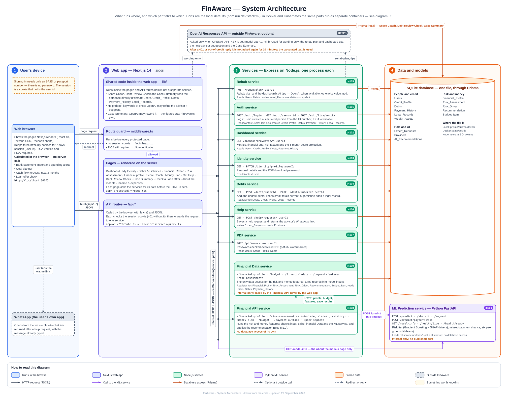

## 02 Every request, end to end

One row for each thing a person does: the screen it starts on → the web-app route → the service route →
what that service calls next → the tables read or written. Grouped by service, with the features that
need no service at the end.

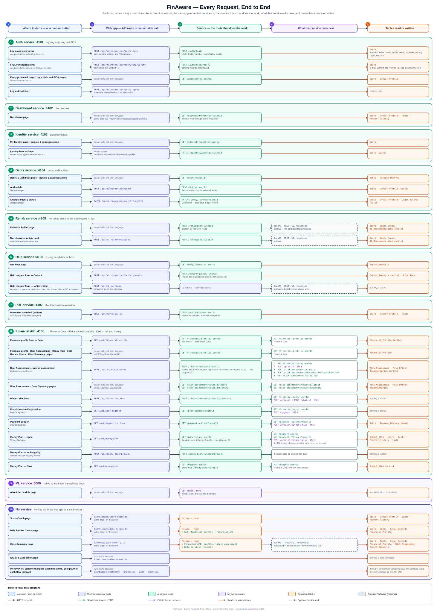

## 03 Three ways to run it

The same parts as processes on one computer (`npm run dev:stack:ml`), as containers with Docker Compose,
and as pods on Kubernetes with the Helm chart. Includes published ports, the shared database volume, the
optional TLS edge and the NetworkPolicy that lets only the Financial API reach the ML service.

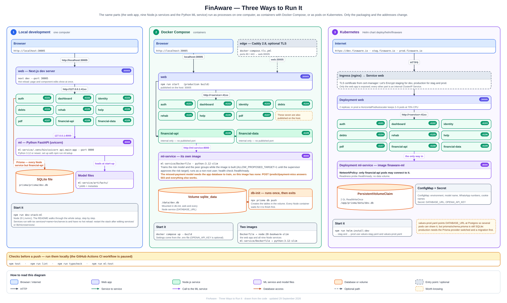

## 04 The three machine-learning models

The risk-tier model, the missed-payment model and the peer groups: the data each learns from, how it is
prepared and chosen, the files it is saved as, the endpoint that serves it and the page that uses it.
The risk target is still marked **proposed**, awaiting supervisor approval.

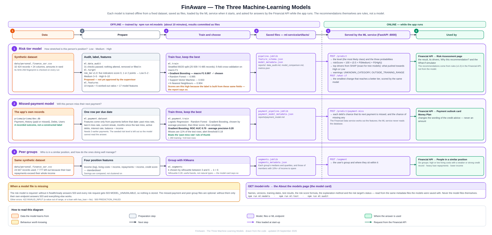

## 05 Data model

All 14 tables with every column, type and key, read straight from `prisma/schema.prisma` when the
diagrams are built — so this one cannot drift from the schema.

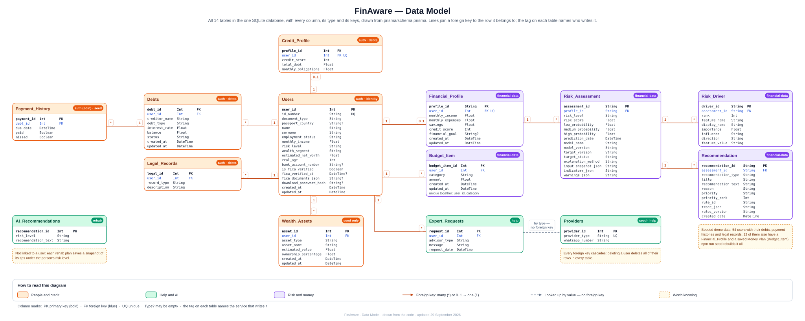

## 06 User journey and pages

From opening FinAware to the menu, what each page offers, and the pages behind them (the financial
profile, the model card, and the Debt Review Check, loan-offer check and Case Summary).

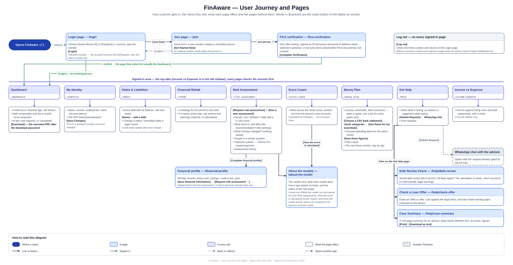

## 07 Flow: log in, join and FICA

Login and Join, how a new person is simulated from their ID number, the three cookies, the route guard,
FICA verification (including the demo placeholder documents) and logging out. Notes that sign-up does
not yet check the SA ID's date of birth or check digit.

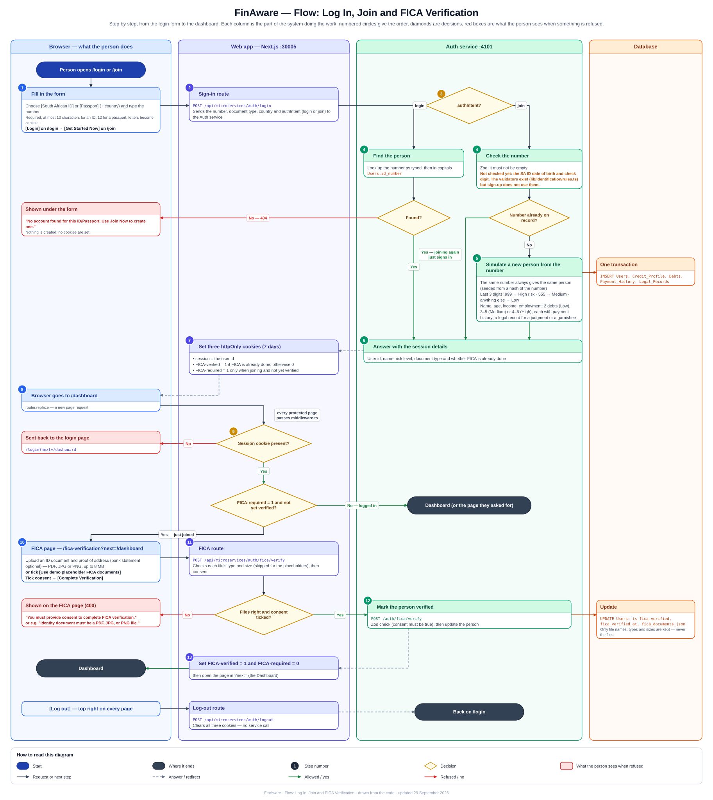

## 08 Flow: risk assessment

The financial profile first, then each step of an assessment across the web app, the Financial API,
Financial Data and the ML service — with every check and the message a person sees if it refuses.

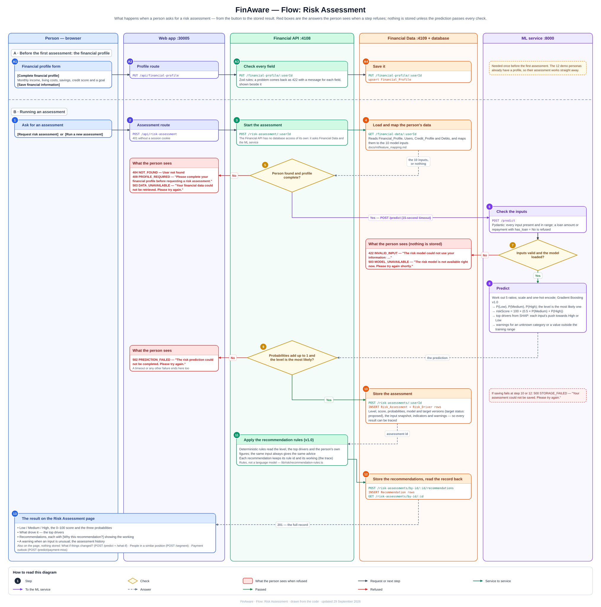

## 09 Flow: Money Plan

Opening the plan and the order in which spare money is given a job, previewing and saving figures, and
the tools that run only in the browser: statement import and spending alerts, the goal planner and the
three-month cash-flow forecast.

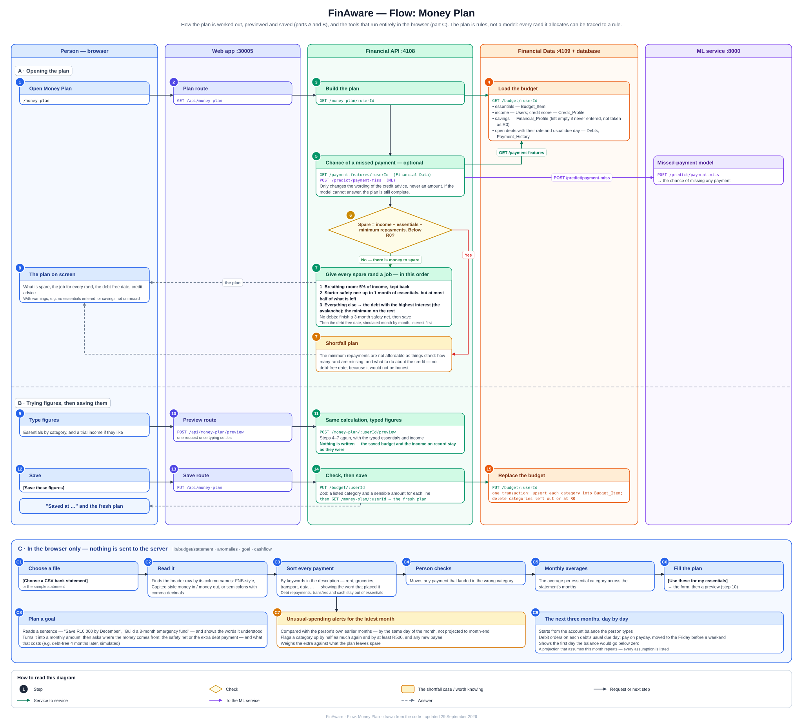

## 10 Flow: Get Help

How an advisor is suggested while the person types (keywords first, then optionally OpenAI), sending the
request to WhatsApp, and how the Debt Review Check, the Case Summary and the loan-offer check reach
their answers.

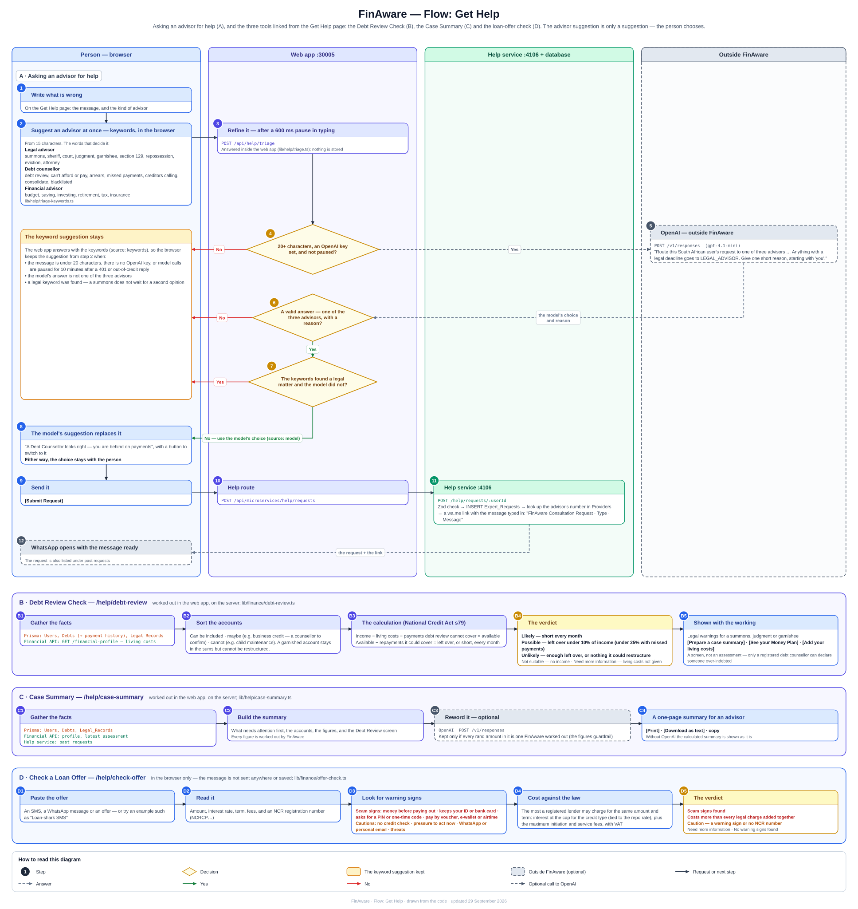

## 11 Flow: AI wording and its safety net

The one path every OpenAI feature takes: FinAware works out the answer first, and the model's wording
is used only if every check passes — including that every rand amount is one FinAware calculated.

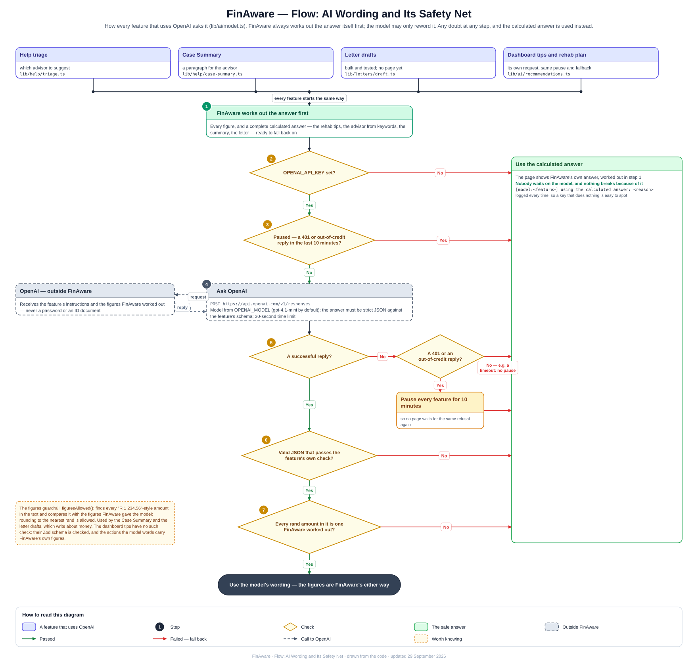

## Keeping them up to date

The diagrams describe the code, so a change to a feature, route, button label or table should come with
a change to its diagram. They are drawn by a helper script that is kept out of the repository, because it
is a tool for making documents rather than part of the app (see `.gitignore`).

## Older diagrams

`docs/architecture-diagram*`, `docs/application-flow-diagram*`, `docs/service-communication-diagram*`,
`docs/uml/` and `FinAware_architecture_diagram.svg` in the project root were drawn before the Money
Plan, the help tools, the peer groups and the missed-payment model were added. They are kept for
reference; the diagrams above describe FinAware as it is now.
