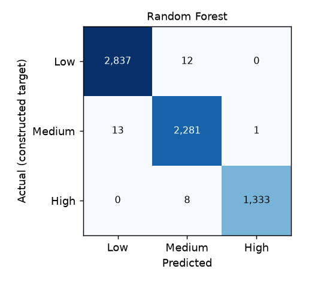

# Model comparison — FinAware financial risk

Generated by `python -m ml.train` on 2026-09-21T23:19:08+00:00. All numbers come from running the code on
`personal_finance_zar.csv` (SHA-256 `aa0aeae91304…`). Target: `risk_tier` version 1.0 (**status: proposed**).

> **PROVISIONAL.** The constructed target has not yet been approved by the supervisor. These results
> show the method working end-to-end. After approval (or any change to the rubric), re-run
> `python -m ml.train` and this report is regenerated.

## Method

- Stratified 80/20 train/test split, `random_state=42`: 25,939 training and 6,485 test records.
- One sklearn Pipeline per model (feature engineering → StandardScaler + OneHotEncoder(handle_unknown='ignore') → model), fitted on the training split only.
- Hyper-parameters chosen by 5-fold stratified cross-validation on the training split (scoring: macro F1). Small grids, listed below.
- SVM probabilities come from `CalibratedClassifierCV(SVC, method='sigmoid', cv=3)`, replacing the deprecated `SVC(probability=True)` (defect D12).
- Model inputs (10 raw → 17 model features): age, monthly_income_zar, monthly_expenses_zar, savings_zar, credit_score, loan_amount_zar, monthly_emi_zar, loan_interest_rate_pct, employment_status, has_loan; plus the dataset ratios and engineered features.

### Class distribution of the constructed target

| Tier | Records | % |
|---|---|---|
| Low | 14,246 | 43.94 |
| Medium | 11,476 | 35.39 |
| High | 6,702 | 20.67 |

## Results on the held-out test set

| Model | Accuracy | Macro P | Macro R | Macro F1 | Weighted F1 | High recall | ROC AUC (OvR) | Log loss | CV macro F1 (mean ± sd) | ms / prediction |
|---|---|---|---|---|---|---|---|---|---|---|
| Random Forest | 0.995 | 0.995 | 0.995 | **0.995** | 0.995 | 0.994 | 1.000 | 0.049 | 0.994 ± 0.001 | 7.5 |
| Gradient Boosting | 0.997 | 0.997 | 0.997 | **0.997** | 0.997 | 0.996 | 1.000 | 0.009 | 0.998 ± 0.000 | 6.3 |
| K-Nearest Neighbours | 0.909 | 0.902 | 0.907 | **0.904** | 0.909 | 0.915 | 0.985 | 0.263 | 0.898 ± 0.006 | 5.1 |
| Support Vector Machine | 0.935 | 0.930 | 0.936 | **0.933** | 0.935 | 0.952 | 0.988 | 0.189 | 0.924 ± 0.005 | 8.8 |

### Per-class precision / recall / F1

| Model | Low P | Low R | Low F1 | Medium P | Medium R | Medium F1 | High P | High R | High F1 |
|---|---|---|---|---|---|---|---|---|---|
| Random Forest | 0.995 | 0.996 | 0.996 | 0.991 | 0.994 | 0.993 | 0.999 | 0.994 | 0.997 |
| Gradient Boosting | 0.996 | 0.999 | 0.998 | 0.996 | 0.995 | 0.996 | 1.000 | 0.996 | 0.998 |
| K-Nearest Neighbours | 0.941 | 0.945 | 0.943 | 0.884 | 0.860 | 0.872 | 0.882 | 0.915 | 0.898 |
| Support Vector Machine | 0.967 | 0.947 | 0.957 | 0.907 | 0.910 | 0.908 | 0.918 | 0.952 | 0.934 |

### Confusion matrices (rows = actual, columns = predicted; Low, Medium, High)

- **Random Forest**: `[[2837, 12, 0], [13, 2281, 1], [0, 8, 1333]]` — 
- **Gradient Boosting**: `[[2846, 3, 0], [11, 2284, 0], [0, 6, 1335]]` — 
- **K-Nearest Neighbours**: `[[2693, 150, 6], [163, 1974, 158], [5, 109, 1227]]` — 
- **Support Vector Machine**: `[[2699, 150, 0], [93, 2088, 114], [0, 65, 1276]]` — 

### Hyper-parameter search

| Model | Grid | Selected |
|---|---|---|
| Random Forest | `{'model__max_depth': [None, 16], 'model__min_samples_leaf': [1, 3]}` | `{'model__max_depth': 16, 'model__min_samples_leaf': 1}` |
| Gradient Boosting | `{'model__n_estimators': [150, 300], 'model__learning_rate': [0.05, 0.1]}` | `{'model__learning_rate': 0.1, 'model__n_estimators': 300}` |
| K-Nearest Neighbours | `{'model__n_neighbors': [5, 15, 31], 'model__weights': ['uniform', 'distance']}` | `{'model__n_neighbors': 31, 'model__weights': 'distance'}` |
| Support Vector Machine | `{'model__estimator__C': [1.0, 5.0]}` | `{'model__estimator__C': 5.0}` |

## Global feature importance (permutation importance, spec §27)

Drop in test macro F1 when one raw input is shuffled (2,000-record stratified test sample, 5 repeats). Derived ratios are recomputed from the shuffled input, so each row shows the full effect of that input.

| Input | Random Forest | Gradient Boosting | K-Nearest Neighbours | Support Vector Machine |
|---|---|---|---|---|
| monthly_expenses_zar | 0.356 ± 0.009 | 0.416 ± 0.009 | 0.277 ± 0.012 | 0.370 ± 0.008 |
| monthly_emi_zar | 0.486 ± 0.010 | 0.494 ± 0.010 | 0.067 ± 0.002 | 0.230 ± 0.007 |
| monthly_income_zar | 0.307 ± 0.005 | 0.384 ± 0.006 | 0.227 ± 0.009 | 0.337 ± 0.008 |
| credit_score | 0.294 ± 0.007 | 0.298 ± 0.008 | 0.233 ± 0.009 | 0.244 ± 0.005 |
| loan_amount_zar | 0.000 ± 0.000 | -0.000 ± 0.001 | 0.132 ± 0.008 | 0.085 ± 0.007 |
| loan_interest_rate_pct | -0.000 ± 0.000 | 0.000 ± 0.000 | 0.064 ± 0.004 | 0.012 ± 0.003 |
| savings_zar | 0.013 ± 0.002 | 0.015 ± 0.002 | 0.015 ± 0.006 | 0.029 ± 0.003 |
| has_loan | -0.000 ± 0.000 | 0.000 ± 0.000 | 0.016 ± 0.003 | 0.011 ± 0.003 |
| age | -0.000 ± 0.000 | 0.000 ± 0.000 | -0.000 ± 0.002 | -0.002 ± 0.001 |
| employment_status | 0.000 ± 0.000 | 0.000 ± 0.000 | -0.006 ± 0.003 | 0.000 ± 0.002 |

## Ablation — models trained WITHOUT the rubric's inputs (circularity check, spec §20)

Inputs: age, loan_amount_zar, loan_interest_rate_pct, employment_status, has_loan. Income, expenses, repayment, savings, credit score and every ratio built from them are removed.

| Model | Accuracy | Macro F1 | High recall |
|---|---|---|---|
| Random Forest | 0.624 | 0.539 | 0.870 |
| Gradient Boosting | 0.622 | 0.546 | 0.793 |
| K-Nearest Neighbours | 0.614 | 0.548 | 0.767 |
| Support Vector Machine | 0.624 | 0.522 | 0.970 |

Interpretation: the gap between these scores and the main results measures how much the models rely on the
same values the constructed target was calculated from. The main models reproduce the rubric; they did not
discover financial risk independently.

## Final model selection (spec §23)

**Selected: Gradient Boosting** (model version 1.0).

Rule fixed before training: rank by test macro F1. Among models within 0.01 macro F1 of the best, prefer a tree-based model because it supports exact per-user
explanations with SHAP TreeExplainer (spec §26) and fast inference; then prefer higher High-risk recall, then lower log loss.

- Highest test macro F1: Gradient Boosting (0.997). Within 0.01: Random Forest, Gradient Boosting.
- Gradient Boosting: macro F1 0.997, weighted F1 0.997, High-risk recall 0.996, log loss 0.009, 6.3 ms per prediction.
- Tree-based, so each user's prediction can be explained exactly with SHAP TreeExplainer.
- Random Forest not selected: lower High-risk recall / worse log loss.
- K-Nearest Neighbours not selected: macro F1 0.904 is more than 0.01 below the best.
- Support Vector Machine not selected: macro F1 0.933 is more than 0.01 below the best.
